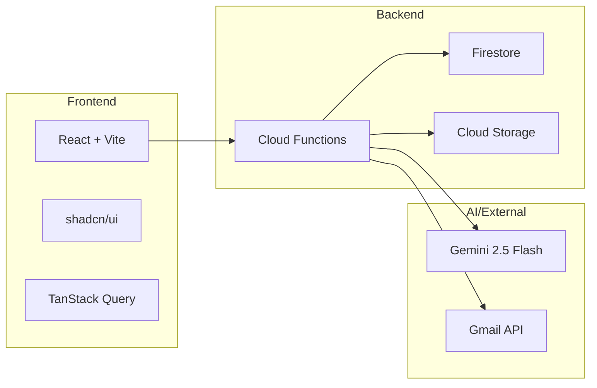

# DocSplit

> AI-powered 書類管理ビューアー

  

## 概要

**DocSplit**は、Gmailの添付ファイルを自動取得し、AI OCRでメタ情報を抽出、検索・グルーピング・閲覧が可能な書類管理ビューアーアプリです。

## 主な特徴

| 特徴 | 説明 |
|------|------|
| **Gmail自動連携** | 指定したGmailアカウントから添付ファイルを自動取得 |
| **AI OCR** | Gemini 2.5 Flashでメタ情報（顧客名、日付、書類種別）を自動抽出 |
| **PDF分割** | 複数書類が結合されたPDFを自動検出・分割 |
| **検索・フィルター** | 顧客名、書類種別、日付などで柔軟に検索 |
| **ホワイトリスト認証** | 登録済みユーザーのみアクセス可能 |

## クイックリンク

- [プロジェクト概要](overview.md) - 詳細な機能説明
- [アーキテクチャ](architecture.md) - システム構成図
- [納品フロー](deployment-flow.md) - クライアントへの納品手順
- [セットアップ手順](setup-guide.md) - 初期設定ガイド

## 技術スタック

## ステータス

| 項目 | 状態 |
|------|------|
| Phase 0-5 | ✅ 完了 |
| Phase 6 (ビジネスロジック) | ✅ 完了 |
| Phase 7 (処理履歴・同姓同名解決) | ✅ 完了 |
| Phase 8 (グループ化・検索機能) | ✅ 完了 |
| CI/CD | ✅ 完了 |
| テスト | ✅ 154テストパス |
| 本番デプロイ | ✅ 稼働中 |

## 納品方式

**セットアップスクリプト方式（雛形なし）** を採用しています。

- 各クライアントが独立したGCPプロジェクトを所有
- `setup-tenant.sh` で初期設定を自動化
- 詳細は[納品フロー](deployment-flow.md)を参照
