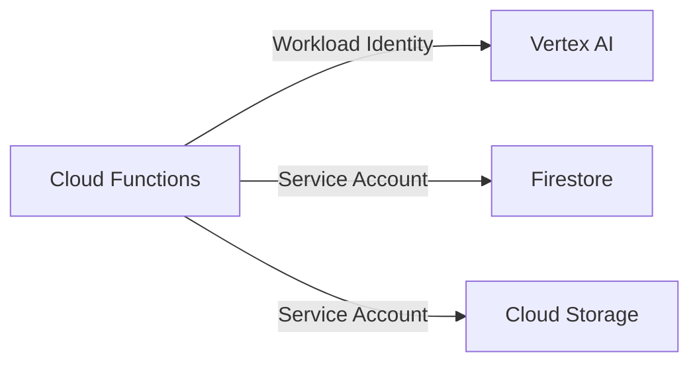
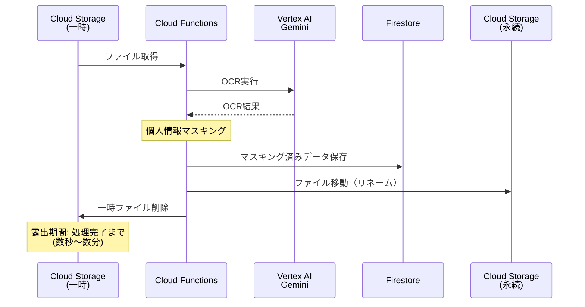

# ADR-0002: セキュリティ設計

## Status
**Accepted** - 2026-01-18 実装完了

## Context
書類管理アプリは個人情報（顧客名、住所等）を含むPDFを処理する。
Vertex AI Geminiへのデータ露出を最小化し、個人情報保護を強化する必要がある。

### セキュリティ要件
1. 個人情報マスキング処理
2. Geminiへのデータ露出期間の最小化
3. APIキー不使用（Workload Identity）
4. データ国内保持（日本リージョン）

## Decision

### 1. 認証・認可

| 項目 | 方針 |
|------|------|
| サービス間認証 | **Workload Identity Federation** |
| APIキー | **使用しない** |
| IAMロール | 最小権限の原則 |

### 2. データ露出最小化フロー

### 3. 個人情報マスキング

| 対象 | マスキング方法 | 例 |
|------|---------------|-----|
| 氏名 | 部分マスク | 山田 太郎 → 山田 ●● |
| 住所 | 市区町村以降マスク | 東京都渋谷区... → 東京都●●● |
| 電話番号 | 下4桁以外マスク | 03-1234-5678 → ●●-●●●●-5678 |
| 生年月日 | 年のみ保持 | 1990/01/15 → 1990/●●/●● |

**実装方針**:
- Cloud Functions内でOCR結果を解析
- 正規表現 + DLP API（オプション）でPII検出
- マスキング後のデータのみFirestoreに保存
- 元データはCloud Storageに暗号化保存（アクセス制限）

### 4. データ保持ポリシー

| データ種別 | 保持場所 | 保持期間 | アクセス権限 |
|-----------|---------|---------|-------------|
| 一時ファイル | Cloud Storage (temp/) | 処理完了まで | Cloud Functions のみ |
| 元PDF | Cloud Storage (archive/) | 要件による | 管理者のみ |
| OCR結果（マスク済） | Firestore | 永続 | アプリ |
| OCR結果（生） | 保存しない | - | - |

### 5. ネットワークセキュリティ（オプション）

| 対策 | 適用レベル | 備考 |
|------|-----------|------|
| VPC Service Controls | 検討中 | コスト・複雑性とのバランス |
| Private Google Access | 推奨 | Vertex AIへのプライベート接続 |
| Cloud Armor | 将来検討 | Web UIがある場合 |

## Consequences

### Pros
- **個人情報保護**: マスキング処理で露出最小化
- **APIキーレス**: 漏洩リスク排除
- **監査可能**: Cloud Loggingで全操作記録
- **国内データ保持**: asia-northeast1固定

### Cons
- **処理オーバーヘッド**: マスキング処理分の遅延
- **マスキング精度**: 誤検出・漏れのリスク（チューニング必要）
- **コスト**: DLP API使用時は追加コスト

## Alternatives Considered

### Cloud DLP API
- メリット: 高精度PII検出、自動マスキング
- 保留理由: 追加コスト、カスタム正規表現で十分か確認後

### Customer-Managed Encryption Keys (CMEK)
- メリット: 暗号鍵の完全管理
- 保留理由: 運用複雑性、要件確認後

## Open Questions

1. [ ] マスキング対象の詳細定義（どの項目を、どの程度マスクするか）
2. [ ] 元データの保持期間（法的要件の確認）
3. [ ] VPC Service Controlsの必要性判断
4. [ ] DLP APIの採用可否（コスト vs 精度）

## References
- `context/gcp-migration-scope.md`
- [Vertex AI データ処理](https://cloud.google.com/vertex-ai/docs/general/data-governance)
- [Cloud DLP](https://cloud.google.com/dlp/docs)
