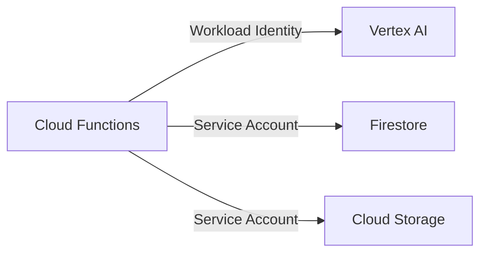
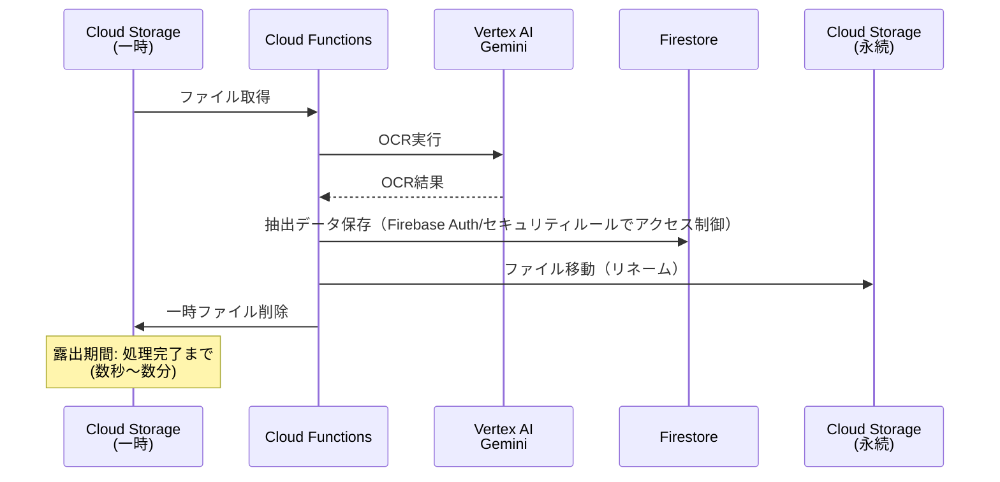

# ADR-0002: セキュリティ設計

## Status
**Accepted** - 2026-01-18（認証・データ露出最小化・データ国内保持は実装完了。個人情報マスキングは2026-07-08時点で不要と判断・見送り、詳細は§3参照）

## 2026-07-08 追記: 個人情報マスキング要件の見直し

当初「セキュリティ要件」に掲げた個人情報マスキング（§3）は実装されていない。理由: `customerName`/`officeName`等はFirestoreにマスク前の実値で保存されており、これは意図的な設計（顧客/事業所マスター突合・画面表示に実値が必須なため、マスキングは製品の中核機能と両立しない）。

Gemini 3.5 Flash移行に伴う個人情報コンプライアンス再確認（Issue #548関連セッション）で、以下の理由からマスキングなしで「及第点」水準を満たすと判断した:

- **安全管理措置（アーキテクチャ）**: データ国内保持（asia-northeast1固定）+ Vertex AI経由のSA認証（APIキー不使用）+ Cloud Logging（GCP既定）+ Firebase Auth/Firestoreセキュリティルールによるアクセス制御、で通常の個人情報について及第点
- **取得・利用目的の適法性（法務・組織層）**: 要配慮個人情報（介護記録等）が絡む場合の本人同意取得は、本人と直接契約関係を持つクライアント（データ管理者）側の責任であり、ベンダー側で技術的に代替（マスキング等）できる性質のものではない。ベンダー側の対応は`docs/context/delivery-and-update-guide.md`§責任分担にクライアント責任として明記済み

VPC Service Controls・DLP API採用可否・元データ保持期間（Open Questions #2-4）は本追記の対象外、未解決のまま。

## Context
書類管理アプリは個人情報（顧客名、住所等）を含むPDFを処理する。
Vertex AI Geminiへのデータ露出を最小化し、個人情報保護を強化する必要がある。

### セキュリティ要件
1. ~~個人情報マスキング処理~~（2026-07-08見送り、上記追記参照）
2. Geminiへのデータ露出期間の最小化
3. APIキー不使用（Workload Identity）
4. データ国内保持（日本リージョン）

## Decision

### 1. 認証・認可

| 項目 | 方針 |
|------|------|
| サービス間認証 | **Workload Identity Federation** |
| APIキー | **使用しない** |
| IAMロール | 最小権限の原則 |

```mermaid
flowchart LR
    CF[Cloud Functions] -->|Workload Identity| VA[Vertex AI]
    CF -->|Service Account| FS[Firestore]
    CF -->|Service Account| CS[Cloud Storage]
```

### 2. データ露出最小化フロー

```mermaid
sequenceDiagram
    participant CS as Cloud Storage<br/>(一時)
    participant CF as Cloud Functions
    participant VA as Vertex AI<br/>Gemini
    participant FS as Firestore
    participant CSP as Cloud Storage<br/>(永続)

    CS->>CF: ファイル取得
    CF->>VA: OCR実行
    VA-->>CF: OCR結果
    CF->>FS: 抽出データ保存（Firebase Auth/セキュリティルールでアクセス制御）
    CF->>CSP: ファイル移動（リネーム）
    CF->>CS: 一時ファイル削除
    Note over CS: 露出期間: 処理完了まで<br/>(数秒〜数分)
```

### 3. 個人情報マスキング（見送り、2026-07-08判断）

当初は氏名・住所・電話番号・生年月日等のマスキングを検討したが、**未実装かつ実装しない方針**。理由: `customerName`/`officeName`等はマスター突合・画面表示に実値が必須で、マスキングは製品の中核機能（顧客/事業所の特定・検索）と両立しない。代わりにFirebase Auth + Firestoreセキュリティルールによるアクセス制御（許可された組織スタッフのみ閲覧可）と、Vertex AI経由のデータ非学習利用保証（Google Cloud公式コミットメント）で保護する。詳細は本ADR冒頭の「2026-07-08追記」を参照。

### 4. データ保持ポリシー

| データ種別 | 保持場所 | 保持期間 | アクセス権限 |
|-----------|---------|---------|-------------|
| 一時ファイル | Cloud Storage (temp/) | 処理完了まで | Cloud Functions のみ |
| 元PDF | Cloud Storage (archive/) | 要件による | 管理者のみ |
| OCR結果（生値、マスキングなし） | Firestore | 永続 | Firebase Auth認証済みアプリユーザー（セキュリティルールで制御） |

### 5. ネットワークセキュリティ（オプション）

| 対策 | 適用レベル | 備考 |
|------|-----------|------|
| VPC Service Controls | 検討中 | コスト・複雑性とのバランス |
| Private Google Access | 推奨 | Vertex AIへのプライベート接続 |
| Cloud Armor | 将来検討 | Web UIがある場合 |

## Consequences

### Pros
- **個人情報保護**: Firebase Auth/Firestoreセキュリティルールによるアクセス制御 + Vertex AI非学習利用保証で露出最小化（マスキングではなくアクセス制御ベース、2026-07-08判断）
- **APIキーレス**: 漏洩リスク排除
- **監査可能**: Cloud Loggingで全操作記録
- **国内データ保持**: asia-northeast1固定

### Cons
- なし（マスキング見送りに伴い、処理オーバーヘッド・マスキング精度・DLP APIコストのConsは解消）

## Alternatives Considered

### Cloud DLP API
- メリット: 高精度PII検出、自動マスキング
- 保留理由: 追加コスト、カスタム正規表現で十分か確認後

### Customer-Managed Encryption Keys (CMEK)
- メリット: 暗号鍵の完全管理
- 保留理由: 運用複雑性、要件確認後

## Open Questions

1. [x] マスキング対象の詳細定義 → 2026-07-08、マスキング自体を見送りと決定（製品の中核機能と両立しないため）。詳細は本ADR冒頭の追記参照
2. [ ] 元データの保持期間（法的要件の確認）
3. [ ] VPC Service Controlsの必要性判断
4. [ ] DLP APIの採用可否（コスト vs 精度） → マスキング見送りに伴い実質的に不要だが、未検証のため未クローズ

## References
- `context/gcp-migration-scope.md`
- [Vertex AI データ処理](https://cloud.google.com/vertex-ai/docs/general/data-governance)
- [Cloud DLP](https://cloud.google.com/dlp/docs)
