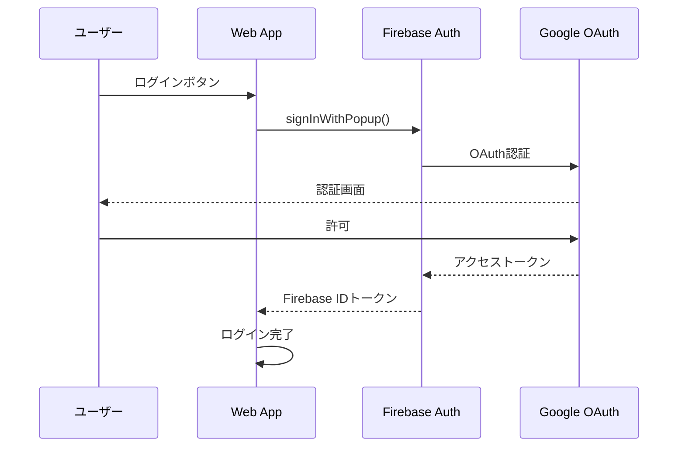
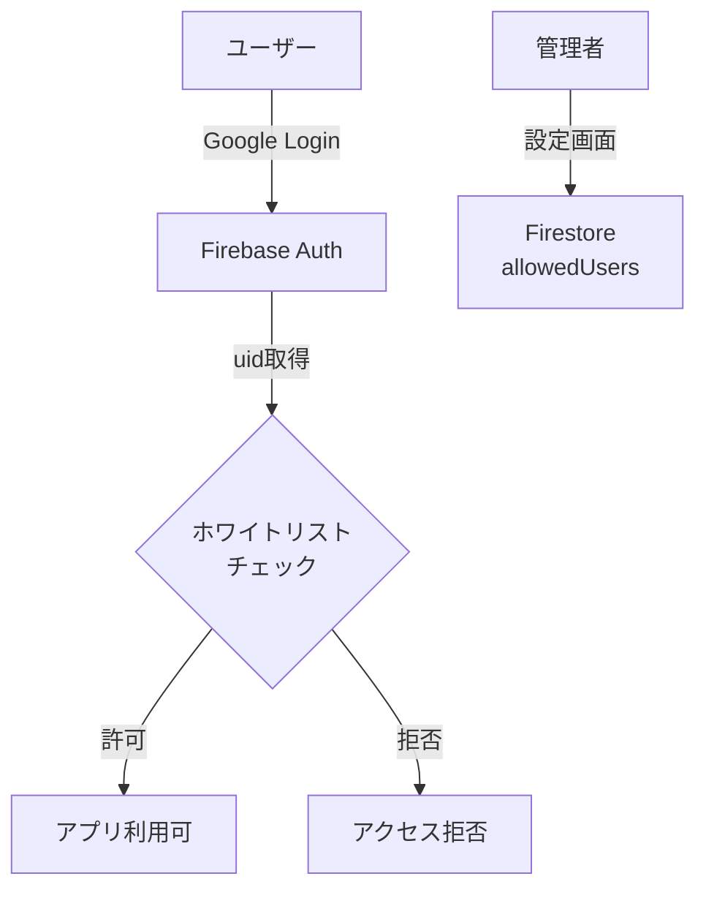
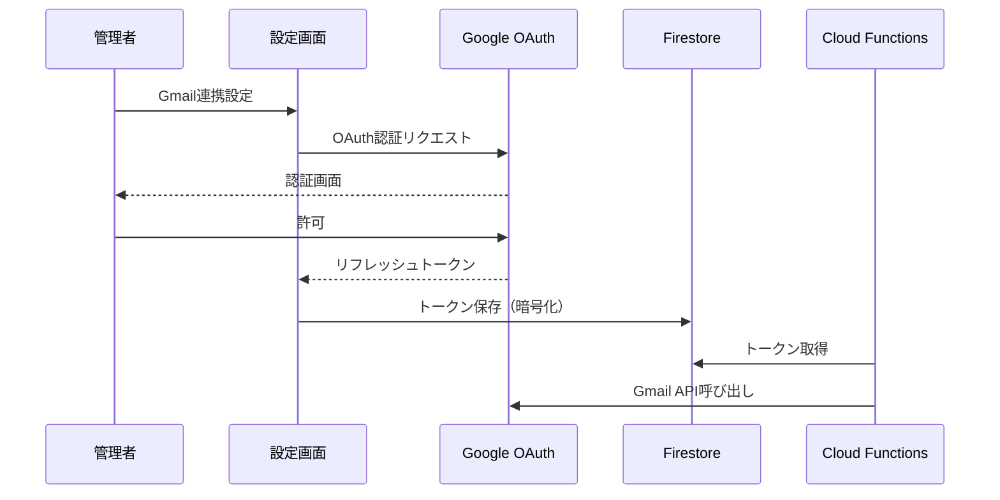
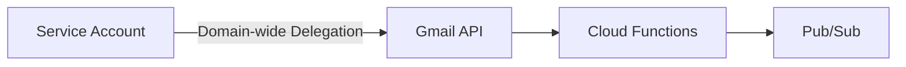
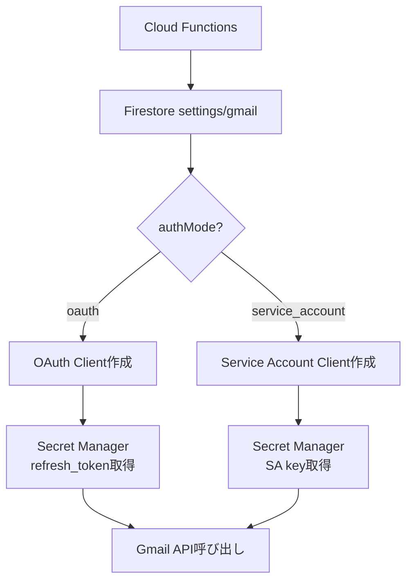
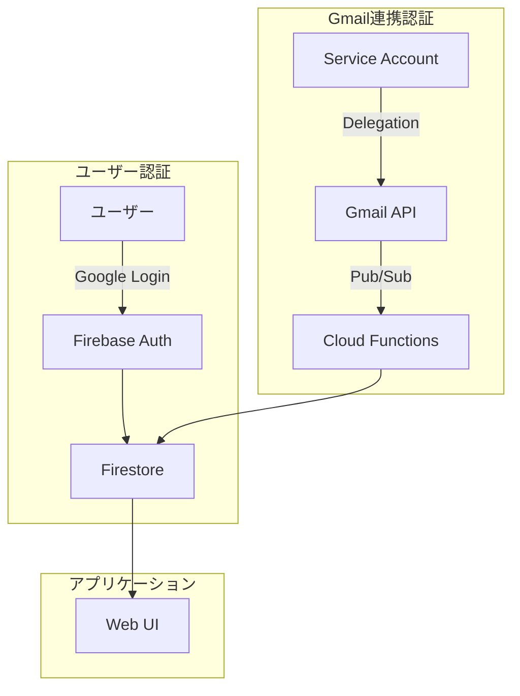

# ADR-0003: 認証設計

## Status
**Accepted** (2026-01-17 更新)

## Context
書類管理アプリには2種類の認証が必要：

1. **ユーザー認証**: アプリへのログイン（Googleソーシャルログイン）
2. **Gmail連携認証**: メール添付ファイルの取得

GCPプロジェクト移譲を前提とするため、移譲後も継続して動作する認証方式が必要。

### 確定した要件
- **納品形態**: 各クライアントのGCPプロジェクトに移譲（シングルテナント）
- **ユーザー管理**: ホワイトリスト方式（設定画面で管理）
- **コスト制約**: 月額3,000円以下

## Decision

### 1. ユーザー認証（Googleソーシャルログイン）

| 候補 | メリット | デメリット | 推奨度 |
|------|----------|------------|--------|
| **Firebase Authentication** | 簡単実装、Firestore統合、無料枠大 | Firebase依存 | ★★★ |
| Identity Platform | 企業向け機能、SLA保証 | コスト高、過剰機能 | ★★ |
| 自前OAuth実装 | 完全制御 | 実装コスト高、セキュリティリスク | ★ |

**推奨: Firebase Authentication**



**実装方針**:
- Firebase Authentication（Google プロバイダー）
- Firestoreセキュリティルールでアクセス制御
- **ホワイトリスト方式**でログイン許可ユーザーを制限（設定画面で管理）

### 1.1 ホワイトリスト機能



**Firestoreコレクション設計**:
```
/settings/auth
  └── allowedEmails: ["user1@example.com", "user2@example.com"]
  └── adminEmails: ["admin@example.com"]
```

**セキュリティルール例**:
```javascript
match /documents/{docId} {
  allow read, write: if isAllowedUser(request.auth.token.email);
}

function isAllowedUser(email) {
  return email in get(/databases/$(database)/documents/settings/auth).data.allowedEmails
      || email in get(/databases/$(database)/documents/settings/auth).data.adminEmails;
}
```

### 2. Gmail連携認証

**環境別の認証方式**:

| 環境 | メールアドレス | 認証方式 | 備考 |
|------|---------------|----------|------|
| 開発/テスト | `@gmail.com`（個人） | OAuth 2.0 | 管理者が初回認証 |
| 本番（推奨） | `@company.com`（Workspace） | Service Account + Delegation | 完全自動 |

#### 2.1 開発環境: OAuth 2.0（個人Gmail対応）



**注意点**:
- リフレッシュトークンの有効期限管理が必要
- トークンはSecret Managerで暗号化保存

#### 2.2 本番環境: Service Account + Delegation（推奨）



**前提条件**:
- クライアントがGoogle Workspaceを使用
- 管理者がDomain-wide Delegationを許可

**移譲時の手順**:
1. 新プロジェクトでService Account作成
2. クライアントの管理コンソールでDelegation許可
3. 対象メールアドレスを設定

#### 2.3 環境切替メカニズム

**環境判定方式**:
```typescript
// Firestore /settings/gmail の設定で判定
interface GmailSettings {
  authMode: 'oauth' | 'service_account';
  // OAuth用
  oauthClientId?: string;
  oauthClientSecret?: string;  // Secret Manager参照
  refreshToken?: string;        // Secret Manager参照
  // Service Account用
  serviceAccountEmail?: string;
  delegatedUserEmail?: string;  // 対象Gmail
}
```

**認証クライアント取得フロー**:


**実装例**:
```typescript
async function getGmailClient(): Promise<gmail_v1.Gmail> {
  const settingsDoc = await db.doc('settings/gmail').get();
  const settings = settingsDoc.data() as GmailSettings;

  if (settings.authMode === 'oauth') {
    // 開発環境: OAuth 2.0
    const refreshToken = await getSecretValue('gmail-refresh-token');
    const oauth2Client = new google.auth.OAuth2(
      settings.oauthClientId,
      await getSecretValue('gmail-client-secret')
    );
    oauth2Client.setCredentials({ refresh_token: refreshToken });
    return google.gmail({ version: 'v1', auth: oauth2Client });
  } else {
    // 本番環境: Service Account + Delegation
    const auth = new google.auth.GoogleAuth({
      scopes: ['https://www.googleapis.com/auth/gmail.readonly'],
      clientOptions: {
        subject: settings.delegatedUserEmail,
      },
    });
    return google.gmail({ version: 'v1', auth });
  }
}
```

**切替手順（開発→本番移行時）**:
1. Google Workspace管理コンソールでDomain-wide Delegation設定
2. Firestore `/settings/gmail` を更新:
   ```json
   {
     "authMode": "service_account",
     "delegatedUserEmail": "target@company.com"
   }
   ```
3. Cloud Functionsを再デプロイ（不要、設定変更で自動切替）

### 3. 認証フロー全体図



## Consequences

### Pros
- **Firebase Auth**: 実装簡単、Firestore統合、コスト効率
- **Domain-wide Delegation**: システム自動化に適切、ユーザー操作不要
- **移譲可能**: 手順書に従えば再設定可能

### Cons
- **Firebase依存**: GCP純正ではないがGoogleサービス
- **Delegation設定**: クライアント側の管理者作業が必要
- **Workspace前提**: クライアントがWorkspace未使用の場合は別方式

## Open Questions (解決済み)

1. [x] クライアントはGoogle Workspaceを使用しているか？
   → **未確定**。開発はOAuth 2.0、本番はWorkspace想定で両対応
2. [x] 監視対象のメールアドレスは何か？
   → **設定画面で指定可能**（開発用: `hy.unimail.11@gmail.com`）
3. [x] ログイン可能ユーザーの制限方法
   → **ホワイトリスト方式**（設定画面で管理、管理アカウントあり）
4. [x] フロントエンドUIは必要か？
   → **必要**（Firebase Hosting + React SPA）

## 移譲チェックリスト

### Firebase Authentication
- [ ] Firebaseプロジェクトの移譲（オーナー権限）
- [ ] 認証プロバイダー設定の文書化
- [ ] 許可ドメイン設定の引継ぎ

### Gmail連携
- [ ] Service Accountの再作成手順
- [ ] Domain-wide Delegation設定手順
- [ ] 必要なOAuthスコープ一覧
- [ ] 対象メールアドレスの設定方法

## References
- [Firebase Authentication](https://firebase.google.com/docs/auth)
- [Domain-wide Delegation](https://developers.google.com/identity/protocols/oauth2/service-account#delegatingauthority)
- `adr/0002-security-design.md`
