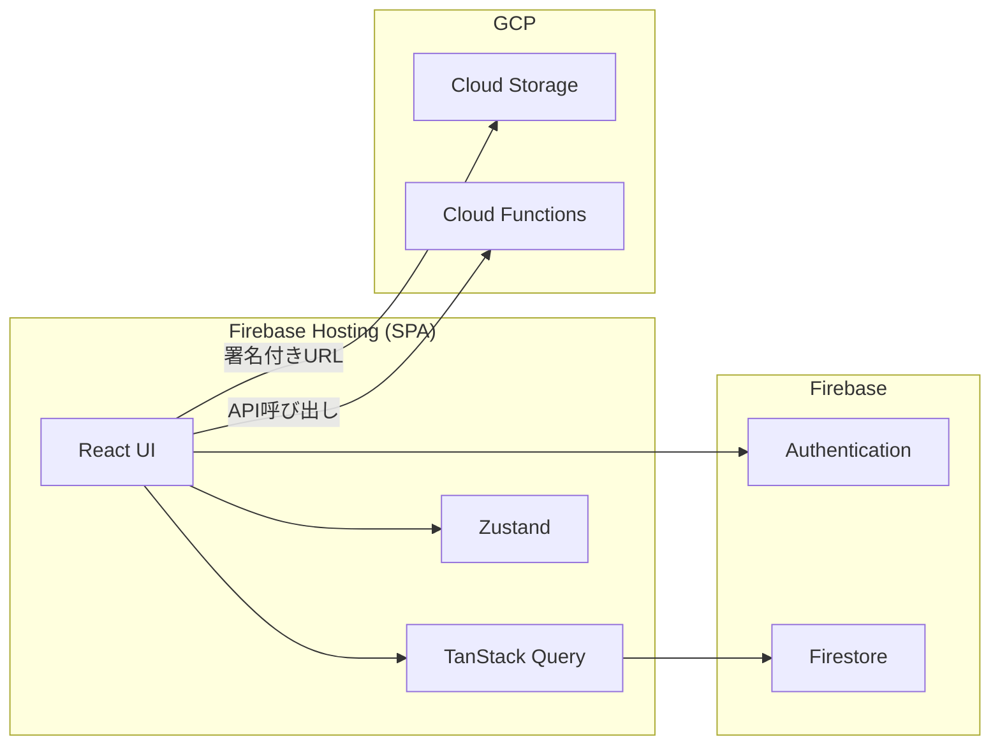

# ADR-0004: フロントエンドアーキテクチャ

## Status
**Proposed**

## Context

書類管理ビューアーアプリのフロントエンド技術選定が必要。

### 要件
- PDFビューアー機能
- メタ情報による検索・フィルタ・グルーピング
- Firebase Authentication連携
- Firestoreからのデータ取得
- GCPプロジェクト移譲を考慮したシンプルな構成

### 検討ポイント
1. ホスティング方式（静的 vs SSR）
2. フレームワーク選定
3. PDFビューアーライブラリ
4. Artifact Registryの要否

## Decision

### 1. ホスティング: Firebase Hosting

| 候補 | メリット | デメリット | 推奨度 |
|------|----------|------------|--------|
| **Firebase Hosting** | 無料枠大、Firebase統合、デプロイ簡単 | SSR不可 | ★★★ |
| Cloud Run | SSR対応、柔軟性 | コンテナ管理必要、コスト | ★★ |
| Cloud Storage + LB | 低コスト | 設定複雑 | ★ |

**選定理由**:
- Firebase Auth/Firestoreとの統合が容易
- 静的SPA配信で十分（SSR不要）
- Artifact Registry不要でシンプル
- 移譲時にFirebaseプロジェクトに含まれる

### 2. フレームワーク: React + Vite

| 候補 | メリット | デメリット | 推奨度 |
|------|----------|------------|--------|
| **React + Vite** | 高速ビルド、エコシステム充実 | 状態管理要検討 | ★★★ |
| Vue 3 + Vite | 学習コスト低、軽量 | Reactより求人少 | ★★★ |
| Next.js (Static) | React + 最適化 | 過剰機能、複雑 | ★★ |

**選定理由**:
- pdf.jsとの相性良好（React-PDF）
- Firebase SDK公式サポート
- Viteによる高速開発体験

### 3. PDFビューアー: react-pdf (pdf.js)

| 候補 | メリット | デメリット | 推奨度 |
|------|----------|------------|--------|
| **react-pdf** | 無料、軽量、pdf.jsベース | 高度な編集機能なし | ★★★ |
| PDF.js直接 | 完全制御 | 実装コスト高 | ★★ |
| PSPDFKit | 高機能、サポート | 有料（高額） | ★ |

**選定理由**:
- ビューアー用途には十分な機能
- 無料で商用利用可
- Reactコンポーネントとして簡単に利用

### 4. 状態管理: Zustand + React Query

| 用途 | ライブラリ | 理由 |
|------|-----------|------|
| サーバー状態 | **TanStack Query** | Firestoreデータのキャッシュ・同期 |
| クライアント状態 | **Zustand** | 軽量、シンプル |

### 5. UIライブラリ: shadcn/ui + Tailwind CSS

| 候補 | メリット | デメリット | 推奨度 |
|------|----------|------------|--------|
| **shadcn/ui** | カスタマイズ自由、軽量 | コンポーネント選択必要 | ★★★ |
| MUI | 充実、企業利用多 | バンドルサイズ大 | ★★ |
| Chakra UI | 使いやすい | やや重い | ★★ |

## Architecture

### 技術スタック

```
Frontend
├── Framework: React 18 + TypeScript
├── Build: Vite
├── Hosting: Firebase Hosting
├── Auth: Firebase Authentication
├── Data: Firestore + TanStack Query
├── State: Zustand
├── UI: shadcn/ui + Tailwind CSS
├── PDF: react-pdf (pdf.js)
└── Storage: Cloud Storage (署名付きURL)
```

### ディレクトリ構成（案）

```
src/
├── components/
│   ├── ui/              # shadcn/ui コンポーネント
│   ├── documents/       # 書類関連コンポーネント
│   ├── pdf-viewer/      # PDFビューアー
│   └── layout/          # レイアウト
├── features/
│   ├── auth/            # 認証
│   ├── documents/       # 書類管理
│   ├── settings/        # 設定
│   └── pdf-split/       # PDF分割
├── hooks/               # カスタムフック
├── lib/
│   ├── firebase.ts      # Firebase設定
│   └── api.ts           # Cloud Functions呼び出し
├── stores/              # Zustand stores
└── types/               # TypeScript型定義
```

### データフロー



## Consequences

### Pros
- **シンプル**: SSR不要、Artifact Registry不要
- **コスト効率**: Firebase Hosting無料枠で運用可能
- **開発速度**: Vite + React + shadcn/uiで高速開発
- **移譲容易**: Firebaseプロジェクトに全て含まれる
- **保守性**: 一般的な技術スタックで引き継ぎやすい

### Cons
- **SEO**: SSRなしのためSEO弱い（管理アプリなので問題なし）
- **初期表示**: SPAのため初期ロードやや遅い（コード分割で対応）
- **オフライン**: PWA対応は追加実装が必要

## Alternatives Considered

### Cloud Run + Next.js SSR
- **却下理由**: 管理アプリにSSRは過剰、コンテナ管理の複雑さ、コスト

### Vue 3
- **却下理由**: React-PDFの成熟度、Firebaseドキュメントの充実度でReact優位

### MUI
- **却下理由**: バンドルサイズ大、shadcn/uiの方が軽量でカスタマイズ性高い

## Implementation Notes

### Firebase Hosting設定

```json
// firebase.json
{
  "hosting": {
    "public": "dist",
    "ignore": ["firebase.json", "**/.*", "**/node_modules/**"],
    "rewrites": [
      {
        "source": "**",
        "destination": "/index.html"
      }
    ]
  }
}
```

### PDF表示（Cloud Storage署名付きURL）

```typescript
// Cloud Functionsで署名付きURL生成
const [url] = await storage
  .bucket(bucketName)
  .file(filePath)
  .getSignedUrl({
    action: 'read',
    expires: Date.now() + 15 * 60 * 1000, // 15分
  });
```

## References

- [Firebase Hosting](https://firebase.google.com/docs/hosting)
- [react-pdf](https://github.com/wojtekmaj/react-pdf)
- [shadcn/ui](https://ui.shadcn.com/)
- [TanStack Query](https://tanstack.com/query)
- `adr/0003-authentication-design.md`
- `context/functional-requirements.md`
