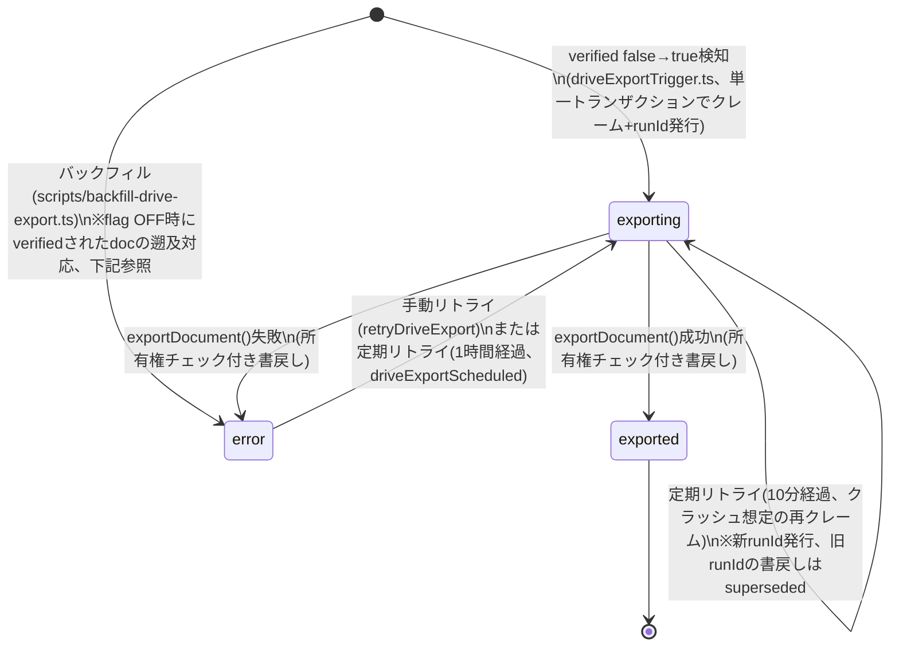

# ADR-0022: Google Drive エクスポート連携（Phase 1）

## Status
Accepted (2026-07-20)

## Context

介護施設向けクライアント（cocoro、kaname）から、書類（ケアプラン・医療・介護保険証等）のPDFを利用者ごとにGoogleドライブへ自動振り分けエクスポートしたいという要望があった。用途はNotebookLM投入、インターネットFAX（eFAX等）送信。

両クライアントの実際のフォルダ構成は非対称：

- **かなめ**: 事業所（固定）→ ケアマネ（姓頭文字+半角スペース+氏名）→ 利用者（フリガナ頭文字+全角スペース+氏名）→ 書類カテゴリ → （ケアプランのみ）年月、の5階層
- **cocoro**: 共有フォルダ（固定）→ ケアマネ別カルテ → 利用者、の3階層。担当ケアマネ変更時はフォルダごと新担当配下へ移動する運用

個別対応ではなく、共通の仕組みで両対応する方針をdecision-makerが明示。設計相談と実機技術検証（`doc-split-dev`環境でのブラウザ実機テスト）を経て、以下の設計判断を確定した。

## Decision

### 1. OAuth接続はGmail連携と完全に独立させる

既存のGmail OAuth連携（`functions/src/utils/gmailAuth.ts`、`gmail.readonly`スコープ固定）とは別に、Google Drive専用の接続を新設する（`settings/drive`、Secret Manager名`drive-oauth-client-id`/`-secret`/`-refresh-token`）。同一Googleアカウントをデフォルトの接続先として選べるが、別アカウントでの接続も構造上妨げない。既存のGmail接続コード（Secret Manager読み書きヘルパー、Callable Functionの骨格）は再利用しつつ、認証情報自体は独立管理する。

### 2. スコープは `drive.file` に確定

`doc-split-dev`環境で実機検証を行い、以下を確認した：
- **`drive.file`スコープ + Google Picker（`setEnableDrives(true)`） + `supportsAllDrives=true`** の組み合わせで、Shared Drive内へのフォルダ作成が成功する。フルスコープ`drive`は不要。
- Shared Driveのルート自体はPickerで選択できず、1階層以上のサブフォルダを選ぶ必要がある（UI上に明示する制約）。
- `drive.file`スコープでは完全削除（`files.delete`）が拒否され、`files.update({trashed:true})`によるゴミ箱移動のみ許可される。

`drive.file`はGoogleが「非破壊的で最小権限」と位置づけるスコープであり、アプリが触れられる範囲をユーザーがPicker操作で明示的に選択したファイル・フォルダに限定できる。フルスコープ`drive`（Drive全体への読み書き）を避けることで、同意取得の重み・監査対象範囲を最小化する。

### 3. フォルダ構成はテナントごとのセグメント型テンプレートで表現する

フォルダ階層を「固定文字列」「ケアマネ（命名フォーマット可変）」「利用者（命名フォーマット可変）」「書類カテゴリ」「日付（条件付き）」という判別可能unionのセグメント配列として定義し（`DriveFolderSegment` / `DriveFolderTemplate`、`shared/types.ts`）、テナントごとに`settings/drive.template`へ保存する。かなめ・cocoro双方の非対称な階層を、コード改修なしに設定の違いだけで表現できる。

フリガナ欠損時（`CustomerMaster.furigana`は既知の欠損ケースがある、Issue #338）は、デフォルトで**エクスポートを停止**（`furiganaFallback:'stop'`）し、エラー一覧に表示する（fail-visible）。テナントが明示的にopt-inした場合のみ、氏名の先頭文字で代替する（`useNameInitial`）。誤った利用者フォルダへの配置は「配置されない」より遥かに危険という判断による。

### 4. フォルダの解決は find-or-create、同名2件以上は停止

各セグメントの子フォルダ検索で、0件なら作成・1件なら再利用・**2件以上なら`AmbiguousFolderError`を投げて停止**する。これにより、「既存フォルダ構造への合流」と「新規ルートからの作成」の両ケースを、単一のロジックで一律に処理できる（ルートに空フォルダを選べば実質新規、既存構造のあるフォルダを選べば実質合流）。曖昧な状態での自動選択は誤配置リスクがあるため、常に停止を優先する。

同一parent+nameに解決する**異なるdocument**が近接タイミングで検証されると、双方が0件マッチを観測して`files.create()`を呼び、重複フォルダが作成されうる（決定4本文の「同名2件以上は停止」は同一検索内の話であり、この異docId間の競合は別問題）。これを防ぐため、0件マッチ時のみ`driveFolderLocks`コレクション（Admin SDK専有）へのFirestoreトランザクションで所有権を主張してから作成する。所有権トークン（fencing token）は決定6の`driveExportRunId`クレーム機構と同型で、staleとみなされ他の実行にロックを奪われた場合でも元の実行が誤って新しい保有者のロックを削除しないようにする。ロック獲得に失敗した場合は`FolderCreationInProgressError`をthrowし、新しい待機/リトライ機構は作らず既存のcatch-and-set-error機構（`driveExportStatus:'error'`→次回スケジュールスイープで自動リトライ）に委ねる（`functions/src/drive/findOrCreateFolder.ts`）。

### 5. 同期トリガーは「確認ボタン」押下（`verified` false→true）

documentの`verified`フィールドがfalse→trueになる瞬間を、Cloud Functions側のFirestoreトリガー（`onDocumentWritten('documents/{docId}')`）で検知してエクスポートを開始する。OCR誤読・利用者取り違えが確定する前の情報を外部Driveへ誤って流出させるリスクを、人間のレビュー完了という明示的なゲートで防ぐ。この方式はcocoro側で承認済み。既存の確認フロー（`useDocumentVerification.ts`の`markAsVerified`、3つの呼び出し元）には一切変更を加えない。

### 6. Drive系フィールドはAdmin SDK専有、outboxパターンで状態管理

`driveExportStatus`（`(フィールド不在) → exporting → exported`、失敗時`error`）と`driveFileId`/`driveExportedAt`/`driveExportError`/`driveExportRunId`を document に追加し、**通常時はCloud Functions（Admin SDK）からのみ書き込む**設計にする。フロントエンドからの再送は直接Firestore書き込みではなく、Callable Function（`retryDriveExport`）経由に限定する。

例外として、`frontend/src/hooks/useDocuments.ts`の`getReprocessClearFields()`（再処理時のフィールドクリア）は、`driveExportStatus`/`driveExportedAt`/`driveExportError`/`driveExportRunId`の4フィールドを`deleteField()`で削除する。これは`documents` collectionの`firestore.rules` update許可フィールドリスト（`hasOnly([...])`方式）への追加が必要（`retryCount`/`provenance`等の既存の派生フィールドと同型）だが、削除または無変更のみを許可する専用ガードにより、FEが値を新規設定・上書きすることはできない（#178教訓の延長。再処理でDriveエクスポートのクレーム状態が残存すると、訂正後の再確認がトリガーのクレームでスキップされ、二度と再エクスポートされなくなる不具合の再発防止）。

**`driveFileId`は削除(deleteField)自体も拒否する**（様子見#47対応、2026-07-22）: 上記4フィールドは「削除または無変更のみ許可」だが、`driveFileId`は次項の通り再処理でも意図的にクリアしないため、クライアントSDK経由での削除を正当化する業務フローが存在しない。`firestore.rules`側で`driveFileId`のみ「存在有無の遷移(追加/削除)自体を禁止し、存在する場合は値も不変」という一段厳しいガードに変更し、アプリコード側（クリア対象からの除外）1箇所のみに依存しない多層防御とした。

**`driveFileId`は例外的に再処理時もクリアしない**（code-review xhigh指摘対応、2026-07-21）。理由は次項参照。

トリガー自身の書き戻し（`driveExportStatus`の更新）による再発火は、`before?.verified !== true && after.verified === true`という「立ち上がりエッジのみ」の判定で防ぐ（既存の`searchIndexer.ts`のハッシュ比較と同じ思想）。

**状態遷移図**（code-review CONFIRMED指摘対応で`pending`状態を廃止し2段階クレームを1段階へ統合、所有権トークン`driveExportRunId`を追加）:

**flag OFF→ON時のバックフィル（code-review指摘#43対応、2026-07-22）**: `driveExportTrigger.ts`はFeature Flag OFF中は完全no-op（`driveExportStatus`フィールド自体を一切書き込まない）ため、OFF期間中にverifiedされたdocumentは`(フィールド不在)`のまま取り残される。トリガーは`verified`のrising edgeのみを見るため再度発火せず、定期スイープ（`driveExportScheduled.ts`）も`driveExportStatus in ['error','exporting']`のみを対象とするため`(フィールド不在)`のdocを一生拾わない。`scripts/backfill-drive-export.ts`（管理スクリプト、`--dry-run`対応）が`verified==true`かつ`driveExportStatus`フィールド不在のdocを見つけ、`driveExportStatus:'error'`に一時的にマークすることで、上記の既存`error`リトライ経路に乗せる（新規Cloud Functionは作らない。実際のDrive API呼び出しは定期スイープが通常通り実行する）。

`exporting`から`exporting`への自己遷移（定期リトライによる再クレーム）は、新しい`driveExportRunId`を発行して所有権を移す。並行して実行されていた古い実行(古いrunId)が後から完了して書き戻そうとしても、書戻し直前に再読込した`driveExportRunId`が自分のものと一致しない場合は書き込みをスキップする(`functions/src/ocr/ocrRunGuard.ts`の`ocrRunId`所有権検証と同じ思想)。これにより、`exportDocument()`の`files.create()`前段の`appProperties`(`docSplitDocId`)による冪等性チェックと合わせて、リトライ時のDriveファイル重複作成・Firestore状態の二重書き込みを防ぐ。

**`driveFileId`優先のmove/rename/内容更新**（code-review xhigh指摘対応、2026-07-21）: 当初の実装では`getReprocessClearFields()`が`driveFileId`も削除していたため、再処理でフォルダパスが変わる訂正（利用者取り違えの修正等）をすると、`exportDocument()`の`appProperties`検索が新しいフォルダ配下しか見ないため旧フォルダに誤配置ファイルが孤児として残り続け、フォルダパスが変わらない訂正では内容が更新されない（stale content）、という2つの不具合があった。`shared/types.ts`の`driveFileId`コメントが元々「重複防止・**再送先**の一意キー」としていた設計意図に立ち返り、`driveFileId`を再処理でもクリアせず保持するよう変更した。`exportDocument()`は`doc.driveFileId`がある場合、`drive.files.get()`で実体を確認したうえで`drive.files.update()`（`addParents`/`removeParents`でフォルダ移動、`requestBody.name`でリネーム、`media`で内容更新を1回のAPI呼び出しで実施）を直接行う。ファイルがDrive上に見つからない（404、手動削除等）場合のみ、従来の`appProperties`ベースのfind-or-create（`findOrUploadFile()`）にフォールバックする。

**既知の残課題（本修正のスコープ外）**: 初回エクスポート時（`driveFileId`が未設定）に2つの実行が真に並走すると、`findOrUploadFile()`のlist-then-createがTOCTOU競合を起こし、Drive上に同一`docId`のファイルが重複作成されうる（以後`AmbiguousFileError`で恒久停止）。Phase 2以降でDrive側の排他制御（例: 作成前にFirestore側でアップロード試行中マーカーを持つ等）を検討する。

**`findOrUploadFile()`のappProperties一致ファイル再利用時も内容(media)を最新化する**（様子見#54対応、2026-07-22）: `driveFileId`が404/`trashed`でフォールバックした場合、または初回エクスポートで過去の孤児アップロードと一致した場合、以前は該当ファイルのidだけを再利用し内容は更新していなかった。この孤児ファイルが`resolveDriveFile()`のフォールバック経由で見つかった場合、現在の`fileUrl`の内容と一致する保証がない（過去の失敗実行時点の内容のまま古くなっている可能性がある）ため、idを再利用する場合も`files.update()`で内容を必ず最新化するよう変更し、`driveFileId`優先パスと同じ「内容は常に最新」という保証を両経路で揃えた。

**Phase1の既知の制約: `verified`維持のままの編集では再エクスポートされない**（PLAUSIBLE#49、2026-07-22決定）: `driveExportTrigger.ts`の`justVerified`判定（`verified`のfalse→true立ち上がりエッジのみ）は、`verified:true`のまま`customerName`/`documentType`等を編集した場合には反応しない設計である。バグではなく意図的な設計判断として本ADRに明記する: Phase1スコープでは、エクスポート後に内容を訂正する場合は運用上「一旦`verified:false`に戻してから再確認する」フローを前提とし、`verified`を維持したままの編集は再エクスポートの対象外とする。この制約を解消する自動再エクスポートの仕組みはPhase2以降で検討する。

**kanameone/cocoro本番展開 Phase D/E再設計（Codex High指摘5件対応、2026-07-23）**: dev環境実装完了後、kanameone(876件)/cocoro(93件)への本番展開設計をCodexセカンドオピニオン（MCP, effort=high）がレビューし、以下5件のHigh指摘を受けて再設計した。

- **flag ON時のallowlist機構**（指摘: flag ON直後は他ユーザーの通常確認操作も全てDrive書込みトリガー対象になり、1件だけのコントロールテストが成立しない）: `settings/features.driveExportAllowlist`（string配列）を新設し、`getDriveExportGate()`（`functions/src/utils/featureFlags.ts`）が単一snapshotで`{enabled, allowlist}`を返す。`driveExportTrigger.ts`のみがこのallowlistでゲートされる（`allowlist!==null && !allowlist.includes(docId)`なら早期return）。**sweep(`driveExportScheduled.ts`)・手動retry(`retryDriveExport.ts`)は意図的にallowlist非対象**（sweepのスコープはbackfillの`--limit`が決め、retryはadmin個別操作でmass export不可なため）。allowlist契約: フィールド不在=null=制限なし（dev環境の全展開挙動を保持）、空配列=block-all（staging用）、不正値（非配列/非string混在）はfail-closedで空配列扱い。**空配列にすることと全展開は別**（空配列は全拒否）: 全展開時は`--remove`でフィールド自体を削除すること（`scripts/set-drive-allowlist.js`の`--set`/`--clear-empty`/`--remove`）。
- **backfillのcanary機構**（指摘: `scripts/backfill-drive-export.ts`に`--limit`/`--expected-count`/manifest/選択的rollbackが無く、cocoro先行実行も全量投入でしかなくcanaryにならない）: `--limit N`（対象を先頭N件に制限）、`--expected-count N`（対象件数が一致することを**書込み前に**アサート、不一致なら書込みゼロで中断）、`--manifest-out <path>`（`{runId, projectId, timestamp, docIds[]}`をJSON出力）、`--rollback <manifest>`（manifest記載docIdのうち、まだbackfillのsentinelエラーマーカーのままのものだけを`FieldValue.delete()`でfield-absentへ復帰。exported/exporting/実エラーへ進んだdocは意図的にskip）を追加。
- **race修正**（指摘: 通常の確認操作とbackfillが競合し`driveExportStatus`を書き戻すリスク）: 従来の無条件`batch.update`を、各docの`updateTime`（Firestore Timestampオブジェクトをそのまま渡す）を`lastUpdateTime`preconditionとする個別`update()`に置換。read→write間に別の書込みが入ると`FAILED_PRECONDITION`(code 9)でskip・ログ出力し、相手の状態を上書きしない。**注意**: precondition値をISO文字列等へ変換して往復させるとnanosecond精度が失われ常に不一致になり全書込みが無言で失敗する（emulatorで実証済みの罠、`Timestamp`オブジェクトを直接渡すことが必須）。
- **ロールバック意味論の明記**（指摘:「flag OFF」はロールバックではない）: flag OFFは**新規開始のみ停止**する。`driveExportTrigger.ts`/`driveExportScheduled.ts`のflagチェックは各実行の開始時点のみで、既に`exporting`へクレーム済みのexportは完走し、**作成済みのDrive上のPDFは自動削除されない**（`appProperties`/`docSplitDocId`による冪等性チェックがあるため、再度flag ONにしても重複作成はされない）。`backfill --rollback`はFirestoreの`driveExportStatus`/`driveExportError`マーカーのみを復帰する操作であり、Drive上の実体には一切関与しない。
- **完了時間・異常停止基準**（指摘: 未定義）: `scripts/drive-export-status-report.ts`（read-only）が`verified==true`の状態分布（exported/exporting/error内訳をbackfillマーカーと実エラーに分割/フィールド不在）を集計する。主シグナルは**exported数の単調増加**（定期スイープ10件/15分が目安）、副シグナルは実エラー比率（>20%で警告表示）。Stage D（コントロールテスト）着手前は本レポートで`error=0`かつ`exporting=0`（既存の滞留docがないこと）を確認するentry gateとする。

段階的展開runbook（Stage D: allowlist+1件コントロールテスト → Stage E1: `--limit`小規模canary backfill → Stage E2: allowlist `--remove`＋残り全件backfill、cocoro先行→kanameone）は`docs/handoff/GOAL.md`に記録し、実際のflag ON/backfill本実行はPhase C（各クライアントのGoogle Drive OAuth接続完了）確認後、番号単位の明示認可で別途実施する。

### 7. スコープはPhase 1（MVP）に限定

Phase 1 = OAuth接続 + Picker + セグメント型テンプレート設定 + 確認ボタン起点のoutboxエクスポート + fileId記録によるfind-or-createの重複防止 + エラー一覧UI + 定期リトライ（Cloud Scheduler）。

Phase 2（担当替え追従の自動フォルダ移動、Shared Drive/Service Accountモード、再送管理UI、本文差替）、Phase 3（NotebookLM/eFAX特化機能）は対象外とし、将来の拡張ポイントとして本ADRに記録するのみとする。

## Consequences

### Pros
- Gmail接続と分離することで、片方の再認可がもう片方を巻き添えにしない
- `drive.file`スコープにより、Google Workspace管理者・エンドユーザーへの説明責任が軽い（最小権限）
- セグメント型テンプレートにより、新規クライアント追加時もコード改修が不要
- fail-visibleな設計（フリガナ欠損・フォルダ重複で停止）により、誤配置による情報漏洩・誤送付のリスクを構造的に排除
- outboxパターンにより、Cloud Functions実行中のクラッシュから定期リトライで自動回復できる
- Admin SDK専有により、firestore.rulesの改ざん可能面を広げない

### Cons
- Shared Driveのルート直下を選択できない制約があり、UI上での説明が必要（実機検証で判明）
- `drive.file`スコープでは完全削除ができず、ゴミ箱移動までしかアプリ側で保証できない
- セグメント型テンプレートは自由度を制約するため、将来的に想定外のフォルダ構成が出た場合は拡張が必要になる
- Phase 1は初回送信のみで、ドキュメント内容の差し替え（本文更新）は非対応（Phase 2で対応）

## Alternatives Considered

- **フロントエンドから直接Drive系フィールドを書き込む案**: 却下。`firestore.rules`のdocuments update許可リストを汚染し、改ざん可能面が広がるため、Admin SDK専有・Callable Function経由に統一した。
- **`onDocumentUpdated`トリガーの採用**: 却下。このプロジェクトのCloud Functionsは全てのFirestoreトリガーを`onDocumentWritten`で統一しており（前例なし）、既存パターンとの一貫性を優先した。
- **フォルダ名重複時の自動選択（先頭を採用する等）**: 却下。誤った利用者フォルダへの配置リスクが「エクスポートされない」リスクより重いと判断し、常に停止を優先した。
- **フルスコープ`drive`の採用**: 却下。実機検証で`drive.file`+`supportsAllDrives=true`の組み合わせで要件を満たせることを確認できたため、より狭いスコープを採用した。

## References
- 関連ドキュメント: `docs/context/data-model.md`（`/settings/drive`、Drive Export状態セクション）
- ADR-0003（Gmail OAuth / Service Account切替）: 同種の認証方式選択の前例
- ADR-0009（クライアント別Feature Flag）: `settings/features.driveExport`フラグの既存パターン
- ADR-0021（ライブ読取集計モデル）: 多重トリガー再発火時のno-op化の根拠
- 実機検証: `doc-split-dev`環境でのGoogle Picker + Drive API v3実機テスト（2026-07-20）
