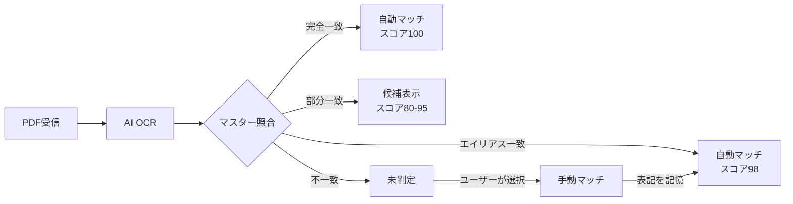

# 表記ゆれ対応（エイリアス学習）

<div class="phase-card">
<h3>この機能でできること</h3>

OCRで読み取った文字が、登録されたマスター名と微妙に異なる場合でも、**自動的に正しいマスターにマッチング**させることができます。

例えば「訪問介護ステーションひまわり」と「ひまわり訪問介護ステーション」のような表記の違い（表記ゆれ）を学習し、次回以降の書類取り込みで自動マッチングの精度を向上させます。
</div>

## 対象マスター

| マスター種別 | エイリアス対応 | 説明 |
|---|---|---|
| **顧客** | ✅ | 「山田太郎」↔「やまだ太郎」（漢字↔ひらがな）など |
| **書類種別** | ✅ | 「訪問介護計画書」↔「訪問介護サービス計画書」など |
| **事業所** | ✅ | 「さくらケアセンター」↔「(株)さくらケアセンター」（法人格の有無）など |
| ケアマネジャー | - | OCR照合対象外（手動入力のみ） |

## 仕組み

<div class="success-box">
<strong>デフォルトで吸収される表記ゆれ:</strong> 全角↔半角、スペースの有無、句読点、ハイフン・長音符、大文字↔小文字の違いは、エイリアス登録なしで自動的に吸収されます。
</div>

<div class="notice-box">
<strong>エイリアスが必要なケース:</strong> 漢字↔ひらがな、語句の追加/省略、語順の違いなど、デフォルトの正規化では吸収できない表記ゆれにはエイリアス登録が必要です。
</div>



## エイリアスの登録方法

エイリアスは以下の **3つの方法** で登録できます。

### 方法1: 書類確定時に自動学習

<div class="timeline">
  <div class="timeline-item">
    <strong>Step 1</strong> - OCRが「未判定」または候補を表示
  </div>
  <div class="timeline-item">
    <strong>Step 2</strong> - 正しいマスターを選択
  </div>
  <div class="timeline-item">
    <strong>Step 3</strong> - 「この表記を記憶する」にチェック
  </div>
  <div class="timeline-item">
    <strong>Step 4</strong> - 「保存」をクリック → エイリアスが自動登録
  </div>
</div>

<div class="success-box">
<strong>次回以降:</strong> 同じ表記の書類が届いたとき、自動的にマッチングされます（手動対応不要）。
</div>

### 方法2: マスター管理画面から直接登録

マスター管理画面（`/masters`）の追加・編集ダイアログから、エイリアスを直接入力できます。

| 操作 | 説明 |
|---|---|
| **新規追加時** | 「許容表記」欄にカンマまたは `\|` 区切りで入力 |
| **編集時** | 既存のエイリアスを編集・追加・削除 |

<div class="notice-box">
<strong>Tips:</strong> 「未判定」が繰り返される場合は、マスター管理画面で事前にエイリアスを登録しておくと効率的です。
</div>

### 方法3: CSV一括インポート

CSVファイルでマスターデータを一括登録する際に、`aliases` 列でエイリアスを指定できます。

**CSVフォーマット例（事業所）:**

```csv
name,shortName,notes,aliases
さくらケアセンター,さくら,,桜ケアセンター|サクラケアセンター
ひまわり訪問介護ステーション,ひまわり,,訪問介護ひまわり
```

<div class="notice-box">
<strong>区切り文字:</strong> エイリアスは <code>|</code>（パイプ）またはカンマで区切ります。
</div>

## テーブル表示

マスター管理画面のテーブルに「許容表記」列が表示され、登録済みのエイリアスを一覧確認できます。

| 列名 | 表示内容 |
|---|---|
| 許容表記 | 登録済みのエイリアスをカンマ区切りで表示 |

## 学習ログ

エイリアスの追加・削除はすべて `aliasLearningLogs` に記録されます。

| フィールド | 説明 |
|---|---|
| masterType | `office` / `customer` / `document` |
| masterId | 対象マスターのID |
| masterName | マスター名 |
| alias | 追加/削除されたエイリアス |
| learnedBy | 操作したユーザーのUID |
| learnedByEmail | 操作したユーザーのメール |
| learnedAt | 操作日時 |

## よくある質問

**Q: エイリアスを削除したい場合は？**

A: マスター管理画面の編集ダイアログで、不要なエイリアスを削除して保存してください。

**Q: エイリアスが多すぎると照合が遅くなる？**

A: いいえ。エイリアス照合はマスターデータの読み込み時にメモリ上で行われるため、パフォーマンスへの影響はほぼありません。

**Q: ケアマネジャーにエイリアスがないのはなぜ？**

A: ケアマネジャーはOCRの自動照合対象外です。書類の顧客情報から担当ケアマネを自動解決するため、ケアマネ名の表記ゆれ対応は不要です。
