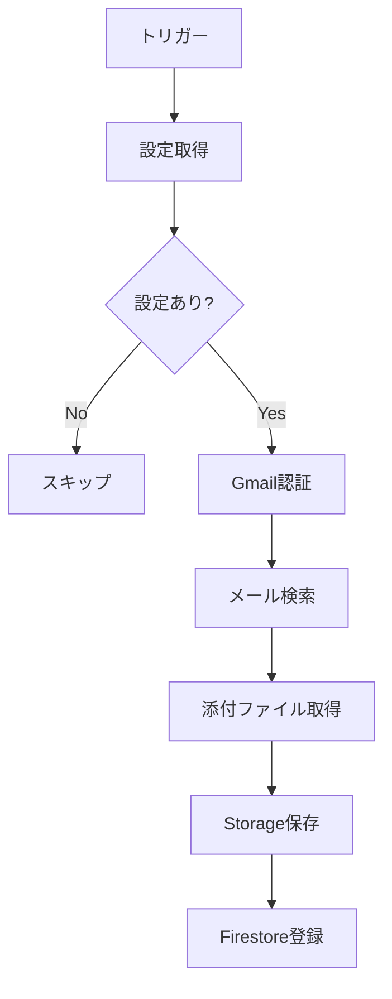
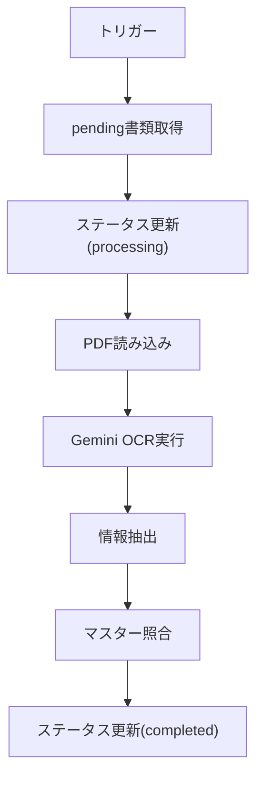

# API/Functions リファレンス

## Cloud Functions

### Scheduled Functions

#### checkGmailAttachments

Gmail添付ファイルを取得してFirestoreに登録する。

| 項目 | 値 |
|------|-----|
| トリガー | Cloud Scheduler (5分間隔) |
| リージョン | asia-northeast1 |
| タイムアウト | 540秒 |
| メモリ | 512MB |

**処理フロー:**


#### processOCR

未処理書類のOCR処理を実行する。

| 項目 | 値 |
|------|-----|
| トリガー | Cloud Scheduler (5分間隔) |
| リージョン | asia-northeast1 |
| タイムアウト | 540秒 |
| メモリ | 1GB |

**処理フロー:**


**レート制限:**
- トークンバケット方式
- 60 RPM (Gemini API制限)

### Callable Functions

#### detectSplitPoints

PDF分割候補を検出する。

**リクエスト:**
```typescript
{
  documentId: string;  // 対象書類ID
}
```

**レスポンス:**
```typescript
{
  splitPoints: Array<{
    pageNumber: number;      // 分割開始ページ
    confidence: number;      // 信頼度 (0-1)
    reason: string;          // 分割理由
    detectedCustomer?: string;
    detectedDocType?: string;
  }>;
  totalPages: number;
}
```

#### splitPdf

PDFを分割する。

**リクエスト:**
```typescript
{
  documentId: string;
  segments: Array<{
    startPage: number;
    endPage: number;
    customerName?: string;
    documentType?: string;
  }>;
}
```

**レスポンス:**
```typescript
{
  success: boolean;
  newDocumentIds: string[];
}
```

#### rotatePdfPages

PDFページを回転する。

**リクエスト:**
```typescript
{
  documentId: string;
  rotations: Array<{
    pageNumber: number;
    degrees: 90 | 180 | 270;
  }>;
}
```

**レスポンス:**
```typescript
{
  success: boolean;
}
```

## ユーティリティ関数

### textNormalizer.ts

テキスト正規化ユーティリティ。

```typescript
// 全角→半角変換
normalizeFullWidth(text: string): string

// 和暦→西暦変換
convertWarekiToSeireki(text: string): string

// 日付候補抽出
extractDateCandidates(text: string): Date[]
```

### extractors.ts

情報抽出ユーティリティ。

```typescript
// 顧客名抽出
extractCustomerCandidates(
  text: string,
  customers: Customer[]
): CustomerCandidate[]

// 書類種別抽出
extractDocumentType(
  text: string,
  docTypes: DocumentType[]
): string | null

// 事業所抽出
extractOffice(
  text: string,
  offices: Office[]
): string | null
```

### fileNaming.ts

ファイル名生成ユーティリティ。

```typescript
// ファイル名生成
generateFileName(params: {
  customerName: string;
  documentType: string;
  fileDate: Date;
  officeName?: string;
}): string

// ファイル名パース
parseFileName(fileName: string): ParsedFileName
```

### pdfAnalyzer.ts

PDF分析ユーティリティ。

```typescript
// ページ単位分析
analyzePages(pdfBuffer: Buffer): PageAnalysis[]

// 分割候補生成
detectSplitCandidates(
  pages: PageAnalysis[]
): SplitCandidate[]
```

## エラーコード

| コード | 説明 | 対処 |
|--------|------|------|
| `AUTH_ERROR` | Gmail認証エラー | OAuth再設定 |
| `RATE_LIMIT` | Gemini API制限 | 時間を置いて再試行 |
| `OCR_FAILED` | OCR処理失敗 | 手動でメタ情報入力 |
| `PDF_CORRUPT` | PDF破損 | 元ファイル確認 |
| `STORAGE_ERROR` | Storage操作失敗 | 権限確認 |
| `FIRESTORE_ERROR` | Firestore操作失敗 | 権限確認 |

## 環境変数/シークレット

### Secret Manager

| シークレット名 | 説明 |
|----------------|------|
| gmail-oauth-client-id | OAuth クライアントID |
| gmail-oauth-client-secret | OAuth クライアントシークレット |
| gmail-oauth-refresh-token | リフレッシュトークン |

### 設定値（Firestore settings/app）

| キー | 型 | 説明 |
|------|-----|------|
| targetLabels | string[] | 監視対象ラベル |
| labelSearchOperator | string | AND/OR |
| gmailAccount | string | 監視Gmail |
| errorNotificationEmails | string[] | 通知先 |
