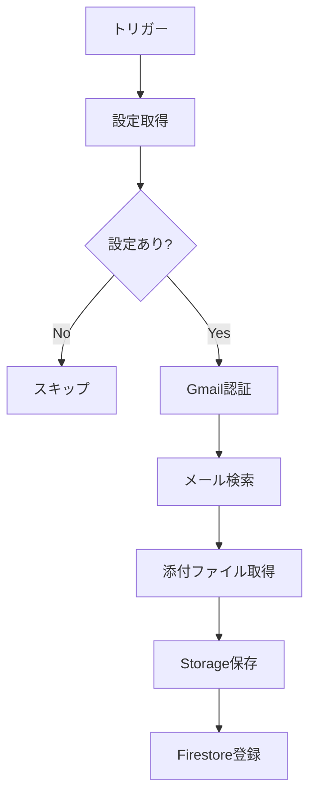
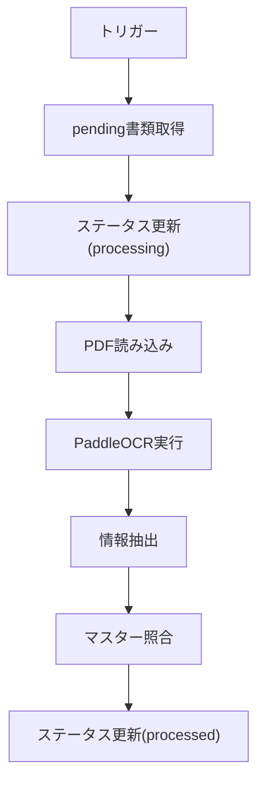

# API/Functions リファレンス

## Cloud Functions

### Scheduled Functions

#### checkGmailAttachments

Gmail添付ファイルを取得してFirestoreに登録する。

| 項目 | 値 |
|------|-----|
| トリガー | Cloud Scheduler (5分間隔) |
| リージョン | asia-northeast1 |
| タイムアウト | 300秒 |
| メモリ | 512MB |

**処理フロー:**

```mermaid
flowchart TD
    A["トリガー"] --> B["設定取得"]
    B --> C{"設定あり?"}
    C -->|No| D["スキップ"]
    C -->|Yes| E["Gmail認証"]
    E --> F["メール検索"]
    F --> G["添付ファイル取得"]
    G --> H["Storage保存"]
    H --> I["Firestore登録"]
```

#### processOCR

未処理書類のOCR処理を実行する。

| 項目 | 値 |
|------|-----|
| トリガー | Cloud Scheduler (1分間隔) |
| リージョン | asia-northeast1 |
| タイムアウト | 900秒（ADR-0023） |
| メモリ | 1GB |

**ポーリング方式（ADR-0010）**: 1分間隔のスケジューラで未処理書類を取得し、OCR処理を実行します。transientエラー（429/503/timeout）はretryCount管理で自動リトライ（非429は最大5回、429/quotaは最大8回、ADR-0017）、processingスタック（20分超過）は自動リセットされます。

**処理フロー:**

```mermaid
flowchart TD
    A["トリガー"] --> B["pending書類取得"]
    B --> C["ステータス更新(processing)"]
    C --> D["PDF読み込み"]
    D --> E["PaddleOCR実行"]
    E --> F["情報抽出"]
    F --> G["マスター照合"]
    G --> H["ステータス更新(processed)"]
```

**同時実行:**
- OCR処理は1分ごとのスケジュール実行（processOCR、同時1件）。外部AIのレート制限用のトークンバケットは、Gemini廃止（ADR-0029）に伴い廃止した

#### generateSummaryBatch

AI要約の依頼を非同期に処理する（ADR-0027）。

| 項目 | 値 |
|------|-----|
| トリガー | Cloud Scheduler (1分間隔) |
| リージョン | asia-northeast1 |
| タイムアウト | 1800秒 |
| メモリ | 512MB |

`regenerateSummary` で受け付けた依頼（`summaryState: pending`）を、自前ホスティングのSarashina（Cloud Run）で順に生成し、結果を書類へ保存する。要約は手動依頼が基本で、`settings/features.autoSummaryOnOcr` が有効な環境に限り、OCR完了後の自動依頼分も処理する。

#### driveExportScheduled

Google Driveエクスポートの定期リトライ（ADR-0022）。

| 項目 | 値 |
|------|-----|
| トリガー | Cloud Scheduler (15分間隔) |
| リージョン | asia-northeast1 |
| タイムアウト | 540秒 |

`driveExportStatus` が `error` の書類、または `exporting` のまま長時間滞留した書類を再エンキューする（outboxパターンのクラッシュ回復）。

#### driveFolderClaimDivergentSweep

Driveフォルダのclaimのうち、人手での解決が必要な状態（`divergent`）で滞留しているものを日次で観測する（Issue #871）。

| 項目 | 値 |
|------|-----|
| トリガー | Cloud Scheduler (24時間間隔) |
| リージョン | asia-northeast1 |
| タイムアウト | 60秒 |

`divergent` の件数と最古の滞留時間を構造化ログ（`event: claimDivergentBacklog`）に出力する。3日を超える滞留があれば警告ログを追加で出力し、ログベースメトリクスのアラートを発火させる。

### Callable Functions

#### 認証・権限レベル一覧

| 関数 | 認証 | ホワイトリスト | adminロール |
|------|:----:|:----:|:----:|
| detectSplitPoints | ✅ | ✅ | - |
| splitPdf | ✅ | ✅ | - |
| rotatePdfPages | ✅ | ✅ | - |
| uploadPdf | ✅ | ✅ | - |
| getOcrText | ✅ | ✅ | - |
| regenerateSummary | ✅ | ✅ | - |
| searchDocuments | ✅ | ✅ | - |
| addMasterAlias | ✅ | ✅ | ✅ |
| removeMasterAlias | ✅ | ✅ | ✅ |
| deleteDocument | ✅ | ✅ | - |
| exchangeGmailAuthCode | ✅ | ✅ | ✅ |
| exchangeDriveAuthCode | ✅ | ✅ | ✅ |
| retryDriveExport | ✅ | ✅ | ✅ |

- **認証**: Firebase Authentication（`request.auth`チェック）
- **ホワイトリスト**: `users/{uid}`ドキュメント存在確認
- **adminロール**: `users/{uid}.role === 'admin'`確認

**管理者向けの呼び出し型関数（上表で adminロール ✅ のもの）:**
- `exchangeGmailAuthCode`: Gmail OAuthの認証コードをrefresh_tokenに交換し、Secret Managerへ保存する（設定画面のGmail連携）
- `exchangeDriveAuthCode`: Google Driveの認証コードを同様に交換して保存する。Gmail連携とは認証情報・接続先が独立（ADR-0022）
- `retryDriveExport`: `driveExportStatus` が `error` の書類のDriveエクスポートを手動で再実行する（エラー一覧画面の「リトライ」ボタン）

#### detectSplitPoints

PDF分割候補を検出する。

**権限:** ホワイトリスト登録ユーザー

**リクエスト:**
```typescript
{
  documentId: string;  // 対象書類ID
}
```

**レスポンス:**
```typescript
{
  splitPoints: Array<{
    pageNumber: number;      // 分割開始ページ
    confidence: number;      // 信頼度 (0-1)
    reason: string;          // 分割理由
    detectedCustomer?: string;
    detectedDocType?: string;
  }>;
  totalPages: number;
}
```

#### splitPdf

PDFを分割する。

**権限:** ホワイトリスト登録ユーザー

**リクエスト:**
```typescript
{
  documentId: string;
  segments: Array<{
    startPage: number;
    endPage: number;
    customerName?: string;
    documentType?: string;
  }>;
}
```

**レスポンス:**
```typescript
{
  success: boolean;
  newDocumentIds: string[];
}
```

#### rotatePdfPages

PDFページを回転する。

**権限:** ホワイトリスト登録ユーザー

**リクエスト:**
```typescript
{
  documentId: string;
  rotations: Array<{
    pageNumber: number;
    degrees: 90 | 180 | 270;
  }>;
}
```

**レスポンス:**
```typescript
{
  success: boolean;
}
```

#### uploadPdf

ローカルPDFファイルをアップロードする。

**権限:** ホワイトリスト登録ユーザー

**リクエスト:**
```typescript
{
  fileName: string;      // ファイル名
  fileData: string;      // Base64エンコードされたPDFデータ
  fileSize: number;      // ファイルサイズ（バイト）
}
```

**レスポンス:**
```typescript
{
  success: boolean;
  documentId: string;    // 作成されたドキュメントID
}
```

**重複チェック:**
- ファイル名ベースで重複を検出
- 重複時は別名保存を提案（例: `file.pdf` → `file_2.pdf`）
- `isSplitSource=true` のファイルは重複チェック対象外

#### deleteDocument

ドキュメントを削除する（ホワイトリスト登録済みユーザーが実行可能、Issue #1037）。

**リクエスト:**
```typescript
{
  documentId: string;    // 削除対象のドキュメントID
}
```

**レスポンス:**
```typescript
{
  success: boolean;
}
```

**権限:** ホワイトリスト登録済み（`users/{uid}` が存在する）ユーザーのみ実行可能

### Firestore Trigger Functions

#### onDocumentWrite

ドキュメント変更時にグループキーを自動設定し、`documentGroups` コレクションの集計を更新する。

| 項目 | 値 |
|------|-----|
| トリガー | Firestore `onDocumentWritten` (`documents/{docId}`) |
| 認証 | 不要（内部トリガー） |

**処理内容:**
- ドキュメントの `customerKey` / `officeKey` / `documentTypeKey` / `careManagerKey` を正規化・自動設定
- `documentGroups` コレクションのカウント・プレビューを再集計

#### onDocumentWriteSearchIndex

ドキュメント変更時に検索インデックスを自動更新する。

| 項目 | 値 |
|------|-----|
| トリガー | Firestore `onDocumentWritten` (`documents/{docId}`) |
| 認証 | 不要（内部トリガー） |

**処理内容:**
- ドキュメント作成/更新時: `search_index` コレクションの反転インデックスを更新
- ドキュメント削除時: 該当インデックスエントリを削除

#### onDocumentWriteDriveExport

書類が確認済みになった時点で、Google Driveへ自動エクスポートする（ADR-0022）。

| 項目 | 値 |
|------|-----|
| トリガー | Firestore `onDocumentWritten` (`documents/{docId}`) |
| 認証 | 不要（内部トリガー） |

**処理内容:**
- `verified` が false→true になった時点（確認ボタン押下）で、feature flagと許可リストを確認し、対象ならエクスポートする。対象外なら何も書き込まない
- outboxパターン（`driveExportStatus`: フィールド不在 → `exporting` → `exported` / `error`）。二重実行は、単一トランザクションでのクレームで防ぐ（確認ボタンの二重タップ等）
- 失敗・滞留分は `driveExportScheduled` が再試行し、`error` は `retryDriveExport` で手動再実行できる

#### onCustomerMasterWrite

顧客マスターの担当ケアマネ名の変更を、該当顧客の書類へ反映する。

| 項目 | 値 |
|------|-----|
| トリガー | Firestore `onDocumentWritten` (`masters/customers/items/{customerId}`) |
| 認証 | 不要（内部トリガー） |

**処理内容:**
- 顧客マスターの `careManagerName` が変更されたとき、該当顧客の全書類の `careManager` と `careManagerKey` を更新する

### セットアップ用 HTTP Functions

初回テナントセットアップ時に `setup-tenant.sh` から呼び出される関数群。通常運用では使用しない。

#### initTenantSettings

テナント初期設定を作成する。

| 項目 | 値 |
|------|-----|
| トリガー | HTTP (`onRequest`) |
| 認証 | なし（初回限定ガード: `settings/auth` 存在時は403拒否） |

**レスポンス:**
```typescript
{ success: boolean; message: string; settings: object }
```

#### registerAdminUser

管理者ユーザーを登録する。

| 項目 | 値 |
|------|-----|
| トリガー | HTTP (`onRequest`) |
| 認証 | なし（初回限定ガード: 既存adminユーザー存在時は403拒否） |
| パラメータ | `?uid=<string>&email=<string>` (クエリ) |

**レスポンス:**
```typescript
{ success: boolean; message: string }
```

#### seedDocumentMasters

書類種別マスターデータをシードする（開発/デモ用）。

| 項目 | 値 |
|------|-----|
| トリガー | HTTP (`onRequest`) |
| 認証 | HTTP認証（Identity Token） |

**レスポンス:**
```typescript
{ success: boolean; message: string; count: number }
```

#### seedAllMasters

全マスターデータ（書類種別/顧客/事業所/ケアマネ）をシードする（開発/デモ用）。

| 項目 | 値 |
|------|-----|
| トリガー | HTTP (`onRequest`) |
| 認証 | HTTP認証（Identity Token） |

**レスポンス:**
```typescript
{ success: boolean; results: { documents: number; customers: number; offices: number; caremanagers: number } }
```

## ユーティリティ関数

### textNormalizer.ts

テキスト正規化ユーティリティ。

```typescript
// 全角→半角変換
normalizeFullWidth(text: string): string

// 和暦→西暦変換
convertWarekiToSeireki(text: string): string

// 日付候補抽出
extractDateCandidates(text: string): Date[]
```

### extractors.ts

情報抽出ユーティリティ。

```typescript
// 顧客名抽出
extractCustomerCandidates(
  text: string,
  customers: Customer[]
): CustomerCandidate[]

// 書類種別抽出
extractDocumentType(
  text: string,
  docTypes: DocumentType[]
): string | null

// 事業所抽出
extractOffice(
  text: string,
  offices: Office[]
): string | null
```

### fileNaming.ts

ファイル名生成ユーティリティ。

```typescript
// ファイル名生成
generateFileName(params: {
  customerName: string;
  documentType: string;
  fileDate: Date;
  officeName?: string;
}): string

// ファイル名パース
parseFileName(fileName: string): ParsedFileName
```

### pdfAnalyzer.ts

PDF分析ユーティリティ。

```typescript
// ページ単位分析
analyzePages(pdfBuffer: Buffer): PageAnalysis[]

// 分割候補生成
detectSplitCandidates(
  pages: PageAnalysis[]
): SplitCandidate[]
```

## エラーコード

| コード | 説明 | 対処 |
|--------|------|------|
| `AUTH_ERROR` | Gmail認証エラー | OAuth再設定 |
| `RATE_LIMIT` | OCR処理サービスの一時的な混雑 | 時間を置いて再試行 |
| `OCR_FAILED` | OCR処理失敗 | 手動でメタ情報入力 |
| `PDF_CORRUPT` | PDF破損 | 元ファイル確認 |
| `STORAGE_ERROR` | Storage操作失敗 | 権限確認 |
| `FIRESTORE_ERROR` | Firestore操作失敗 | 権限確認 |

## 環境変数/シークレット

### Secret Manager

| シークレット名 | 説明 |
|----------------|------|
| gmail-oauth-client-id | OAuth クライアントID |
| gmail-oauth-client-secret | OAuth クライアントシークレット |
| gmail-oauth-refresh-token | リフレッシュトークン |

### 設定値（Firestore settings/app）

| キー | 型 | 説明 |
|------|-----|------|
| targetLabels | string[] | 監視対象ラベル |
| labelSearchOperator | string | AND/OR |
| gmailAccount | string | 監視Gmail |
| errorNotificationEmails | string[] | 通知先 |
