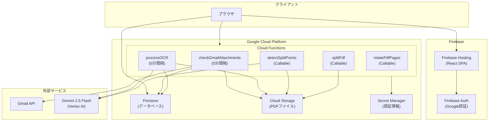
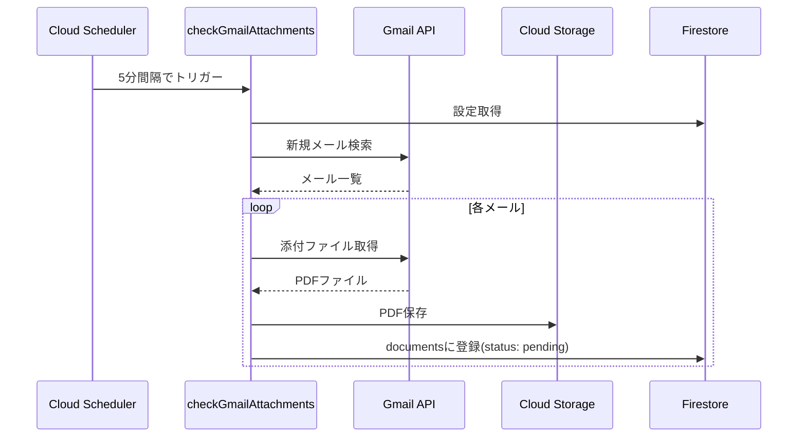
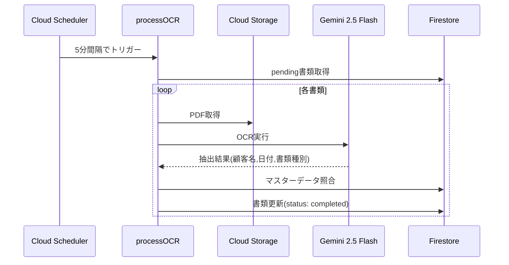
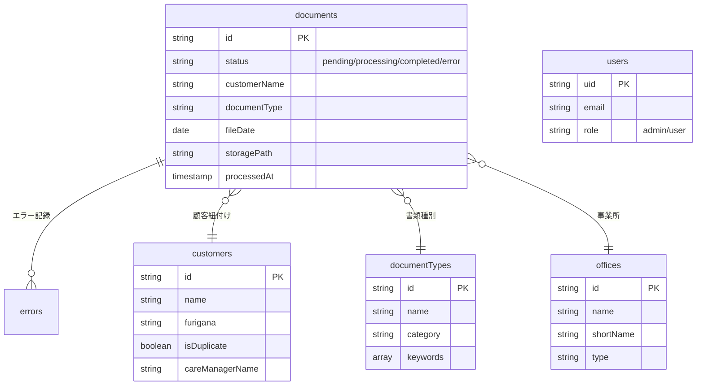
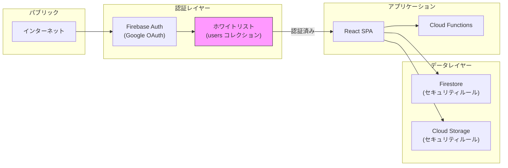

# アーキテクチャ

## システム全体構成

## データフロー

### 書類取得フロー

### OCR処理フロー

## コンポーネント詳細

### Cloud Functions

| 関数名 | トリガー | 説明 |
|--------|----------|------|
| `checkGmailAttachments` | Scheduled (5分) | Gmail添付ファイル取得 |
| `processOCR` | Scheduled (5分) | AI OCR処理 |
| `detectSplitPoints` | Callable | PDF分割候補検出 |
| `splitPdf` | Callable | PDF分割実行 |
| `rotatePdfPages` | Callable | PDFページ回転 |
| `regenerateSummary` | Callable | AI要約再生成 |
| `searchDocuments` | Callable | 全文検索（日付パース対応） |
| `onDocumentWriteSearchIndex` | Trigger | 検索インデックス自動更新 |

### Firestore コレクション

## セキュリティ設計

## インフラ構成

| リソース | 設定 |
|----------|------|
| リージョン | `asia-northeast1` (東京) |
| Functions | 2nd gen, Node.js 22 |
| Firestore | Native mode |
| Storage | Standard |
| Hosting | Firebase Hosting |
