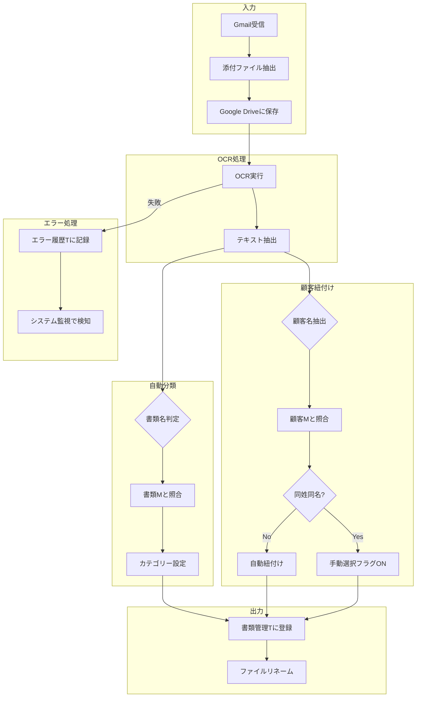

# ビジネスロジック概要

## メインワークフロー



## 主要アクション一覧（30個）

### ファイル操作系
| アクション名 | 機能 | トリガー |
|-------------|------|----------|
| Open File (ファイルURL) | Google Driveファイルを開く | ユーザー操作 |
| ファイル名を変更 | 書類名+顧客名でリネーム | 自動/手動 |
| リネーム true | リネーム実行 | 条件成立時 |
| リネーム false | リネームスキップ | 条件不成立時 |
| 新しいファイル名を上書き | ファイル名更新 | リネーム後 |
| PDF回転 | PDF向き補正 | ユーザー操作 |

### OCR処理系
| アクション名 | 機能 | トリガー |
|-------------|------|----------|
| 再読み込み | OCR再実行 | ユーザー操作 |
| 再取得 | メール添付から再取得 | エラー復旧時 |
| 別ページ情報追加 | 複数ページ処理 | 自動 |

### データ操作系
| アクション名 | 機能 | 対象テーブル |
|-------------|------|-------------|
| Add | レコード追加 | 書類管理T |
| Edit | レコード編集 | 書類管理T |
| Delete | レコード削除 | 書類管理T |
| 当レコードを削除 | 処理済みレコード削除 | Process系 |

## 外部連携（GAS）

AppSheetからGoogle Apps Script (GAS) を呼び出して処理：

| 処理名 | 機能 | 呼び出し元 |
|--------|------|-----------|
| OCR対象書類フォルダーに移動 | ファイル移動 | OCR再読み込み準備 |
| 回転処理 | PDF向き変更 | PDF向き変更アクション |
| メールの添付ファイルから再取得 | ファイル再取得 | 再取得アクション |

## 判定ロジック

### 書類名判定
```
1. OCR結果テキストを取得
2. テキスト先頭200文字を検索範囲とする（DOCUMENT_NAME_SEARCH_RANGE_CHARS）
3. 書類Mの各書類名パターンと照合
4. マッチした書類名を設定
5. マッチなし → "未判定" を設定
```

### 顧客紐付け
```
1. OCR結果から顧客名候補を抽出
2. 顧客Mの顧客氏名と照合（類似度閾値: 70%）
3. 完全一致 → 自動紐付け
4. 同姓同名あり → フラグON、手動選択を促す
5. マッチなし → "不明顧客" を設定
```

### 事業所紐付け
```
1. OCR結果から事業所名候補を抽出
2. 事業所Mの事業所名と照合（類似度閾値: 70%）
3. マッチ → 自動設定
4. マッチなし → "未判定" を設定
```

### 日付抽出
```
1. 書類Mの日付マーカー（例: "発行日"）を取得
2. OCRテキスト内でマーカーを検索
3. マーカー後50文字以内から日付パターンを抽出（DATE_MARKER_SEARCH_RANGE_CHARS）
4. YYYY/MM/DD形式に正規化
```

## 設定値（元システムからの抽出）

| 定数名 | 値 | 説明 |
|--------|-----|------|
| CUSTOMER_SIMILARITY_THRESHOLD | 70 | 顧客名・事業所名の類似度閾値（0-100） |
| DOCUMENT_NAME_SEARCH_RANGE_CHARS | 200 | 書類名検索時のOCRテキスト先頭文字数 |
| DATE_MARKER_SEARCH_RANGE_CHARS | 50 | 日付マーカー後の検索文字数 |
| STATUS_UNDETERMINED | "未判定" | 未識別情報の代替文字列 |
| FILE_NAME_UNKNOWN_DOCUMENT | "不明文書" | 不明書類の代替文字列 |
| FILE_NAME_UNKNOWN_CUSTOMER | "不明顧客" | 不明顧客の代替文字列 |

## ファイル命名規則

```
[YYYYMMDD]_[顧客名]_[事業所名]_[書類名]_[ファイルID先頭8文字].[拡張子]
```

**例**: `20250115_山田太郎_東京事業所_請求書_a1b2c3d4.pdf`

**サニタイズルール**:
- 禁止文字（`\ / : * ? " < > |`）→ `_` に置換
- 全角・半角スペース → `_` に置換
- 連続アンダースコア → 単一に統合
- 先頭・末尾アンダースコア → 削除
- 事業所名「未判定」の場合 → ファイル名に含めない

## GCP移行時の実装方針

| 元の仕組み | GCP実装案 |
|-----------|----------|
| AppSheet自動化 | Cloud Functions + Cloud Scheduler |
| GAS連携 | Cloud Functions (Node.js/Python) |
| Gmail監視 | Gmail API + Pub/Sub |
| OCR処理 | **Vertex AI Gemini 2.5 Flash** (asia-northeast1) |
| ファイル操作 | Cloud Storage |

> **Note**: OCRはCloud Vision APIではなくGemini 2.5 Flashを採用。
> AI OCRとして高精度、書類分類も同時に可能。詳細は `adr/0001-tech-stack-selection.md` 参照。

## 参照
- 詳細アクション定義: `reference/sections/03_behavior.md`
- OCRカラム詳細: `reference/sections/01_data.md` (書類管理T)
