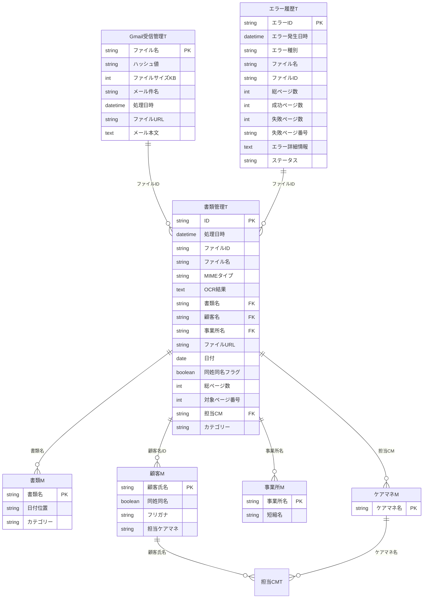

# データモデル概要

## テーブル分類

| 分類 | テーブル数 | 説明 |
|------|-----------|------|
| マスタ（M） | 4 | 書類・顧客・事業所・ケアマネ |
| トランザクション（T） | 5 | 書類管理・Gmail受信・エラー・保守・担当CM |
| システム | 2 | ユーザー設定・利用者情報 |
| 処理用（Process/Output） | 19 | AppSheet自動化用の中間テーブル |

## ER図（主要テーブル）



## 主要テーブル詳細

### 書類管理T（メインテーブル）
OCR処理結果を格納するトランザクションテーブル。

| カラム | 型 | 説明 | FK先 |
|--------|-----|------|------|
| ID | Text | 主キー | - |
| ファイルID | Text | Google Driveファイル識別子 | - |
| OCR結果 | LongText | OCR読み取りテキスト全文 | - |
| 書類名 | Text | 判定された書類種別 | 書類M |
| 顧客名 | Text | 紐付けられた顧客 | 顧客M |
| 事業所名 | Text | 紐付けられた事業所 | 事業所M |
| 同姓同名フラグ | Boolean | 顧客名が同姓同名の場合True | - |
| 担当CM | Text | 担当ケアマネージャー | ケアマネM |

### 顧客M（顧客マスタ）
顧客情報を管理。OCR結果との照合に使用。

| カラム | 型 | 説明 |
|--------|-----|------|
| 顧客氏名 | Text | 主キー（氏名） |
| 同姓同名 | Boolean | 同姓同名が存在するか |
| フリガナ | Text | カナ表記（照合用） |
| 担当ケアマネ | Text | 担当ケアマネージャー名（optional） |

### 書類M（書類マスタ）
書類種別のマスタ。OCR結果から書類名を判定する際の参照先。

| カラム | 型 | 説明 |
|--------|-----|------|
| 書類名 | Text | 主キー（書類種別名） |
| 日付位置 | Text | 書類内の日付記載位置 |
| カテゴリー | Text | 書類カテゴリ |

## GCP移行時の考慮点

1. **Process/Outputテーブル（19個）**
   - AppSheet自動化専用のため、GCPでは不要
   - Cloud Functions等で処理ロジックとして再実装

2. **外部キー制約**
   - AppSheetは参照整合性が緩い
   - Firestoreではサブコレクションまたはドキュメント参照で実装

3. **OCR結果（LongText）**
   - Firestoreのドキュメントサイズ制限: 1MB
   - 大きなOCR結果はCloud Storageに保存し、URLを参照

## Firestore コレクション設計（案）

```
/documents/{docId}                    # 書類管理T
  - id: string
  - processedAt: timestamp
  - fileId: string
  - fileName: string
  - mimeType: string
  - ocrResult: string                 # 短い場合は直接保存
  - ocrResultUrl: string              # 長い場合はCloud Storage参照
  - documentType: string              # → /masters/documents参照
  - customerName: string              # → /masters/customers参照
  - officeName: string                # → /masters/offices参照
  - fileUrl: string
  - fileDate: timestamp
  - isDuplicateCustomer: boolean
  - allCustomerCandidates: string
  - totalPages: number
  - targetPageNumber: number
  - status: string                    # pending | processed | error

/masters/documents/items/{name}       # 書類M
  - name: string
  - dateMarker: string                # 日付抽出の目印（例: "発行日"）
  - category: string

/masters/customers/items/{id}         # 顧客M
  - name: string
  - isDuplicate: boolean              # 同姓同名フラグ
  - furigana: string
  - careManagerName: string           # 担当ケアマネージャー名（optional）

/masters/offices/items/{name}         # 事業所M
  - name: string
  - shortName: string                 # 短縮名（optional、OCRマッチング用）

/errors/{errorId}                     # エラー履歴T
  - errorId: string
  - errorDate: timestamp
  - errorType: string                 # OCR完全失敗 | OCR部分失敗 | 情報抽出エラー | ファイル処理エラー | システムエラー
  - fileName: string
  - fileId: string
  - totalPages: number
  - successPages: number
  - failedPages: number
  - failedPageNumbers: string[]
  - errorDetails: string
  - fileUrl: string
  - status: string                    # 未対応 | 対応中 | 完了

/gmailLogs/{logId}                    # Gmail受信管理T
  - fileName: string
  - hash: string                      # MD5ハッシュ（重複検知用）
  - fileSizeKB: number
  - emailSubject: string
  - processedAt: timestamp
  - fileUrl: string
  - emailBody: string

/settings/app                         # アプリ設定
  - targetLabels: string[]            # 監視対象Gmailラベル
  - labelSearchOperator: string       # AND | OR
  - errorNotificationEmails: string[]

/users/{uid}                          # ユーザー管理
  - email: string
  - role: string                      # admin | user
  - createdAt: timestamp
  - lastLoginAt: timestamp

/search_index/{tokenId}               # 検索インデックス（反転インデックス）
  - token: string                     # 検索トークン（bi-gram or キーワード）
  - documents: array                  # マッチするドキュメント配列
    - docId: string
    - weight: number                  # フィールド重み（customerName=3, officeName=2等）
    - fields: string[]                # マッチしたフィールド名
  - documentCount: number             # ドキュメント数（IDF計算用）
  - createdAt: timestamp
  - updatedAt: timestamp

/_migrations/{migrationId}            # マイグレーション状態
  - status: string                    # pending | running | completed | failed
  - processedCount: number
  - skippedCount: number
  - errorCount: number
  - completedAt: timestamp
```

## エラー種別定数

| 種別 | 説明 |
|------|------|
| OCR完全失敗 | OCR処理が全ページで失敗 |
| OCR部分失敗 | 一部ページのみ失敗 |
| 情報抽出エラー | OCR成功だが書類名・顧客名抽出失敗 |
| ファイル処理エラー | ファイル移動・リネーム失敗 |
| システムエラー | API障害、認証エラー等 |

## 参照
- 詳細カラム定義: `reference/sections/01_data.md`
- GASソースコード: `reference/gas-source/main-ocr-processor/config.js`
