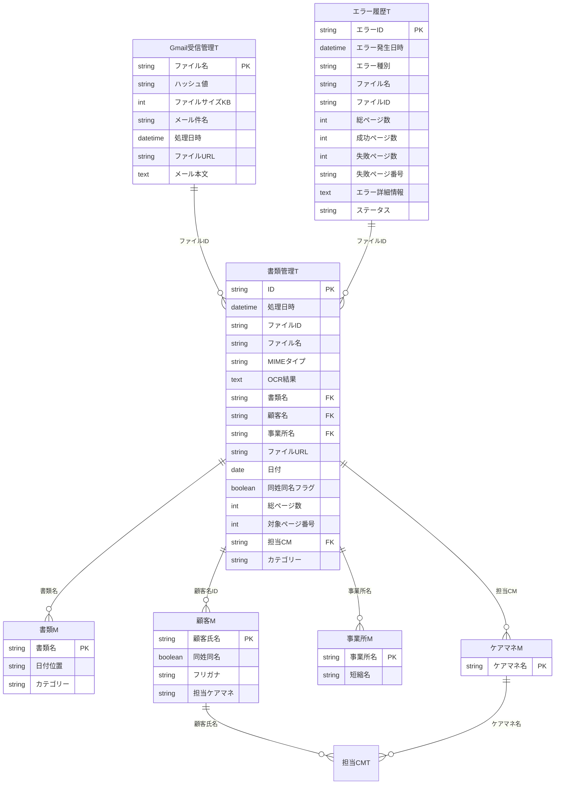

# データモデル概要

DocSplitのデータはすべてCloud Firestoreに格納される。
本ドキュメントは実装コード（`shared/types.ts`、`firestore.rules`、Cloud Functions）を参照元とした正確なスキーマ定義である。

## コレクション一覧

| コレクション | 説明 | 書き込み元 |
|-------------|------|-----------|
| `documents` | 書類管理（メインテーブル） | Cloud Functions / フロントエンド（一部フィールド） |
| `masters/{type}/items` | マスターデータ（documents/customers/offices/caremanagers） | 管理者 |
| `documentGroups` | グループ別集計キャッシュ | Cloud Functions（onDocumentWriteトリガー） |
| `errors` | エラーログ（構造化） | Cloud Functions |
| `notifications` | エラー通知 | Cloud Functions |
| `gmailLogs` | Gmail受信ログ | Cloud Functions |
| `uploadLogs` | アップロードログ | Cloud Functions |
| `users` | ユーザー管理 | Firebase Auth連携 / 管理者 |
| `settings` | アプリ設定（app / auth / gmail） | 管理者 |
| `search_index` | 検索インデックス（反転インデックス + TF-IDF） | Cloud Functions（onDocumentWriteSearchIndexトリガー） |
| `customerResolutionLogs` | 顧客解決監査ログ | フロントエンド |
| `officeResolutionLogs` | 事業所解決監査ログ | フロントエンド |
| `editLogs` | ドキュメント編集監査ログ | フロントエンド |
| `aliasLearningLogs` | エイリアス学習履歴 | Cloud Functions |
| `stats/gemini/daily/{YYYY-MM-DD}` | Gemini API使用量追跡 | Cloud Functions |
| `_migrations` | マイグレーション状態 | Cloud Functions / 管理スクリプト |

---

## /documents/{docId}

書類管理のメインコレクション。Gmail取得またはアップロードで作成され、OCR処理後にメタ情報が付与される。

### 基本情報

| フィールド | 型 | 必須 | 説明 |
|-----------|-----|------|------|
| id | string | Yes | ドキュメントID |
| fileName | string | Yes | ファイル名 |
| fileId | string | Yes | Cloud Storageファイル識別子 |
| mimeType | string | Yes | MIMEタイプ |
| fileUrl | string | Yes | Cloud StorageプレビューURL |
| sourceType | SourceType | No | `gmail` \| `upload` |
| status | DocumentStatus | Yes | `pending` \| `processing` \| `processed` \| `error` \| `split` |
| processedAt | timestamp | Yes | 処理日時 |
| updatedAt | timestamp | No | 最終更新日時 |

### OCR結果

| フィールド | 型 | 必須 | 説明 |
|-----------|-----|------|------|
| ocrResult | string | Yes | OCR全文テキスト（短い場合） |
| ocrResultUrl | string | No | Cloud Storage参照URL（長い場合） |
| summary | string | No | AI生成の要約 |
| ocrExtraction | OcrExtraction | No | OCRフィールド抽出スナップショット（正解フィードバック用） |
| pageResults | PageOcrResult[] | No | ページ単位OCR結果（PDF分割用） |

### 書類情報

| フィールド | 型 | 必須 | 説明 |
|-----------|-----|------|------|
| documentType | string | Yes | 書類種別（`/masters/documents`参照） |
| fileDate | timestamp | Yes | 書類日付（OCR抽出） |
| totalPages | number | Yes | 総ページ数 |
| targetPageNumber | number | Yes | 対象ページ番号 |
| category | string | No | 書類カテゴリ |

### 顧客確定（Phase 7）

| フィールド | 型 | 必須 | 説明 |
|-----------|-----|------|------|
| customerName | string | Yes | 顧客名（表示用） |
| customerId | string \| null | No | 顧客マスターID（「該当なし」選択時はnull） |
| customerCandidates | CustomerCandidateInfo[] | No | 構造化された候補リスト |
| customerConfirmed | boolean | No | 確定済みフラグ（デフォルト: true） |
| confirmedBy | string \| null | No | 確定者UID（システム自動確定時はnull） |
| confirmedAt | timestamp \| null | No | 確定日時（システム自動確定時はnull） |
| isDuplicateCustomer | boolean | Yes | 同姓同名フラグ |
| needsManualCustomerSelection | boolean | No | 後方互換用（Phase 6以前） |

### 事業所確定

| フィールド | 型 | 必須 | 説明 |
|-----------|-----|------|------|
| officeName | string | Yes | 事業所名（表示用） |
| officeId | string \| null | No | 事業所マスターID（「該当なし」選択時はnull） |
| officeCandidates | OfficeCandidateInfo[] | No | 構造化された候補リスト |
| officeConfirmed | boolean | No | 確定済みフラグ（デフォルト: true） |
| officeConfirmedBy | string \| null | No | 確定者UID（システム自動確定時はnull） |
| officeConfirmedAt | timestamp \| null | No | 確定日時（システム自動確定時はnull） |
| suggestedNewOffice | string \| null | No | ファイル名から抽出された事業所名（登録提案用） |

### ケアマネ

| フィールド | 型 | 必須 | 説明 |
|-----------|-----|------|------|
| careManager | string | No | ケアマネ名（顧客マスターから取得） |

### グループ化キー（Phase 8、onDocumentWriteトリガーで自動設定）

| フィールド | 型 | 必須 | 説明 |
|-----------|-----|------|------|
| customerKey | string | No | customerName正規化版 |
| officeKey | string | No | officeName正規化版 |
| documentTypeKey | string | No | documentType正規化版 |
| careManagerKey | string | No | careManager正規化版 |

### OCR確認ステータス

| フィールド | 型 | 必須 | 説明 |
|-----------|-----|------|------|
| verified | boolean | No | 確認済みフラグ（デフォルト: false） |
| verifiedBy | string \| null | No | 確認者UID |
| verifiedAt | timestamp \| null | No | 確認日時 |

### PDF分割・回転

| フィールド | 型 | 必須 | 説明 |
|-----------|-----|------|------|
| splitSuggestions | SplitSuggestion[] | No | 分割候補 |
| splitInto | string[] | No | 分割で生成されたドキュメントIDリスト（元ドキュメントに設定） |
| isSplitSource | boolean | No | 分割元フラグ（重複チェック除外用） |
| parentDocumentId | string | No | 分割元ドキュメントID（子に設定） |
| splitFromPages | {start: number, end: number} | No | 分割元のページ範囲（子に設定） |
| pageRotations | PageRotation[] | No | ページ回転情報（永続保存） |

### エラー情報

| フィールド | 型 | 必須 | 説明 |
|-----------|-----|------|------|
| lastErrorId | string | No | 最新のエラーログID |
| lastErrorMessage | string | No | 最新のエラーメッセージ |

### 編集

| フィールド | 型 | 必須 | 説明 |
|-----------|-----|------|------|
| editedBy | string \| null | No | 編集者UID |
| editedAt | timestamp \| null | No | 編集日時 |

### 検索メタデータ（onDocumentWriteSearchIndexトリガーで自動設定）

| フィールド | 型 | 必須 | 説明 |
|-----------|-----|------|------|
| search.version | number | No | インデックスバージョン |
| search.tokens | string[] | No | トークンリスト |
| search.tokenHash | string | No | トークンハッシュ（変更検知用） |
| search.indexedAt | timestamp | No | インデックス日時 |

### Firestoreセキュリティルール

- **read**: ホワイトリスト登録ユーザー
- **create**: Cloud Functionsのみ（サービスアカウント経由、ルール適用外）
- **update**: ホワイトリスト登録ユーザー（許可フィールドのみ: 顧客/事業所解決、OCR編集、確認ステータス、再処理）
- **delete**: 管理者のみ

---

## /masters/{type}/items/{id}

マスターデータ。`type` は `documents` | `customers` | `offices` | `caremanagers` の4種。

### 共通フィールド

| フィールド | 型 | 必須 | 説明 |
|-----------|-----|------|------|
| name | string | Yes | 名称 |
| aliases | string[] | No | 許容される別表記（エイリアス学習で追加） |
| createdAt | timestamp | No | 作成日時 |
| updatedAt | timestamp | No | 更新日時 |

### documents（書類種別）

| フィールド | 型 | 必須 | 説明 |
|-----------|-----|------|------|
| dateMarker | string | Yes | 日付抽出の目印（例: "発行日"） |
| category | string | Yes | 書類カテゴリ |
| keywords | string[] | No | 照合用キーワード（例: ["被保険者証", "介護保険"]） |

### customers（顧客）

| フィールド | 型 | 必須 | 説明 |
|-----------|-----|------|------|
| isDuplicate | boolean | Yes | 同姓同名フラグ |
| furigana | string | Yes | ふりがな（照合用） |
| careManagerName | string | No | 担当ケアマネジャー名 |
| notes | string | No | 区別用補足情報（例: "北名古屋在住"） |

### offices（事業所）

| フィールド | 型 | 必須 | 説明 |
|-----------|-----|------|------|
| isDuplicate | boolean | Yes | 同名フラグ |
| shortName | string | No | 短縮名（OCR照合用） |
| nameKey | string | No | 正規化キー（検索用） |
| notes | string | No | 区別用補足情報（例: "東部"） |

### caremanagers（ケアマネ）

| フィールド | 型 | 必須 | 説明 |
|-----------|-----|------|------|
| email | string | No | メールアドレス（Google Workspace） |
| notes | string | No | 補足情報 |

### Firestoreセキュリティルール

- **read**: ホワイトリスト登録ユーザー
- **write**: 管理者のみ

---

## /documentGroups/{groupId}

グループ別集計キャッシュ。`onDocumentWrite` トリガーで自動更新される。

groupId = `{groupType}_{groupKey}`（例: `customer_やまだたろう`）

| フィールド | 型 | 必須 | 説明 |
|-----------|-----|------|------|
| id | string | Yes | `{groupType}_{groupKey}` |
| groupType | GroupType | Yes | `customer` \| `office` \| `documentType` \| `careManager` |
| groupKey | string | Yes | 正規化キー |
| displayName | string | Yes | 表示名（元の値） |
| count | number | Yes | グループ内ドキュメント数 |
| latestAt | timestamp | Yes | 最新処理日時 |
| latestDocs | GroupPreviewDoc[] | Yes | プレビュー用（最新3件: {id, fileName, documentType, processedAt}） |
| updatedAt | timestamp | Yes | 集計更新日時 |

### Firestoreセキュリティルール

- **read**: ホワイトリスト登録ユーザー
- **write**: Cloud Functionsのみ

---

## /errors/{errorId}

構造化されたエラーログ。`errorLogger.ts` で記録される。

| フィールド | 型 | 必須 | 説明 |
|-----------|-----|------|------|
| id | string | Yes | エラーログID |
| createdAt | timestamp | Yes | 発生日時 |
| category | ErrorCategory | Yes | `transient` \| `recoverable` \| `fatal` \| `data` |
| severity | ErrorSeverity | Yes | `info` \| `warning` \| `error` \| `critical` |
| source | ErrorSource | Yes | `gmail` \| `ocr` \| `pdf` \| `storage` \| `auth` |
| functionName | string | Yes | 発生した関数名 |
| documentId | string | No | 関連ドキュメントID |
| fileId | string | No | 関連ファイルID |
| errorCode | string | Yes | エラーコード |
| errorMessage | string | Yes | エラーメッセージ |
| stackTrace | string | No | スタックトレース（開発環境のみ） |
| retryCount | number | Yes | リトライ回数 |
| status | string | Yes | `pending` \| `resolved` \| `ignored` |
| resolution | string | No | 解決方法 |
| resolvedBy | string | No | 解決者 |
| resolvedAt | timestamp | No | 解決日時 |

### Firestoreセキュリティルール

- **read**: ホワイトリスト登録ユーザー
- **write**: 管理者のみ

---

## /notifications/{notificationId}

エラー通知。致命的エラー発生時に `errorLogger.ts` の `sendNotification` で自動作成される。

| フィールド | 型 | 必須 | 説明 |
|-----------|-----|------|------|
| type | string | Yes | 通知タイプ（現在は `error` のみ） |
| errorId | string | Yes | 関連エラーログID |
| source | ErrorSource | Yes | エラー発生源 |
| severity | ErrorSeverity | Yes | 重要度 |
| message | string | Yes | 通知メッセージ |
| createdAt | timestamp | Yes | 作成日時 |
| read | boolean | Yes | 既読フラグ（デフォルト: false） |

---

## /gmailLogs/{logId}

Gmail添付ファイル取得ログ。重複検知用のMD5ハッシュを含む。

| フィールド | 型 | 必須 | 説明 |
|-----------|-----|------|------|
| fileName | string | Yes | ファイル名 |
| hash | string | Yes | MD5ハッシュ（重複検知用） |
| fileSizeKB | number | Yes | ファイルサイズ（KB） |
| emailSubject | string | Yes | メール件名 |
| processedAt | timestamp | Yes | 処理日時 |
| fileUrl | string | Yes | Cloud Storage URL |
| emailBody | string | Yes | メール本文 |

### Firestoreセキュリティルール

- **read**: ホワイトリスト登録ユーザー
- **write**: Cloud Functionsのみ

---

## /uploadLogs/{logId}

手動アップロードのログ。Cloud Functions（`uploadPdf`）で記録される。

| フィールド | 型 | 必須 | 説明 |
|-----------|-----|------|------|
| fileName | string | Yes | 最終ファイル名 |
| originalFileName | string | Yes | 元のファイル名（リネーム前） |
| hash | string | Yes | MD5ハッシュ（重複検知用） |
| fileSizeKB | number | Yes | ファイルサイズ（KB） |
| uploadedAt | timestamp | Yes | アップロード日時 |
| uploadedBy | string | Yes | アップロード者UID |
| uploadedByEmail | string | Yes | アップロード者メールアドレス |
| fileUrl | string | Yes | Cloud Storage URL |

### Firestoreセキュリティルール

- **read**: ホワイトリスト登録ユーザー
- **write**: Cloud Functionsのみ

---

## /users/{uid}

ユーザー管理。ドキュメントIDはFirebase Auth UID。

| フィールド | 型 | 必須 | 説明 |
|-----------|-----|------|------|
| uid | string | Yes | Firebase Auth UID |
| email | string | Yes | メールアドレス |
| displayName | string | No | 表示名 |
| role | UserRole | Yes | `admin` \| `user` |
| createdAt | timestamp | Yes | 作成日時 |
| lastLoginAt | timestamp | Yes | 最終ログイン日時 |

### Firestoreセキュリティルール

- **read（自分）**: 認証済みユーザー（`request.auth.uid == userId`）
- **create（自分）**: 認証済みユーザー（ドメイン許可リストによる自動登録用）
- **read/write（全体）**: 管理者のみ

---

## /settings/{settingId}

アプリケーション設定。3つのサブドキュメントで構成される。

### /settings/app

| フィールド | 型 | 必須 | 説明 |
|-----------|-----|------|------|
| targetLabels | string[] | Yes | 監視対象Gmailラベル |
| targetSenders | string[] | Yes | 監視対象送信元メールアドレス |
| labelSearchOperator | LabelSearchOperator | Yes | `AND` \| `OR` |
| errorNotificationEmails | string[] | Yes | エラー通知先メールアドレス |
| gmailAccount | string | No | 監視対象Gmailアカウント |
| delegatedUserEmail | string | No | Gmail委任対象メールアドレス |

### /settings/auth

| フィールド | 型 | 必須 | 説明 |
|-----------|-----|------|------|
| allowedDomains | string[] | Yes | 自動ログイン許可ドメイン |

### /settings/gmail

Gmail認証方式の設定。`gmailAuth.ts` が参照する。

| フィールド | 型 | 必須 | 説明 |
|-----------|-----|------|------|
| authMode | string | Yes | `oauth` \| `service_account` |
| serviceAccountEmail | string | No | Service Accountメールアドレス（本番環境用） |
| delegatedUserEmail | string | No | 対象Gmailアドレス（本番環境用） |

> OAuth認証情報（clientId, clientSecret, refreshToken）はSecret Managerに保存。Firestoreには格納しない。

### Firestoreセキュリティルール

- **read（settings/auth）**: 認証済みユーザー（ドメイン許可チェック用、users未登録でも可）
- **read（settings/auth以外）**: ホワイトリスト登録ユーザー
- **write**: 管理者のみ

---

## /search_index/{tokenId}

反転インデックス + TF-IDFスコアリング。`onDocumentWriteSearchIndex` トリガーで自動更新。

| フィールド | 型 | 必須 | 説明 |
|-----------|-----|------|------|
| df | number | Yes | ドキュメント頻度（Document Frequency） |
| updatedAt | timestamp | Yes | 最終更新日時 |
| postings | map | Yes | `map<docId, {score, fieldsMask, updatedAt}>` |

**fieldsMask ビットフラグ**:
| ビット | フィールド |
|--------|-----------|
| 1 | customerName |
| 2 | officeName |
| 4 | documentType |
| 8 | fileName |
| 16 | date |

### Firestoreセキュリティルール

- **read**: ホワイトリスト登録ユーザー
- **write**: Cloud Functionsのみ

---

## /customerResolutionLogs/{logId}

顧客解決の監査ログ。フロントエンドで作成され、更新・削除は不可（イミュータブル）。

| フィールド | 型 | 必須 | 説明 |
|-----------|-----|------|------|
| documentId | string | Yes | 対象書類ID |
| previousCustomerId | string \| null | Yes | 変更前の顧客ID（初回確定時はnull） |
| newCustomerId | string \| null | Yes | 変更後の顧客ID（「該当なし」選択時はnull） |
| newCustomerName | string | Yes | 変更後の顧客名（「該当なし」時は"不明顧客"） |
| resolvedBy | string | Yes | 確定者UID |
| resolvedByEmail | string | Yes | 確定者メールアドレス |
| resolvedAt | timestamp | Yes | 確定日時 |
| reason | string | No | 任意のメモ（「該当なし」時は"該当なし選択"） |

### Firestoreセキュリティルール

- **read**: ホワイトリスト登録ユーザー
- **create**: ホワイトリスト登録ユーザー（resolvedBy == 自分のUID）
- **update/delete**: 禁止（監査ログは不変）

---

## /officeResolutionLogs/{logId}

事業所解決の監査ログ。構造は customerResolutionLogs と同等。

| フィールド | 型 | 必須 | 説明 |
|-----------|-----|------|------|
| documentId | string | Yes | 対象書類ID |
| previousOfficeId | string \| null | Yes | 変更前の事業所ID（初回確定時はnull） |
| newOfficeId | string \| null | Yes | 変更後の事業所ID（「該当なし」選択時はnull） |
| newOfficeName | string | Yes | 変更後の事業所名（「該当なし」時は"不明事業所"） |
| resolvedBy | string | Yes | 確定者UID |
| resolvedByEmail | string | Yes | 確定者メールアドレス |
| resolvedAt | timestamp | Yes | 確定日時 |
| reason | string | No | 任意のメモ |

### Firestoreセキュリティルール

- **read**: ホワイトリスト登録ユーザー
- **create**: ホワイトリスト登録ユーザー（resolvedBy == 自分のUID）
- **update/delete**: 禁止（監査ログは不変）

---

## /editLogs/{logId}

ドキュメント編集の監査ログ。フロントエンド（`useDocumentEdit.ts`）で作成。

| フィールド | 型 | 必須 | 説明 |
|-----------|-----|------|------|
| documentId | string | Yes | 対象書類ID |
| fieldName | string | Yes | 編集されたフィールド名 |
| oldValue | string \| null | Yes | 変更前の値 |
| newValue | string \| null | Yes | 変更後の値 |
| editedBy | string | Yes | 編集者UID |
| editedByEmail | string | Yes | 編集者メールアドレス |
| editedAt | timestamp | Yes | 編集日時 |

### Firestoreセキュリティルール

- **read**: ホワイトリスト登録ユーザー
- **create**: ホワイトリスト登録ユーザー（editedBy == 自分のUID）
- **update/delete**: 禁止（監査ログは不変）

---

## /aliasLearningLogs/{logId}

エイリアス学習の履歴ログ。Cloud Functions（`addMasterAlias`）で記録。

| フィールド | 型 | 必須 | 説明 |
|-----------|-----|------|------|
| id | string | Yes | ログID |
| masterType | AliasLearningMasterType | Yes | `office` \| `customer` \| `document` |
| masterId | string | Yes | マスターデータID |
| masterName | string | Yes | マスターデータ名称 |
| alias | string | Yes | 学習されたエイリアス |
| learnedBy | string | Yes | 学習者UID |
| learnedByEmail | string | Yes | 学習者メールアドレス |
| learnedAt | timestamp | Yes | 学習日時 |

### Firestoreセキュリティルール

- **read**: ホワイトリスト登録ユーザー
- **write**: Cloud Functionsのみ

---

## /stats/gemini/daily/{YYYY-MM-DD}

Gemini API使用量の日次追跡。`rateLimiter.ts` の `trackGeminiUsage` で更新（`set` with `merge: true`）。

| フィールド | 型 | 必須 | 説明 |
|-----------|-----|------|------|
| date | string | Yes | 日付（YYYY-MM-DD形式） |
| inputTokens | number | Yes | 入力トークン数（累積） |
| outputTokens | number | Yes | 出力トークン数（累積） |
| requestCount | number | Yes | リクエスト回数（累積） |
| estimatedCostUsd | number | Yes | 推定コスト（USD、累積） |
| updatedAt | timestamp | Yes | 最終更新日時 |

---

## /_migrations/{migrationId}

マイグレーション状態管理。

| フィールド | 型 | 必須 | 説明 |
|-----------|-----|------|------|
| status | string | Yes | `pending` \| `running` \| `completed` \| `failed` |
| processedCount | number | Yes | 処理済み件数 |
| errorCount | number | Yes | エラー件数 |

### Firestoreセキュリティルール

- **read**: 管理者のみ
- **write**: Cloud Functions / 管理スクリプトのみ

---

## 埋め込み型定義

`shared/types.ts` で定義されている主要な埋め込み型。

### OcrExtraction

OCRフィールド抽出スナップショット。正解フィードバック用にOCR処理時の推定結果を保存する。

```typescript
interface OcrExtraction {
  version: string;             // OCRモデルバージョン (例: "gemini-2.5-flash")
  extractedAt: Timestamp;      // 抽出日時
  customer?: OcrFieldExtraction;
  office?: OcrFieldExtraction;
  documentType?: OcrFieldExtraction;
}

interface OcrFieldExtraction {
  suggestedValue: string;      // OCRが提案した値
  suggestedId?: string | null; // マッチしたマスターID
  confidence: number;          // 信頼度スコア (0-100)
  matchType: string;           // exact | partial | fuzzy | none
}
```

### CustomerCandidateInfo

顧客候補情報。processOCRで生成され、同姓同名解決モーダルで表示。

```typescript
interface CustomerCandidateInfo {
  customerId: string;
  customerName: string;
  customerNameKana?: string;
  isDuplicate: boolean;
  officeId?: string;
  officeName?: string;
  careManagerName?: string;
  score: number;               // 類似度スコア (0-100)
  matchType: 'exact' | 'partial' | 'fuzzy';
}
```

### OfficeCandidateInfo

事業所候補情報。processOCRで生成され、同名解決モーダルで表示。

```typescript
interface OfficeCandidateInfo {
  officeId: string;
  officeName: string;
  shortName?: string;
  isDuplicate: boolean;
  score: number;               // 類似度スコア (0-100)
  matchType: 'exact' | 'partial' | 'fuzzy';
}
```

### PageOcrResult / SplitSuggestion / PageRotation

PDF分割・回転に関する型。

```typescript
interface PageOcrResult {
  pageNumber: number;
  text: string;
  detectedDocumentType: string | null;
  detectedCustomerName: string | null;
  detectedOfficeName: string | null;
  detectedDate: Date | null;
  matchScore: number;          // 0-100
  matchType: 'exact' | 'partial' | 'none';
}

interface SplitSuggestion {
  afterPageNumber: number;     // このページの後で分割
  reason: 'new_customer' | 'new_document_type' | 'content_break' | 'manual';
  confidence: number;          // 0-100
  newDocumentType: string | null;
  newCustomerName: string | null;
}

interface PageRotation {
  pageNumber: number;
  rotation: 0 | 90 | 180 | 270;
}
```

---

## 定数（ビジネスロジック設定値）

`shared/types.ts` の `CONSTANTS` で定義。

| 定数名 | 値 | 説明 |
|--------|-----|------|
| CUSTOMER_SIMILARITY_THRESHOLD | 70 | 顧客名・事業所名の類似度閾値（0-100） |
| DOCUMENT_NAME_SEARCH_RANGE_CHARS | 200 | 書類名検索時のOCRテキスト先頭文字数 |
| DATE_MARKER_SEARCH_RANGE_CHARS | 50 | 日付マーカー後の検索文字数 |
| STATUS_UNDETERMINED | '未判定' | 未識別情報の代替文字列 |
| FILE_NAME_UNKNOWN_DOCUMENT | '不明文書' | 不明書類の代替文字列 |
| FILE_NAME_UNKNOWN_CUSTOMER | '不明顧客' | 不明顧客の代替文字列 |

---

## GCP移行時の考慮点

1. **AppSheet Process/Outputテーブル（旧19個）**
   - AppSheet自動化専用のため、GCPでは不要
   - Cloud Functionsの処理ロジックとして再実装済み

2. **外部キー制約**
   - Firestoreでは参照整合性を持たない
   - アプリケーション層（OCR処理・フロントエンド）でマスターデータとの照合を実行

3. **OCR結果（LongText）**
   - Firestoreのドキュメントサイズ制限: 1MB
   - 大きなOCR結果は Cloud Storage に保存し、`ocrResultUrl` で参照

---

## 参照

- 型定義: `shared/types.ts`
- セキュリティルール: `firestore.rules`
- エラーハンドリング: `docs/context/error-handling-policy.md`
- Geminiレート制限: `docs/context/gemini-rate-limiting.md`

---

## AppSheet旧データモデル（アーカイブ）

以下はAppSheet時代のER図。GCPリプレイスにより Firestore スキーマに移行済み。参考資料として残す。

<details>
<summary>AppSheet ER図（クリックで展開）</summary>



</details>
