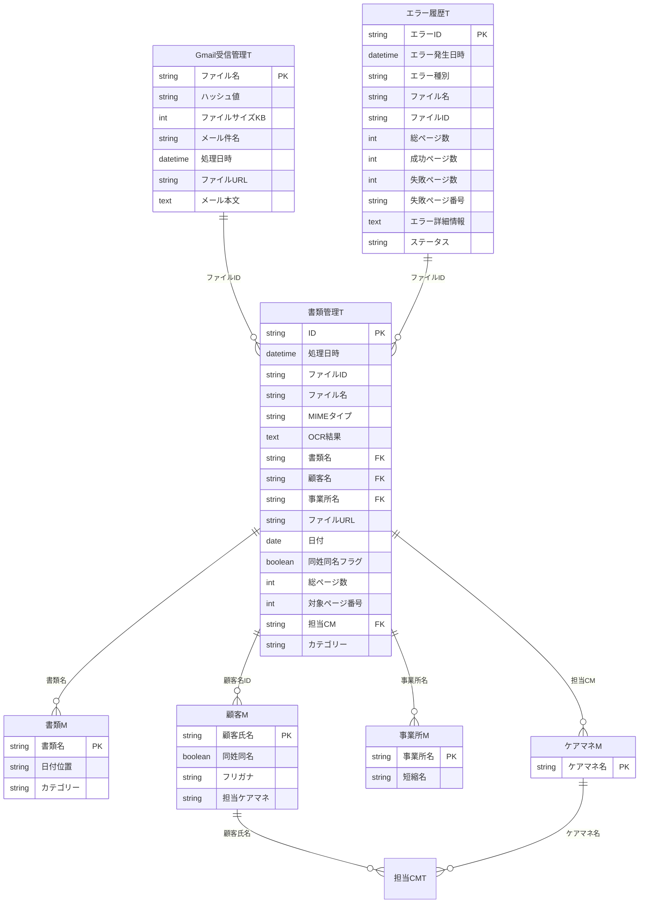

# データモデル概要

## テーブル分類

| 分類 | テーブル数 | 説明 |
|------|-----------|------|
| マスタ（M） | 4 | 書類・顧客・事業所・ケアマネ |
| トランザクション（T） | 5 | 書類管理・Gmail受信・エラー・保守・担当CM |
| システム | 2 | ユーザー設定・利用者情報 |
| 処理用（Process/Output） | 19 | AppSheet自動化用の中間テーブル |

## ER図（主要テーブル）



## 主要テーブル詳細

### 書類管理T（メインテーブル）
OCR処理結果を格納するトランザクションテーブル。

| カラム | 型 | 説明 | FK先 |
|--------|-----|------|------|
| ID | Text | 主キー | - |
| ファイルID | Text | Google Driveファイル識別子 | - |
| OCR結果 | LongText | OCR読み取りテキスト全文 | - |
| 書類名 | Text | 判定された書類種別 | 書類M |
| 顧客名 | Text | 紐付けられた顧客 | 顧客M |
| 事業所名 | Text | 紐付けられた事業所 | 事業所M |
| 同姓同名フラグ | Boolean | 顧客名が同姓同名の場合True | - |
| 担当CM | Text | 担当ケアマネジャー | ケアマネM |

### 顧客M（顧客マスタ）
顧客情報を管理。OCR結果との照合に使用。

| カラム | 型 | 説明 |
|--------|-----|------|
| 顧客氏名 | Text | 主キー（氏名） |
| 同姓同名 | Boolean | 同姓同名が存在するか |
| フリガナ | Text | カナ表記（照合用） |
| 担当ケアマネ | Text | 担当ケアマネジャー名（optional） |

### 書類M（書類マスタ）
書類種別のマスタ。OCR結果から書類名を判定する際の参照先。

| カラム | 型 | 説明 |
|--------|-----|------|
| 書類名 | Text | 主キー（書類種別名） |
| 日付位置 | Text | 書類内の日付記載位置 |
| カテゴリー | Text | 書類カテゴリ |

## GCP移行時の考慮点

1. **Process/Outputテーブル（19個）**
   - AppSheet自動化専用のため、GCPでは不要
   - Cloud Functions等で処理ロジックとして再実装

2. **外部キー制約**
   - AppSheetは参照整合性が緩い
   - Firestoreではサブコレクションまたはドキュメント参照で実装

3. **OCR結果（LongText）**
   - Firestoreのドキュメントサイズ制限: 1MB
   - 大きなOCR結果はCloud Storageに保存し、URLを参照

## Firestore コレクション設計（実装済み）

### コレクション一覧

| コレクション | 説明 |
|-------------|------|
| `documents` | 書類管理（メインテーブル） |
| `masters/{type}/items` | マスターデータ（documents/customers/offices/caremanagers） |
| `documentGroups` | グループ別集計キャッシュ |
| `errors` | エラー履歴 |
| `gmailLogs` | Gmail受信ログ |
| `users` | ユーザー管理 |
| `settings` | アプリ設定 |
| `search_index` | 検索インデックス（反転インデックス） |
| `customerResolutionLogs` | 顧客解決監査ログ |
| `officeResolutionLogs` | 事業所解決監査ログ |
| `editLogs` | ドキュメント編集監査ログ |
| `aliasLearningLogs` | エイリアス学習履歴 |
| `uploadLogs` | アップロードログ |
| `_migrations` | マイグレーション状態 |

### /documents/{docId}（メインテーブル）

```
基本情報:
  - id: string
  - fileName: string
  - fileId: string
  - mimeType: string
  - fileUrl: string                      # Cloud StorageプレビューURL
  - sourceType: string                   # gmail | upload
  - status: string                       # pending | processing | processed | error | split
  - processedAt: timestamp
  - updatedAt: timestamp

OCR結果:
  - ocrResult: string                    # OCR全文（短い場合）
  - ocrResultUrl?: string                # Cloud Storage参照（長い場合）
  - summary?: string                     # AI生成要約
  - ocrExtraction?: object               # OCRフィールド抽出スナップショット
  - pageResults?: array                  # ページ単位OCR結果

書類情報:
  - documentType: string                 # 書類種別 → /masters/documents参照
  - fileDate: timestamp                  # 書類日付（抽出）
  - totalPages: number
  - targetPageNumber: number
  - category?: string

顧客確定:
  - customerName: string                 # 顧客名（表示用）
  - customerId?: string | null           # 顧客マスターID（該当なし=null）
  - customerCandidates?: array           # 候補リスト（{id, name, score, furigana}）
  - customerConfirmed?: boolean          # 確定済みフラグ（デフォルト: true）
  - confirmedBy?: string | null          # 確定者UID
  - confirmedAt?: timestamp | null
  - isDuplicateCustomer: boolean         # 同姓同名フラグ

事業所確定:
  - officeName: string                   # 事業所名（表示用）
  - officeId?: string | null             # 事業所マスターID
  - officeCandidates?: array             # 候補リスト
  - officeConfirmed?: boolean
  - officeConfirmedBy?: string | null
  - officeConfirmedAt?: timestamp | null
  - suggestedNewOffice?: string | null   # 登録提案用

ケアマネ:
  - careManager?: string                 # ケアマネ名（顧客マスターから取得）

グループ化キー（正規化版、onDocumentWriteトリガーで自動設定）:
  - customerKey?: string
  - officeKey?: string
  - documentTypeKey?: string
  - careManagerKey?: string

OCR確認ステータス:
  - verified?: boolean                   # 確認済みフラグ（デフォルト: false）
  - verifiedBy?: string | null           # 確認者UID
  - verifiedAt?: timestamp | null

PDF分割・回転:
  - splitSuggestions?: array             # 分割候補
  - pageRotations?: array               # ページ回転情報（永続保存）
  - parentDocumentId?: string            # 分割元ドキュメントID
  - splitFromPages?: object              # {start, end}

編集:
  - editedBy?: string | null
  - editedAt?: timestamp | null

検索メタデータ（トリガー自動設定）:
  - search?.version: number
  - search?.tokens: string[]
  - search?.tokenHash: string
  - search?.indexedAt: timestamp
```

### /masters/{type}/items/{id}

**type**: documents | customers | offices | caremanagers

```
共通:
  - name: string                         # 名称
  - aliases?: string[]                   # 許容される別表記（エイリアス学習）
  - createdAt?: timestamp
  - updatedAt?: timestamp

documents（書類種別）:
  - dateMarker: string                   # 日付抽出の目印（例: "発行日"）
  - category: string                     # 書類カテゴリ
  - keywords?: string[]                  # 照合用キーワード

customers（顧客）:
  - isDuplicate: boolean                 # 同姓同名フラグ
  - furigana: string                     # ふりがな（照合用）
  - careManagerName?: string             # 担当ケアマネジャー名
  - notes?: string                       # 区別用補足情報

offices（事業所）:
  - shortName?: string                   # 短縮名（OCR照合用）
  - isDuplicate: boolean                 # 同名フラグ
  - nameKey?: string                     # 正規化キー
  - notes?: string                       # 区別用補足情報

caremanagers（ケアマネ）:
  - email?: string                       # メールアドレス（Google Workspace）
  - notes?: string
```

### /documentGroups/{groupId}

groupId = `{groupType}_{groupKey}`（例: `customer_やまだたろう`）

```
  - id: string                           # {groupType}_{groupKey}
  - groupType: string                    # customer | office | documentType | careManager
  - groupKey: string                     # 正規化キー
  - displayName: string                  # 表示名（元の値）
  - count: number                        # グループ内ドキュメント数
  - latestAt: timestamp                  # 最新処理日時
  - latestDocs: array                    # プレビュー用（最新3件）
  - updatedAt: timestamp
```

### その他コレクション

```
/errors/{errorId}
  - errorType: string                    # OCR完全失敗 | OCR部分失敗 | 情報抽出エラー | ファイル処理エラー | システムエラー
  - fileName, fileId, errorDetails, fileUrl, status（未対応|対応中|完了）

/gmailLogs/{logId}
  - fileName, hash（MD5）, emailSubject, processedAt, fileUrl

/users/{uid}
  - email, role（admin|user）, createdAt, lastLoginAt

/settings/app
  - targetLabels: string[], labelSearchOperator（AND|OR）, errorNotificationEmails
/settings/auth
  - allowedDomains: string[]             # 自動ログイン許可ドメイン

/search_index/{tokenId}                  # 反転インデックス + TF-IDF
  - df: number, updatedAt: timestamp
  - postings: map<docId, {score, fieldsMask, updatedAt}>
  # fieldsMask: customerName=1, officeName=2, documentType=4, fileName=8, date=16

/customerResolutionLogs/{logId}          # 顧客解決監査ログ
  - documentId, previousCustomerId, newCustomerId, newCustomerName
  - resolvedBy, resolvedByEmail, resolvedAt, reason?

/officeResolutionLogs/{logId}            # 事業所解決監査ログ
  - documentId, previousOfficeId, newOfficeId, newOfficeName
  - resolvedBy, resolvedByEmail, resolvedAt, reason?

/editLogs/{logId}                        # 編集監査ログ
  - documentId, fieldName, editedBy, editedByEmail

/aliasLearningLogs/{logId}               # エイリアス学習履歴
  - masterType（office|customer|document）, masterId, masterName, alias
  - learnedBy, learnedByEmail, learnedAt

/uploadLogs/{logId}                      # アップロードログ

/_migrations/{migrationId}               # マイグレーション状態
  - status（pending|running|completed|failed）, processedCount, errorCount
```

## エラー種別定数

| 種別 | 説明 |
|------|------|
| OCR完全失敗 | OCR処理が全ページで失敗 |
| OCR部分失敗 | 一部ページのみ失敗 |
| 情報抽出エラー | OCR成功だが書類名・顧客名抽出失敗 |
| ファイル処理エラー | ファイル移動・リネーム失敗 |
| システムエラー | API障害、認証エラー等 |

## 参照
- 詳細カラム定義: `reference/sections/01_data.md`
- GASソースコード: `reference/gas-source/main-ocr-processor/config.js`
