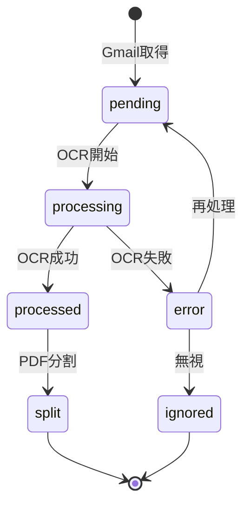

# エラーハンドリングポリシー

## 概要

本ドキュメントでは、DocSplitにおけるエラーの分類、リトライ戦略、ログ記録、通知ルールを定義する。

## 1. エラー分類

### 1.1 エラーカテゴリ

| カテゴリ | 例 | 自動リトライ | 通知 |
|---------|-----|------------|------|
| **Transient** | ネットワークタイムアウト、Rate Limit | ✅ 最大3回 | 3回失敗後 |
| **Recoverable** | OCR精度不足、マスター不一致 | ❌ | ✅ 要確認 |
| **Fatal** | 認証失敗、設定ミス | ❌ | ✅ 即時 |
| **Data** | 不正PDF、ファイル破損 | ❌ | ✅ 要確認 |

### 1.2 詳細定義

#### Transient Errors（一時的エラー）
```typescript
const TRANSIENT_ERRORS = [
  'ETIMEDOUT',           // ネットワークタイムアウト
  'ECONNRESET',          // 接続リセット
  'RESOURCE_EXHAUSTED',  // GCP Rate Limit
  '429',                 // Too Many Requests
  '503',                 // Service Unavailable
  '504',                 // Gateway Timeout
];
```

#### Recoverable Errors（回復可能エラー）
- OCR結果から書類種別を特定できない（マスター不一致）
- 顧客名の信頼度が閾値（70%）未満
- ファイル名生成に必要な情報が不足

#### Fatal Errors（致命的エラー）
- Gmail API認証失敗
- Service Account権限不足
- Firestore接続失敗
- Secret Managerアクセス拒否

#### Data Errors（データエラー）
- PDFファイルが破損
- サポート外のファイル形式
- ファイルサイズ超過（>10MB）

## 2. リトライ戦略

### 2.1 Exponential Backoff

```typescript
interface RetryConfig {
  maxRetries: 3;
  initialDelayMs: 1000;
  maxDelayMs: 30000;
  backoffMultiplier: 2;
}

async function withRetry<T>(
  fn: () => Promise<T>,
  config: RetryConfig = defaultRetryConfig
): Promise<T> {
  let lastError: Error;
  let delay = config.initialDelayMs;

  for (let attempt = 1; attempt <= config.maxRetries; attempt++) {
    try {
      return await fn();
    } catch (error) {
      lastError = error as Error;
      if (!isTransientError(error) || attempt === config.maxRetries) {
        throw error;
      }
      await sleep(Math.min(delay, config.maxDelayMs));
      delay *= config.backoffMultiplier;
    }
  }
  throw lastError!;
}
```

### 2.2 処理別リトライ設定

| 処理 | 最大リトライ | 初期遅延 | 備考 |
|------|------------|---------|------|
| Gmail API | 3 | 1秒 | Rate Limit考慮 |
| Gemini OCR | 2 | 2秒 | コスト考慮で控えめ |
| Storage操作 | 3 | 500ms | 高速リトライ |
| Firestore書込 | 3 | 500ms | 高速リトライ |

## 3. エラーログ記録

### 3.1 Firestoreスキーマ

```typescript
// /errors/{errorId}
interface ErrorLog {
  id: string;
  createdAt: Timestamp;
  resolvedAt?: Timestamp;

  // エラー分類
  category: 'transient' | 'recoverable' | 'fatal' | 'data';
  severity: 'info' | 'warning' | 'error' | 'critical';

  // 発生コンテキスト
  source: 'gmail' | 'ocr' | 'pdf' | 'storage' | 'auth';
  functionName: string;
  documentId?: string;
  fileId?: string;

  // エラー詳細
  errorCode: string;
  errorMessage: string;
  stackTrace?: string;  // 開発時のみ
  retryCount: number;

  // 解決情報
  status: 'pending' | 'resolved' | 'ignored';
  resolution?: string;
  resolvedBy?: string;
}
```

### 3.2 ログ記録関数

```typescript
async function logError(params: {
  error: Error;
  source: ErrorSource;
  functionName: string;
  documentId?: string;
  retryCount?: number;
}): Promise<string> {
  const category = categorizeError(params.error);
  const severity = getSeverity(category);

  const errorDoc: ErrorLog = {
    id: db.collection('errors').doc().id,
    createdAt: admin.firestore.FieldValue.serverTimestamp(),
    category,
    severity,
    source: params.source,
    functionName: params.functionName,
    documentId: params.documentId,
    errorCode: params.error.name || 'UNKNOWN',
    errorMessage: params.error.message,
    retryCount: params.retryCount || 0,
    status: 'pending',
  };

  // 開発環境のみスタックトレース保存
  if (process.env.NODE_ENV !== 'production') {
    errorDoc.stackTrace = params.error.stack;
  }

  await db.doc(`errors/${errorDoc.id}`).set(errorDoc);

  // 通知判定
  if (shouldNotify(category, severity)) {
    await sendNotification(errorDoc);
  }

  return errorDoc.id;
}
```

## 4. 通知ルール

### 4.1 通知条件

| 条件 | 通知先 | 方法 |
|------|-------|------|
| Fatal Error発生 | 管理者 | メール（即時） |
| 同一エラー3回連続 | 管理者 | メール |
| Recoverable Error | 一般ユーザー | アプリ内通知 |
| 日次エラーサマリー | 管理者 | メール（毎朝9時） |

### 4.2 通知実装

```typescript
async function sendNotification(error: ErrorLog): Promise<void> {
  const settings = await getAppSettings();
  const adminEmail = settings.adminEmail;

  if (error.severity === 'critical') {
    // 即時メール通知
    await sendEmail({
      to: adminEmail,
      subject: `[DocSplit] 重大エラー発生: ${error.errorCode}`,
      body: formatErrorEmail(error),
    });
  }

  // Firestoreに通知記録
  await db.collection('notifications').add({
    type: 'error',
    errorId: error.id,
    createdAt: admin.firestore.FieldValue.serverTimestamp(),
    read: false,
  });
}
```

### 4.3 アプリ内通知

```typescript
// フロントエンドで未読通知をリアルタイム監視
const unsubscribe = db
  .collection('notifications')
  .where('read', '==', false)
  .orderBy('createdAt', 'desc')
  .limit(10)
  .onSnapshot((snapshot) => {
    // 通知バッジ更新
  });
```

## 5. ドキュメントステータス遷移



### 5.1 ステータス定義

| ステータス | 説明 | 次のアクション |
|-----------|------|--------------|
| `pending` | OCR待ち | 自動処理 |
| `processing` | OCR処理中 | 待機（長時間停滞時は下記参照） |
| `processed` | OCR完了 | 閲覧可能 |
| `error` | 処理失敗 | 再処理 or 無視 |
| `split` | 分割済み | 子ドキュメント参照 |
| `ignored` | 無視 | 非表示 |

### 5.2 processingスタック（2026-02-07修正）

エラーハンドラ内の障害で `processing` → `error` 遷移に失敗し、ドキュメントが停滞するケース。
UI上の「再処理」ボタンは `error` 状態のみ対応のため、スクリプトで復旧する。

```bash
FIREBASE_PROJECT_ID=<project-id> node scripts/fix-stuck-documents.js --dry-run
FIREBASE_PROJECT_ID=<project-id> node scripts/fix-stuck-documents.js
```

**修正内容**: `handleProcessingError` でステータス更新をログ記録より先に実行し、各ステップを独立した try-catch で囲む設計に変更。

## 6. 再処理フロー

### 6.1 UI操作

1. エラー一覧画面でエラードキュメントを選択
2. 「再処理」ボタンをクリック
3. ステータスが `pending` に戻る
4. 次のOCR処理サイクルで自動処理

### 6.2 実装

```typescript
// Callable Function
export const retryDocument = onCall(async (request) => {
  const { documentId } = request.data;

  // ドキュメント取得
  const docRef = db.doc(`documents/${documentId}`);
  const doc = await docRef.get();

  if (!doc.exists) {
    throw new HttpsError('not-found', 'Document not found');
  }

  if (doc.data()?.status !== 'error') {
    throw new HttpsError('failed-precondition', 'Document is not in error state');
  }

  // ステータスリセット
  await docRef.update({
    status: 'pending',
    retryCount: admin.firestore.FieldValue.increment(1),
    lastRetryAt: admin.firestore.FieldValue.serverTimestamp(),
  });

  // 関連エラーログをresolved
  const errorDocs = await db
    .collection('errors')
    .where('documentId', '==', documentId)
    .where('status', '==', 'pending')
    .get();

  const batch = db.batch();
  errorDocs.forEach((errorDoc) => {
    batch.update(errorDoc.ref, {
      status: 'resolved',
      resolution: 'manual_retry',
      resolvedAt: admin.firestore.FieldValue.serverTimestamp(),
    });
  });
  await batch.commit();

  return { success: true };
});
```

## 7. モニタリング

### 7.1 Cloud Monitoringダッシュボード

```yaml
# メトリクス
- function_execution_count (by function, status)
- function_execution_latency
- firestore_document_write_count
- error_count (by category)

# アラート
- エラー率 > 10% → 警告
- Fatal Error発生 → 即時通知
- Function実行時間 > 30秒 → 警告
```

### 7.2 ログベースメトリクス

```bash
# Cloud Loggingフィルタ
resource.type="cloud_function"
severity>=ERROR

# エラーカウントメトリクス作成
gcloud logging metrics create error-count \
  --filter="resource.type=cloud_function AND severity>=ERROR"
```

## 参照

- データモデル: `context/data-model.md`
- 実装計画: `context/implementation-plan.md`
- セキュリティ: `adr/0002-security-design.md`
