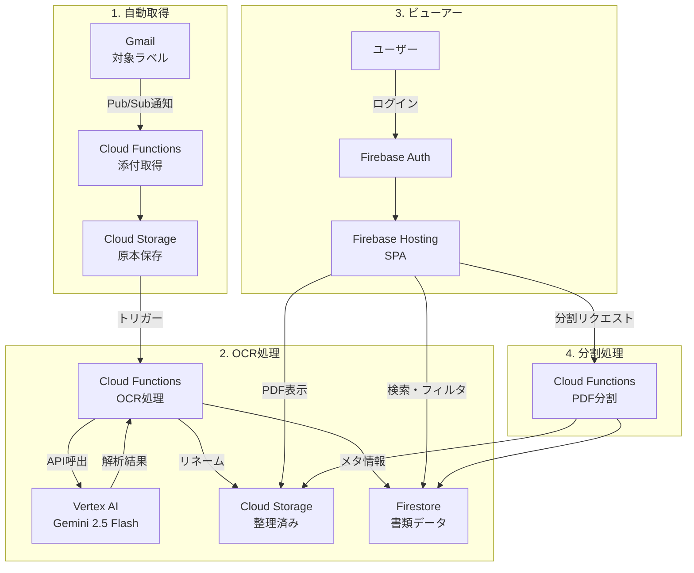

# 機能要件

## アプリ概要

Gmailの添付ファイルを自動取得し、AI OCRでメタ情報を抽出、検索・グルーピング・閲覧が可能な**書類管理ビューアーアプリ**。

## ユーザーストーリー

1. **自動収集**: 指定ラベルのメールから添付ファイルが自動的に取り込まれる
2. **自動整理**: OCRでファイル名とメタ情報が自動設定される
3. **検索・閲覧**: メタ情報で絞り込み、PDFを快適に閲覧できる
4. **分割処理**: 複数書類が含まれるPDFを適切に分割できる

## 機能一覧

### P0: Must Have（MVP）

| ID | 機能 | 説明 | 処理場所 |
|----|------|------|----------|
| F01 | Gmail添付取得 | 対象ラベルのメールから添付ファイルを自動取得 | Cloud Functions |
| F02 | ラベル設定 | 監視対象のGmailラベルを設定画面から指定 | UI + Firestore |
| F03 | Cloud Storage保存 | 取得ファイルをCloud Storageに保存 | Cloud Functions |
| F04 | AI OCR処理 | Geminiで書類内容を解析 | Cloud Functions + Vertex AI |
| F05 | 自動リネーム | OCR結果に基づきファイル名を自動設定 | Cloud Functions |
| F06 | メタ情報抽出 | 書類種別、日付、顧客名等を自動抽出 | Cloud Functions |
| F07 | 書類一覧表示 | 登録済み書類の一覧表示 | UI |
| F08 | 検索・フィルタ | メタ情報による絞り込み検索 | UI + Firestore |
| F09 | グルーピング | 顧客別、書類種別別などでグループ表示 | UI |
| F10 | PDFビューアー | PDF書類のプレビュー表示 | UI (pdf.js) |
| F11 | 認証 | Googleアカウントでログイン | Firebase Auth |
| F21 | ホワイトリスト管理 | ログイン許可ユーザーの追加・削除 | UI + Firestore |
| F22 | 管理者権限 | 管理者のみ設定画面にアクセス可能 | UI + Firestore Rules |
| F23 | Gmail OAuth設定 | 管理者がGmail連携を設定（初回OAuth認証） | UI + Cloud Functions |
| F12 | **PDF分割** | 複合書類を個別PDFに分割（必須機能） | Cloud Functions |
| F13 | **分割候補提示** | OCRでページ区切りを検出し分割候補をサジェスト | Cloud Functions + UI |
| F17 | **PDF回転** | ページ単位での回転（90°/180°/270°） | Cloud Functions + UI |
| F14 | メタ情報編集 | 分割後のメタ情報を手動修正 | UI |

### P1: Should Have

| ID | 機能 | 説明 | 処理場所 |
|----|------|------|----------|
| F15 | エラー一覧 | OCR失敗等のエラー書類を一覧表示 | UI |
| F16 | 再処理 | エラー書類のOCR再実行 | UI + Cloud Functions |

### P2: Nice to Have

| ID | 機能 | 説明 | 処理場所 |
|----|------|------|----------|
| F18 | ダウンロード | 書類の個別/一括ダウンロード | UI |
| F19 | 処理統計 | 処理件数、エラー率等のダッシュボード | UI + Cloud Monitoring |
| F20 | 複数ラベル対応 | 複数のGmailラベルを監視 | Cloud Functions |

## 画面一覧

| 画面 | 説明 | 主要機能 | アクセス権限 |
|------|------|----------|-------------|
| ログイン | Google認証画面 | Firebase Auth | 全員 |
| 書類一覧 | メイン画面、書類リスト表示 | 検索、フィルタ、グルーピング | ホワイトリスト |
| 書類詳細 | PDFビューアー + メタ情報 | 閲覧、編集、分割 | ホワイトリスト |
| 設定（一般） | アプリ設定 | ラベル設定 | 管理者のみ |
| 設定（ユーザー） | ユーザー管理 | ホワイトリスト編集 | 管理者のみ |
| 設定（Gmail） | Gmail連携設定 | OAuth認証、対象メール設定 | 管理者のみ |
| エラー一覧 | 処理失敗書類 | 確認、再処理 | ホワイトリスト |

## データフロー

## メタ情報（抽出項目）

| 項目 | 説明 | 抽出方法 |
|------|------|----------|
| 書類種別 | 請求書、領収書、契約書等 | Gemini分類 |
| 書類日付 | 書類に記載の日付 | Gemini抽出 |
| 顧客名 | 関連する顧客・取引先 | Gemini抽出 + マスタ照合 |
| 金額 | 請求額等（該当する場合） | Gemini抽出 |
| ファイル名 | 自動生成されたファイル名 | ルールベース |
| 取得日時 | メール受信/処理日時 | システム自動 |
| 元メール | 取得元メールの情報 | Gmail API |
| ページ数 | PDFのページ数 | システム自動 |
| OCRステータス | 成功/失敗/要確認 | システム自動 |

### 追加実装済み機能（Phase 7-8以降）

| ID | 機能 | 説明 | 実装Phase |
|----|------|------|----------|
| F24 | 処理履歴 | Gmail取得・OCR処理の実行ログ表示 | Phase 7 |
| F25 | 同姓同名解決 | 顧客名の曖昧さを解消するフロー | Phase 7 |
| F26 | グループ化ビュー | 顧客×書類種別でのグループ表示・集計 | Phase 8 |
| F27 | 全文検索 | 反転インデックス+TF-IDFによる高速検索 | Phase 8 |
| F28 | エイリアス学習 | 書類種別・顧客・事業所の別名自動学習 | 追加実装 |
| F29 | OCR確認ステータス | 書類ごとの確認済みマーク | 追加実装 |
| F30 | AI要約 | OCR結果からの要約自動生成 | 追加実装 |
| F31 | 無限スクロール | 初期100件+スクロールで追加読込 | 追加実装 |
| F32 | あかさたなフィルター | 顧客名の頭文字でフィルタリング | 追加実装 |
| F33 | 期間指定フィルター | 書類日付での期間絞り込み | 追加実装 |
| F34 | ドメイン許可リスト | メールドメインによる自動ログイン許可 | 追加実装 |
| F35 | PDFアップロード | ローカルPDFの手動アップロード | 追加実装 |

## 非機能要件

| 項目 | 要件 |
|------|------|
| 可用性 | Cloud Functions + Firebase で高可用性 |
| レスポンス | 一覧表示: 2秒以内、PDF表示: 3秒以内 |
| セキュリティ | 認証必須、ホワイトリスト制御、個人情報マスキング |
| データ保持 | Cloud Storage: 無期限、Firestore: 無期限 |
| 同時接続 | 10ユーザー程度（想定） |
| **コスト** | **月額3,000円以下**（無料枠を最大活用） |

### コスト内訳（想定）

| サービス | 無料枠 | 想定使用量 | 超過リスク |
|----------|--------|------------|------------|
| Firebase Hosting | 10GB/月 | < 1GB | 低 |
| Firestore | 1GB保存、5万読取/日 | 〜500MB | 低 |
| Cloud Functions | 200万回/月 | < 1万回 | 低 |
| Cloud Storage | 5GB | 〜2GB | 低 |
| Vertex AI Gemini | 無料枠あり | 要監視 | **中** |

**注意**: Gemini APIの使用量がコスト超過の主要リスク

## 制約事項

- **Gmail連携**:
  - 開発環境: 個人Gmail（`@gmail.com`）でOAuth 2.0認証
  - 本番環境: Google Workspace（`@company.com`）でService Account推奨
- 対応ファイル形式: PDF（将来的に画像対応検討）
- 1ファイル最大サイズ: 10MB（Gemini API制限考慮）
- **納品形態**: GCPプロジェクト移譲（シングルテナント）

## 参照

- 移行スコープ: `context/gcp-migration-scope.md`
- データモデル: `context/data-model.md`
- 認証設計: `adr/0003-authentication-design.md`
