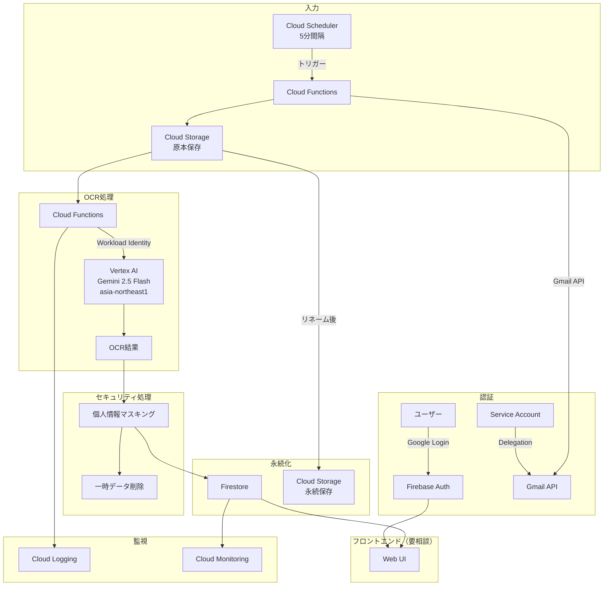

# GCP移行スコープ

## 移行概要

| 項目 | 内容 |
|------|------|
| 移行元 | AppSheet + Google Apps Script |
| 移行先 | GCP（プロジェクト単位で完結） |
| 納品形態 | **GCPプロジェクト移譲**（クライアントへ引き渡し） |
| 目的 | AppSheet/Workspace依存を排除し、移譲可能な形態に |

## 設計方針（確定事項）

### OCR処理
| 項目 | 選定 | 理由 |
|------|------|------|
| エンジン | **Vertex AI Gemini 2.5 Flash** | AI OCR、高精度 |
| リージョン | **asia-northeast1（東京）** | データ国内保持 |
| 認証方式 | **Workload Identity** | APIキー不使用、セキュア |

### セキュリティ要件（重要）
| 要件 | 対応方針 |
|------|----------|
| 個人情報マスキング | OCR後に自動マスキング処理 |
| Geminiへのデータ露出最小化 | 処理後即時削除、一時保存期間を最短に |
| APIキー排除 | Workload Identity Federation採用 |
| データ保護 | VPC Service Controls検討 |

### データベース（要相談）
| 候補 | メリット | デメリット |
|------|----------|------------|
| **Firestore** | サーバーレス、従量課金、コスト最適 | 複雑なクエリに制限 |
| Cloud SQL | RDB、柔軟なクエリ | 固定費発生 |

**現時点の方向性**: Firestore（コスト圧縮優先）

### ストレージ（要相談）
| 候補 | メリット | デメリット |
|------|----------|------------|
| **Cloud Storage** | コスパ良好、柔軟なライフサイクル | Firebase統合なし |
| Firebase Storage | Firestore連携容易 | 若干コスト高 |

**現時点の方向性**: Cloud Storage（コストパフォーマンス優先）

### 認証
| 項目 | 選定 | 備考 |
|------|------|------|
| ユーザー認証 | **Firebase Authentication** | Googleソーシャルログイン |
| Gmail連携 | **Service Account + Domain-wide Delegation** | Workspace前提 |

> 詳細は `adr/0003-authentication-design.md` 参照

### フロントエンド
| 項目 | 選定 | 理由 |
|------|------|------|
| ホスティング | **Firebase Hosting** | Firebase統合、コスト効率、SSR不要 |
| フレームワーク | **React + Vite + TypeScript** | エコシステム、開発速度 |
| UIライブラリ | **shadcn/ui + Tailwind CSS** | 軽量、カスタマイズ性 |
| PDFビューアー | **react-pdf (pdf.js)** | 無料、軽量 |
| 状態管理 | **Zustand + TanStack Query** | シンプル、Firestore連携 |

> 詳細は `adr/0004-frontend-architecture.md` 参照

**Artifact Registryは不要**（Firebase Hosting + Cloud Functionsソースデプロイのため）

### 監視・運用
| 項目 | 選定 |
|------|------|
| ログ | Cloud Logging |
| メトリクス | Cloud Monitoring |
| ヘルスチェック | Cloud Monitoring Uptime Checks |
| アラート | Cloud Monitoring Alerting |

## アーキテクチャ概要図

## 機能スコープ

> 詳細は `context/functional-requirements.md` 参照

### P0: Must Have（MVP）

| 機能 | GCP実装 |
|------|---------|
| Gmail添付ファイル取得（ラベル指定） | Gmail API + Cloud Scheduler + Cloud Functions |
| Cloud Storage保存 | Cloud Functions |
| AI OCR処理 | Vertex AI Gemini 2.5 Flash |
| 自動リネーム・メタ情報抽出 | Cloud Functions |
| 書類一覧・検索・フィルタ・グルーピング | Firebase Hosting (React SPA) |
| PDFビューアー | react-pdf (pdf.js) |
| 認証 | Firebase Authentication |

### P1: Should Have

| 機能 | GCP実装 |
|------|---------|
| PDF分割（OCRベース区切り検出） | Cloud Functions |
| メタ情報手動編集 | React SPA |
| エラー一覧・再処理 | React SPA + Cloud Functions |
| 個人情報マスキング | Cloud Functions |

### P2: Nice to Have

| 機能 | GCP実装 |
|------|---------|
| PDF回転補正 | Cloud Functions |
| ダウンロード（個別/一括） | React SPA |
| 処理統計ダッシュボード | Cloud Monitoring |

### 移行対象外

| 機能 | 理由 |
|------|------|
| AppSheet UI | Firebase Hosting + Reactで再構築 |
| Google Workspace連携（Sheets等） | プロジェクト移譲のため排除 |
| GAS | Cloud Functionsで置換 |

## 納品要件

### GCPプロジェクト移譲チェックリスト
- [ ] 全リソースが単一プロジェクトに収まる
- [ ] IAMロールの文書化
- [ ] 環境変数・シークレットの引継ぎ手順
- [ ] 運用手順書
- [ ] コスト見積もり

### 依存関係排除
| 排除対象 | 代替 |
|----------|------|
| AppSheet | Cloud Run + Web UI or 別ソリューション |
| Google Workspace | Gmail APIのみ使用（OAuth）|
| GAS | Cloud Functions |

## 相談事項（TODO）

### 解決済み
1. [x] **フロントエンドUI**: Firebase Hosting + React SPAで確定
2. [x] **コスト上限**: 月額3,000円以下
3. [x] **Google Workspace使用有無**: 開発はOAuth 2.0（個人Gmail）、本番はWorkspace想定で両対応
4. [x] **監視対象メールアドレス**: 設定画面で指定可能（開発用: `hy.unimail.11@gmail.com`）
5. [x] **ログイン許可ユーザー**: ホワイトリスト方式（設定画面で管理、管理アカウントあり）

### 確定（2026-01-17）
6. [x] **Firestore vs Cloud SQL**: **Firestore**（無料枠で十分、Firebase統合）
7. [x] **Cloud Storage vs Firebase Storage**: **Cloud Storage**（Cloud Functions連携がメイン）
8. [x] **VPC Service Controls**: **不要**（コスト制約、アプリ層セキュリティで担保）

## 参照
- データモデル: `context/data-model.md`
- ビジネスロジック: `context/business-logic.md`
- ADR: `adr/`
