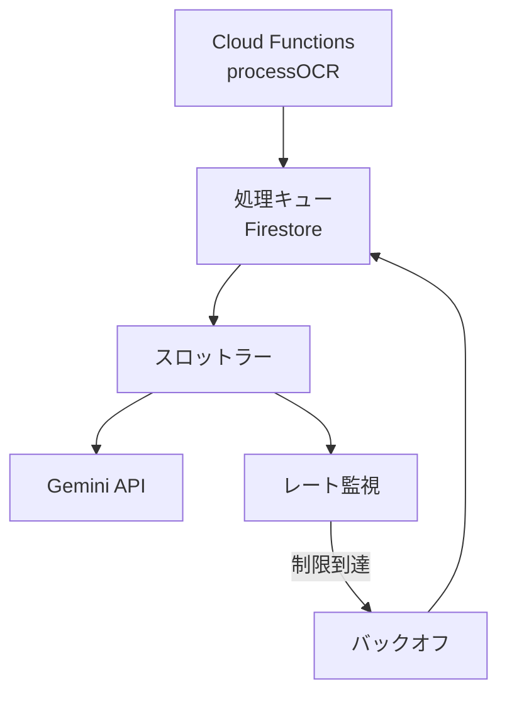
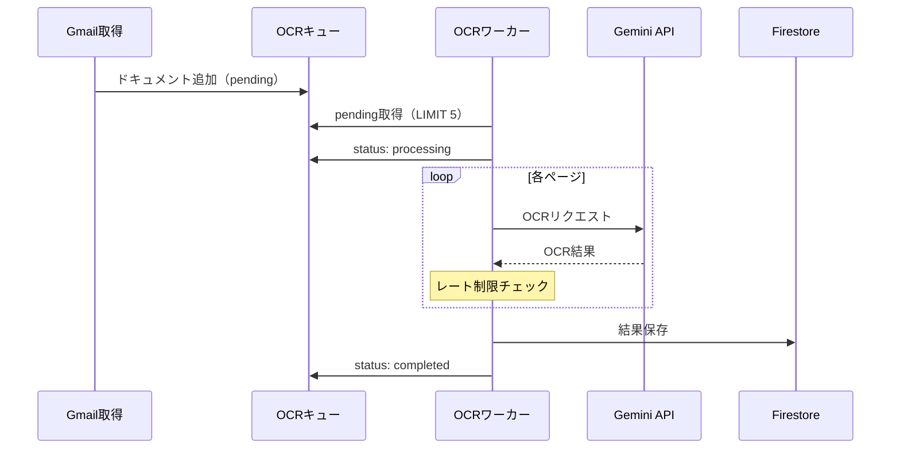

# Gemini APIレート制限設計

## 1. Gemini 2.5 Flash レート制限

### 1.1 制限値（2026年1月時点）

| リソース | 制限 | 備考 |
|---------|------|------|
| RPM（Requests/分） | 1,000 | リージョン共通 |
| TPM（Tokens/分） | 4,000,000 | 入力+出力 |
| TPD（Tokens/日） | 無制限 | 課金対象 |
| 最大入力トークン | 1,048,576 | 約100万 |
| 最大出力トークン | 8,192 | |
| 最大画像サイズ | 20MB | PDF含む |

### 1.2 OCR処理の想定トークン消費

| 処理 | 入力トークン | 出力トークン | 備考 |
|------|------------|------------|------|
| PDFページ（テキスト系） | 〜5,000 | 〜2,000 | A4書類想定 |
| PDFページ（表組み） | 〜10,000 | 〜3,000 | 複雑な帳票 |
| マスター照合プロンプト | 〜1,000 | 〜500 | 固定 |

### 1.3 1日あたりの処理能力

```
想定: 1日50ファイル × 平均5ページ = 250ページ/日

トークン消費:
- 入力: 250 × 6,000 = 1,500,000 tokens
- 出力: 250 × 2,000 = 500,000 tokens
- 合計: 2,000,000 tokens/日

レート制限余裕:
- RPM: 250 / (8h × 60min) = 0.5 RPM（余裕あり）
- TPM: 2,000,000 / (8h × 60min) = 4,167 TPM（余裕あり）
```

## 2. スロットリング実装

### 2.1 アーキテクチャ



### 2.2 トークンバケットアルゴリズム

```typescript
interface RateLimiter {
  tokens: number;
  lastRefill: number;
  maxTokens: number;
  refillRate: number;  // tokens per second
}

class GeminiRateLimiter {
  private bucket: RateLimiter = {
    tokens: 1000,      // 初期トークン（RPM相当）
    lastRefill: Date.now(),
    maxTokens: 1000,
    refillRate: 16.67, // 1000/60秒
  };

  async acquire(cost: number = 1): Promise<void> {
    this.refill();

    if (this.bucket.tokens < cost) {
      const waitTime = (cost - this.bucket.tokens) / this.bucket.refillRate * 1000;
      console.log(`Rate limit: waiting ${waitTime}ms`);
      await sleep(waitTime);
      this.refill();
    }

    this.bucket.tokens -= cost;
  }

  private refill(): void {
    const now = Date.now();
    const elapsed = (now - this.bucket.lastRefill) / 1000;
    this.bucket.tokens = Math.min(
      this.bucket.maxTokens,
      this.bucket.tokens + elapsed * this.bucket.refillRate
    );
    this.bucket.lastRefill = now;
  }
}
```

### 2.3 バッチ処理設計

```typescript
interface BatchConfig {
  batchSize: 5;           // 同時処理ページ数
  intervalMs: 3000;       // バッチ間隔（3秒）
  maxConcurrent: 3;       // 最大並列リクエスト
  retryDelayMs: 5000;     // リトライ待機時間
}

async function processPdfBatch(
  pages: PDFPage[],
  config: BatchConfig
): Promise<OCRResult[]> {
  const rateLimiter = new GeminiRateLimiter();
  const results: OCRResult[] = [];

  // ページをバッチに分割
  const batches = chunk(pages, config.batchSize);

  for (const batch of batches) {
    // レート制限チェック
    await rateLimiter.acquire(batch.length);

    // 並列処理（制限付き）
    const batchResults = await pLimit(config.maxConcurrent)(
      batch.map(page => () => processPage(page))
    );

    results.push(...batchResults);

    // バッチ間インターバル
    await sleep(config.intervalMs);
  }

  return results;
}
```

## 3. エラーハンドリング

### 3.1 レート制限エラーの検出

```typescript
function isRateLimitError(error: unknown): boolean {
  if (error instanceof GoogleGenerativeAIError) {
    return error.message.includes('RESOURCE_EXHAUSTED') ||
           error.message.includes('429') ||
           error.message.includes('rate limit');
  }
  return false;
}
```

### 3.2 Exponential Backoff

```typescript
async function callGeminiWithRetry(
  request: OCRRequest,
  maxRetries: number = 3
): Promise<OCRResult> {
  let lastError: Error;
  let delay = 1000;  // 初期1秒

  for (let attempt = 1; attempt <= maxRetries; attempt++) {
    try {
      return await callGemini(request);
    } catch (error) {
      lastError = error as Error;

      if (!isRateLimitError(error)) {
        throw error;  // レート制限以外は即失敗
      }

      if (attempt === maxRetries) {
        throw new Error(`Rate limit exceeded after ${maxRetries} retries`);
      }

      console.log(`Rate limit hit, attempt ${attempt}/${maxRetries}, waiting ${delay}ms`);
      await sleep(delay);
      delay = Math.min(delay * 2, 30000);  // 最大30秒
    }
  }

  throw lastError!;
}
```

## 4. コスト管理

### 4.1 料金体系（2026年1月時点）

| モデル | 入力（/1M tokens） | 出力（/1M tokens） |
|--------|------------------|------------------|
| Gemini 2.5 Flash | $0.075 | $0.30 |

### 4.2 月額コスト試算

```
想定: 月間1,000ファイル × 5ページ = 5,000ページ

トークン消費:
- 入力: 5,000 × 6,000 = 30,000,000 tokens (30M)
- 出力: 5,000 × 2,000 = 10,000,000 tokens (10M)

コスト:
- 入力: 30M × $0.075 / 1M = $2.25
- 出力: 10M × $0.30 / 1M = $3.00
- 合計: $5.25/月 ≈ ¥800/月（1USD=150円）
```

### 4.3 コスト監視

```typescript
// Firestore /stats/gemini でトークン使用量を追跡
interface GeminiUsageStats {
  date: string;  // YYYY-MM-DD
  inputTokens: number;
  outputTokens: number;
  requestCount: number;
  estimatedCostUsd: number;
}

async function trackGeminiUsage(
  inputTokens: number,
  outputTokens: number
): Promise<void> {
  const today = new Date().toISOString().split('T')[0];
  const statsRef = db.doc(`stats/gemini/daily/${today}`);

  await statsRef.set({
    inputTokens: admin.firestore.FieldValue.increment(inputTokens),
    outputTokens: admin.firestore.FieldValue.increment(outputTokens),
    requestCount: admin.firestore.FieldValue.increment(1),
    estimatedCostUsd: admin.firestore.FieldValue.increment(
      inputTokens * 0.075 / 1000000 + outputTokens * 0.30 / 1000000
    ),
  }, { merge: true });
}
```

### 4.4 コストアラート

```yaml
# Cloud Monitoring アラート設定
displayName: "Gemini Daily Cost Alert"
conditions:
  - displayName: "Daily cost exceeds $1"
    conditionThreshold:
      filter: 'metric.type="custom.googleapis.com/gemini/daily_cost_usd"'
      comparison: COMPARISON_GT
      thresholdValue: 1.0
      duration: 0s
notificationChannels:
  - projects/[PROJECT_ID]/notificationChannels/[CHANNEL_ID]
```

## 5. 処理キュー設計

### 5.1 Firestoreベースのキュー

```typescript
// /queues/ocr/{docId}
interface OCRQueueItem {
  documentId: string;
  fileUrl: string;
  priority: 'high' | 'normal' | 'low';
  createdAt: Timestamp;
  status: 'pending' | 'processing' | 'completed' | 'failed';
  attempts: number;
  lastAttempt?: Timestamp;
  error?: string;
}
```

### 5.2 処理フロー



### 5.3 Cloud Scheduler設定

```yaml
# OCRワーカー: 5分間隔
schedule: "*/5 * * * *"
timeZone: "Asia/Tokyo"
httpTarget:
  uri: "https://asia-northeast1-[PROJECT_ID].cloudfunctions.net/processOCR"
  httpMethod: POST
retryConfig:
  retryCount: 3
  minBackoffDuration: "10s"
  maxBackoffDuration: "300s"
```

## 6. モニタリングダッシュボード

### 6.1 主要メトリクス

| メトリクス | 説明 | アラート閾値 |
|-----------|------|------------|
| `gemini/request_count` | リクエスト数/分 | > 500 RPM |
| `gemini/token_usage` | トークン使用量/分 | > 2M TPM |
| `gemini/error_rate` | エラー率 | > 5% |
| `gemini/latency_p99` | 99パーセンタイルレイテンシ | > 30秒 |
| `gemini/daily_cost_usd` | 日次コスト | > $1 |

### 6.2 ログ構造

```typescript
// Cloud Loggingに出力
interface GeminiLogEntry {
  severity: 'INFO' | 'WARNING' | 'ERROR';
  timestamp: string;
  operation: 'ocr_request' | 'ocr_response' | 'rate_limit' | 'error';
  documentId?: string;
  pageNumber?: number;
  inputTokens?: number;
  outputTokens?: number;
  latencyMs?: number;
  errorCode?: string;
  errorMessage?: string;
}
```

## 参照

- Vertex AI Gemini Quotas: https://cloud.google.com/vertex-ai/generative-ai/docs/quotas
- エラーハンドリング: `context/error-handling-policy.md`
- OCR処理: `functions/src/ocr/processOCR.ts`
