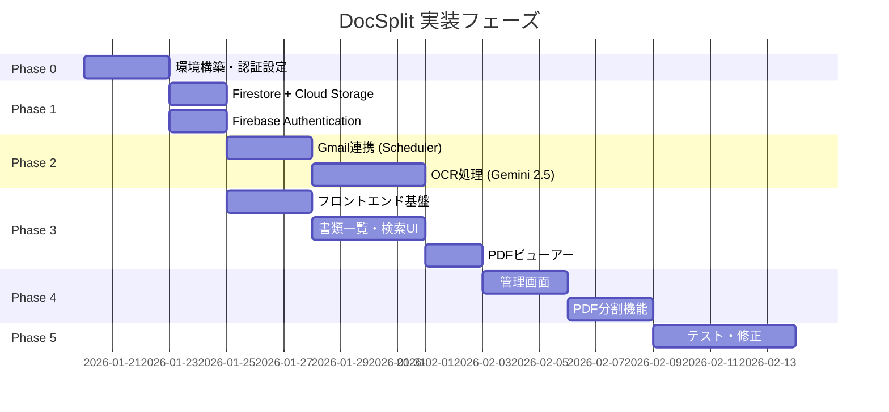
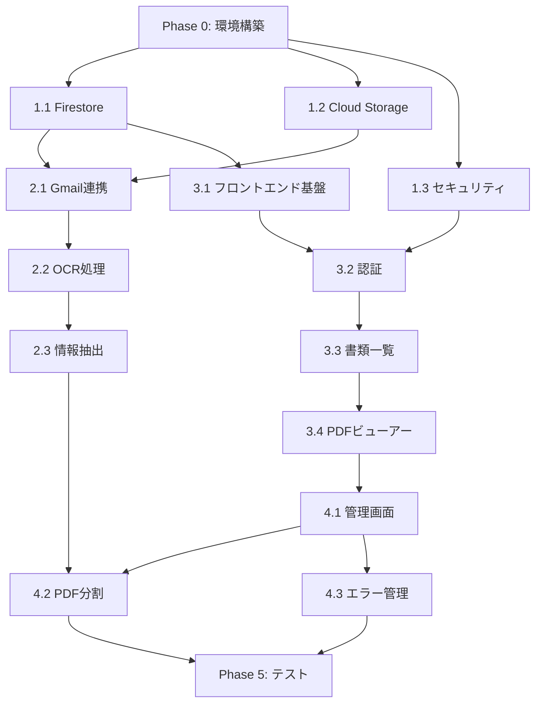

# 実装計画

## フェーズ概要



## Phase 0: 環境構築（前提条件）

### 0.1 GCPプロジェクト設定
- [ ] プロジェクト作成（asia-northeast1）
- [ ] 請求アカウント設定
- [ ] 必要API有効化:
  - Cloud Functions
  - Cloud Storage
  - Firestore
  - Firebase Authentication
  - Gmail API
  - Vertex AI
  - Cloud Pub/Sub

### 0.2 Firebase設定
- [ ] Firebaseプロジェクト連携
- [ ] Firebase Hosting設定
- [ ] Firebase Authentication設定（Googleプロバイダー）

### 0.3 Workload Identity設定
- [ ] サービスアカウント作成
- [ ] IAMロール付与
- [ ] Cloud Functions用認証設定

### ✅ Phase 0 完了条件
```bash
# 全てパスすること
gcloud config get-value project          # → プロジェクトID表示
firebase projects:list                    # → プロジェクト表示
firebase emulators:start                  # → エラーなく起動
gcloud services list --enabled | grep -E "cloudfunctions|firestore|storage"  # → 有効化確認
```

---

## Phase 1: データ基盤（P0必須）

### 1.1 Firestoreスキーマ実装
**依存**: Phase 0完了

| コレクション | 優先度 | 説明 |
|-------------|--------|------|
| `/documents` | P0 | 書類管理メイン |
| `/masters/documents` | P0 | 書類マスター |
| `/masters/customers` | P0 | 顧客マスター |
| `/masters/offices` | P0 | 事業所マスター |
| `/errors` | P1 | エラー履歴 |
| `/gmailLogs` | P1 | Gmail受信ログ |
| `/users` | P0 | ユーザー管理 |
| `/settings` | P0 | アプリ設定 |

### 1.2 Cloud Storage構成
**依存**: Phase 0完了

```
gs://[project-id]-documents/
├── original/           # 原本保存（削除不可）
├── processed/          # 処理済み（リネーム後）
├── ocr-results/        # 長いOCR結果テキスト
└── temp/               # 一時ファイル（TTL: 24h）
```

### 1.3 セキュリティルール
- [ ] Firestore Security Rules
- [ ] Cloud Storage IAMポリシー
- [ ] ホワイトリスト制御実装

### ✅ Phase 1 完了条件
```bash
# Firestoreルールテスト
cd functions && npm test -- --grep "firestore"   # → 全テストパス

# Storageアップロードテスト
gsutil cp test.pdf gs://[project-id]-documents/temp/  # → 成功
gsutil ls gs://[project-id]-documents/                 # → フォルダ構成確認

# エミュレータでCRUD確認
firebase emulators:start
# → Firestore UIで /documents, /users にデータ作成・読取可能
```

---

## Phase 2: バックエンド処理（P0必須）

### 2.1 Gmail連携 Cloud Function
**依存**: Phase 1完了

```
機能: checkGmailAttachments
トリガー: Cloud Scheduler（5分間隔）

処理フロー:
1. Gmail API → ラベル指定でメール検索（過去10分）
2. Firestore gmailLogs → MD5ハッシュで重複チェック
3. 新規ファイルのみ → Cloud Storage原本保存
4. Firestore → gmailLogs記録
5. Firestore → documents（status: pending）作成
6. 次のOCR処理でpending取得 → OCR実行
```

**設計理由（ADR）**:
- リアルタイム性不要（業務特性）
- 複数顧客展開でのシンプルさ優先
- 障害時の原因切り分け容易性

### 2.2 OCR処理 Cloud Function
**依存**: 2.1完了

```
機能: processOCR
トリガー: Cloud Pub/Sub (ocr-queue)

処理フロー:
1. Cloud Storage → ファイル取得
2. PDF分割 (pdf-lib)
3. Vertex AI Gemini 2.5 Flash → OCR
4. 書類名・顧客名・事業所名抽出
5. ファイルリネーム
6. Firestore → documents記録
7. エラー時 → errors記録 + 通知
```

### 2.3 情報抽出ロジック
**依存**: マスターデータ投入

```
- 書類名判定（類似度マッチング）
- 顧客名抽出（閾値: 70%）
- 事業所名抽出（閾値: 70%）
- 日付抽出（マーカーベース）
```

### ✅ Phase 2 完了条件
```bash
# Gmail連携テスト（エミュレータ）
firebase functions:shell
> checkGmailAttachments()   # → ログに "Starting Gmail attachment check" 表示

# OCR処理テスト
# 1. Firestoreに status: pending のドキュメントを作成
# 2. processOCR を実行
firebase functions:shell
> processOCR()              # → status が processed に変更

# 本番テスト（デプロイ後）
firebase deploy --only functions
# → Cloud Scheduler で5分後に自動実行確認
# → Firestore に書類データが作成される
```

---

## Phase 3: フロントエンド（P0必須）

### 3.1 基盤構築
**依存**: Phase 1完了

```
技術スタック:
- React + Vite + TypeScript
- Tailwind CSS + shadcn/ui
- Firebase SDK
- TanStack Query + Zustand
```

### 3.2 認証・ルーティング
**依存**: 3.1完了

```
- Firebase Authentication統合
- ホワイトリストチェック
- Protected Routes
- 管理者ルート分離
```

### 3.3 書類一覧画面
**依存**: 3.2完了

```
機能:
- Firestore リアルタイム同期
- 検索（書類名、顧客名、日付）
- フィルター（書類種別、ステータス）
- グルーピング（顧客別、日付別）
- ソート（処理日時、書類日付）
```

### 3.4 PDFビューアー
**依存**: 3.3完了

```
技術: react-pdf (pdf.js)
機能:
- Cloud Storage URL表示
- ページナビゲーション
- ズーム
- メタ情報サイドパネル
```

### ✅ Phase 3 完了条件
```bash
# ビルド成功
npm run build                # → エラーなし

# ローカル動作確認
npm run dev
# → http://localhost:3000 でアクセス
# → Googleログイン成功
# → 書類一覧表示（空でもOK）
# → PDFビューアーでサンプルPDF表示

# Firebase Hosting プレビュー
firebase hosting:channel:deploy preview
# → プレビューURLでアクセス可能
```

---

## Phase 4: 管理機能（P1）

### 4.1 管理画面
**依存**: Phase 3完了

```
- ホワイトリスト管理（ユーザー追加/削除）
- Gmailラベル設定
- マスターデータ編集
```

### 4.2 PDF分割機能
**依存**: 4.1完了

```
- OCRベースページ区切り検出
- 分割候補UI表示
- 分割実行→新規ドキュメント作成
```

### 4.3 エラー管理
**依存**: 4.1完了

```
- エラー一覧表示
- 再処理ボタン
- ステータス更新
```

### ✅ Phase 4 完了条件
```bash
# 管理画面テスト
npm run dev
# → http://localhost:3000/settings にアクセス
# → ホワイトリスト編集（追加/削除）が動作
# → Gmailラベル設定の変更がFirestoreに反映

# PDF分割テスト
# → 複数書類PDFを開く
# → 分割候補が黄色でハイライト表示される
# → 分割実行 → 新規ドキュメントが作成される
# → 元ドキュメントが status: split に更新

# エラー管理テスト
# → エラー一覧画面表示
# → 再処理ボタンクリック → Pub/Subにメッセージ送信
# → ステータスが pending に戻る
```

---

## Phase 5: テスト・デプロイ

### 5.1 テスト
- [ ] Cloud Functions単体テスト
- [ ] Firestoreルールテスト
- [ ] フロントエンドE2Eテスト
- [ ] 本番データ移行テスト

### 5.2 本番デプロイ
- [ ] Firebase Hosting デプロイ
- [ ] Cloud Functions デプロイ
- [ ] DNS設定（カスタムドメイン）
- [ ] 運用手順書作成

### ✅ Phase 5 完了条件
```bash
# テスト完了確認
cd functions && npm test          # → 全テストパス（カバレッジ80%以上）
cd frontend && npm run test:e2e   # → 全E2Eテストパス

# 本番デプロイ確認
firebase deploy --only hosting    # → デプロイ成功
firebase deploy --only functions  # → 全Function デプロイ成功

# 本番動作確認
# → 本番URLでログイン可能
# → Gmail添付取得が5分間隔で動作
# → OCR処理が正常完了
# → PDF分割が動作

# 納品ドキュメント確認
ls docs/user-guide.md             # → 存在確認
ls docs/admin-guide.md            # → 存在確認
ls docs/internal/setup-procedure.md  # → 存在確認
```

---

## 納品準備（プロジェクト移譲用）

### 納品モデル
```
マスタープロジェクト（自社保有）
    ↓ コピー
顧客プロジェクト
    ↓ 初期設定（サポート対応）
    ↓ マスターデータ登録（サポート対応）
    ↓ 動作確認
顧客へ移譲
```

### 初期設定スクリプト（サポート用）
```bash
scripts/
├── init-project.sh       # 顧客固有設定の一括変更
└── import-masters.sh     # マスターデータ投入（CLI）
```

### 顧客固有設定（変更が必要な項目）
```
Firestore /settings/app:
├── targetLabels          # 監視対象Gmailラベル
├── adminEmail            # 管理者メールアドレス
└── gmailAccount          # 監視対象Gmailアカウント

Firestore /users/{uid}:
└── 初期ユーザー登録（ホワイトリスト）
```

### マスターデータ投入（サポート対応）
```bash
# CLIでCSVからFirestoreへ投入
node scripts/import-masters.js --customers customers.csv
node scripts/import-masters.js --documents documents.csv
node scripts/import-masters.js --offices offices.csv
```

### 納品ドキュメント（内部用）
| ドキュメント | 内容 |
|-------------|------|
| `docs/internal/setup-procedure.md` | 納品作業手順（サポート担当用） |
| `docs/internal/troubleshooting.md` | よくある問題と対処法 |

### 納品ドキュメント（顧客向け）
| ドキュメント | 内容 |
|-------------|------|
| `docs/user-guide.md` | エンドユーザー操作マニュアル |
| `docs/admin-guide.md` | 管理画面操作マニュアル |

### 監視設定（マスタープロジェクトに設定済み）
- [x] Cloud Monitoring ダッシュボード
- [x] コスト上限アラート（月額3,000円）
- [x] エラー通知メール設定（管理者メールへ）

---

## 依存関係マップ



## コスト見積もり（月額）

| サービス | 想定使用量 | 見積もり |
|----------|-----------|---------|
| Firebase Hosting | < 1GB | 無料枠内 |
| Firestore | 〜500MB | 無料枠内 |
| Cloud Functions | < 1万回 | 無料枠内 |
| Cloud Storage | 〜2GB | 無料枠内 |
| Vertex AI Gemini | 要監視 | 〜2,000円 |
| **合計** | | **〜2,000円/月** |

> ⚠️ Gemini API使用量がコスト主要因。バッチ処理でレート制限を活用。

## 参照
- 機能要件: `context/functional-requirements.md`
- データモデル: `context/data-model.md`
- 認証設計: `adr/0003-authentication-design.md`
