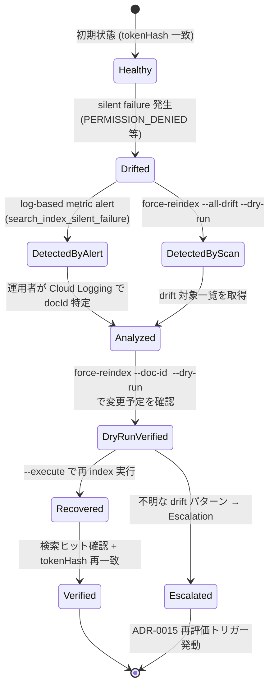

# search_index drift 復旧 Runbook (ADR-0015 Follow-up, Issue #229)

**最終更新**: 2026-04-16 (Issue #229)
**対象読者**: オンコール運用者、保守開発者
**関連**:
- [ADR-0015: search_index silent failure 対処方針](../adr/0015-search-index-silent-failure-policy.md)
- [監視セットアップ](monitoring-setup.md) (log-based metric / alert policy)
- `scripts/force-reindex.js` (復旧スクリプト)

---

## このドキュメントの目的

`onDocumentWriteSearchIndex` trigger で silent failure が起き、`documents.search.tokenHash` と
`search_index.postings` の間に不整合 (drift) が発生した場合の**検出・復旧手順**を定義する。

ADR-0015 で採用された「現状維持」方針により、削除経路の drift は自動復旧されない。
本 Runbook は監視 alert 発火時に運用者が実行する SOP である。

---

## 状態遷移図



---

## 1. drift の検出

### 1.1 監視 alert を受けた場合 (primary)

`search_index_silent_failure` metric の alert が発火すると以下のメールが届く:

```
Subject: [ALERT] doc-split-<env>: search_index_silent_failure (severity=ERROR)
...
Log filter: resource.labels.function_name="ondocumentwritesearchindex" severity>=ERROR
```

#### 影響 docId の特定

Cloud Logging で以下のクエリを実行:

```bash
gcloud logging read \
  'resource.labels.function_name="ondocumentwritesearchindex" severity>=ERROR \
   textPayload:"Failed to remove tokens from search index" \
   timestamp>="YYYY-MM-DDT00:00:00Z"' \
  --project=<env-project-id> --limit=100 --format="value(timestamp,textPayload)"
```

textPayload から docId を抽出: `Failed to remove tokens from search index for <DOC_ID>:` の
`<DOC_ID>` が影響を受けたドキュメント。

### 1.2 drift scan による検出 (secondary、定期実行または疑いがある時)

`force-reindex.js --all-drift --dry-run` で全 `processed` ドキュメントの tokenHash を再計算し、
実際の値と比較して差分を検出:

```bash
# GitHub Actions (推奨):
# Actions → "Run Operations Script" → environment: <env>
#   script: force-reindex --all-drift --dry-run
# ドキュメント数が多い環境では --sample=100 で部分検証も可能

# ローカル (ADC 必要):
FIREBASE_PROJECT_ID=<env-project-id> node scripts/force-reindex.js --all-drift --dry-run
```

出力例:

```
[MODE] 全 drift scan (dry-run)
  [DRIFT] abc123: hash (none) → 1a2b3c4d
  [DRIFT] def456: hash stale001 → 9e8f7a6b
---
走査: 4260 件 / drift: 2 件 / 再 index: 0 件
```

**drift: 0 件**なら復旧作業は不要。1 件以上あれば Step 2 へ。

---

## 2. 復旧実行 (dry-run → execute)

### 2.1 特定 docId (推奨、影響範囲が明確な場合)

alert から docId が特定できている場合:

```bash
# Step 1: dry-run で変更予定を確認
# GitHub Actions: script=force-reindex --doc-id, doc_id=<DOC_ID>
# ローカル (デフォルトが dry-run のため --execute 省略時は書き込みなし):
FIREBASE_PROJECT_ID=<env> node scripts/force-reindex.js --doc-id <DOC_ID>
```

期待出力:

```
[MODE] 単一 docId (dry-run): <DOC_ID>
  [DRY] <DOC_ID>: +25 / -3 tokens, hash stale001 → 1a2b3c4d
```

`+tokensToAdd` と `-tokensToRemove` が妥当であれば実行:

```bash
# Step 2: 実書き込み
# GitHub Actions: script=force-reindex --doc-id --execute, doc_id=<DOC_ID>
# ローカル:
FIREBASE_PROJECT_ID=<env> node scripts/force-reindex.js --doc-id <DOC_ID> --execute
```

### 2.2 一括 drift 復旧 (全対象)

scan で複数 docId が判明した場合:

```bash
# Step 1: dry-run で全対象を確認
FIREBASE_PROJECT_ID=<env> node scripts/force-reindex.js --all-drift --dry-run

# Step 2: sample で挙動確認 (先頭 5 件のみ実行)
FIREBASE_PROJECT_ID=<env> node scripts/force-reindex.js --all-drift --sample=5 --execute

# Step 3: 全件実行
FIREBASE_PROJECT_ID=<env> node scripts/force-reindex.js --all-drift --execute
```

**注意**: `--all-drift --execute` は Firestore 書き込み量が多くなる可能性がある。大規模環境では
batch-size=100 程度に絞り、時間をおいて分割実行することを推奨:

```bash
FIREBASE_PROJECT_ID=<env> node scripts/force-reindex.js --all-drift --execute --batch-size=100
```

---

## 3. 事後確認

### 3.1 tokenHash 再一致の確認

```bash
FIREBASE_PROJECT_ID=<env> node scripts/force-reindex.js --all-drift --dry-run
```

出力が `drift: 0 件` となることを確認。

### 3.2 検索機能の動作確認

本番 UI (`https://<env>.web.app/`) で以下を確認:

- 復旧対象 docId のファイル名やメタ情報をクエリして検索ヒットする
- 検索結果のメタ表示が正しい (customerName/officeName/documentType)
- 削除済み書類が誤ってヒットし続けていないか

### 3.3 Cloud Logging で再発確認

復旧後 1 時間以上経過した時点で alert metric を再確認:

```bash
gcloud logging read \
  'resource.labels.function_name="ondocumentwritesearchindex" severity>=ERROR \
   timestamp>="(復旧完了時刻)"' \
  --project=<env-project-id> --limit=10
```

新規の ERROR ログが発生していなければ復旧完了。

---

## 4. トラブルシューティング

### 4.1 `--doc-id` 指定で「ドキュメントが見つかりません」

→ docId の typo か、そのドキュメントが既に削除されている。search_index 側の孤児 posting は
   別 Issue で扱う (本スクリプトは documents 基点のため)。

### 4.2 `status=processed 以外` で中止される

→ 仕様。`onDocumentWriteSearchIndex` trigger が `after.status !== 'processed'` では index を
   更新しないため、drift の復旧対象ではない。status 遷移が本来の問題である可能性を調査する。

### 4.3 build エラー (functions/lib/ の自動生成失敗)

→ ローカル実行時: 事前に `cd functions && npm run build` を実行してから再試行。
   GitHub Actions 経由なら workflow 内で build ステップが走る。

### 4.4 NOT_FOUND エラーで復旧スクリプトが停止

→ 旧 posting 削除時の NOT_FOUND は冪等な無視として扱われるため停止しない。
   もし停止した場合はログを添付して Escalation。

---

## 5. Escalation 基準

以下の場合は復旧後も **必ず ADR-0015 の再評価トリガーを発動** する (該当 Issue で起票):

1. **同一 docId で 7 日以内に drift が再発**: root cause が未解消。`removeTokensFromIndex` の
   実装見直し (案 B' 削除経路 throw 化) を検討。
2. **PERMISSION_DENIED 以外のエラーコードが検出された**: UNAVAILABLE/DEADLINE_EXCEEDED/
   RESOURCE_EXHAUSTED のいずれか → 案 B' (削除経路のみ throw + `retry: true`) で自動復旧可能。
3. **drift が月次 1 件以上検出された**: dead letter pattern (案 C) への昇格を検討。

Escalation 先: `docs/adr/0015-search-index-silent-failure-policy.md` の再評価トリガーセクションを参照。

---

## 6. 関連コマンド早見表

| 目的 | コマンド |
|------|---------|
| 全環境 drift 確認 (読取のみ) | `FIREBASE_PROJECT_ID=<env> node scripts/force-reindex.js --all-drift --dry-run` |
| 単一 docId 復旧プレビュー | `... --doc-id <ID>` |
| 単一 docId 復旧実行 | `... --doc-id <ID> --execute` |
| 部分検証 (先頭 n 件のみ) | `... --all-drift --sample=<n> --execute` |
| バッチサイズ指定 | `... --all-drift --batch-size=<n> --execute` |
| ERROR ログ確認 | `gcloud logging read 'resource.labels.function_name="ondocumentwritesearchindex" severity>=ERROR' --project=<env-id> --limit=50` |
| Firestore バックアップ確認 (復旧前) | `gcloud firestore backups list --database='(default)' --project=<env-id>` |

---

## 7. スクリプト仕様の境界

本 Runbook および `force-reindex.js` のスコープ外:

- **孤児 posting 検出** (documents 側削除済だが `search_index.postings.<docId>` に残存):
  全 search_index 走査が必要でコスト大。将来の別 Issue で対応。
- **復旧操作の Audit Log**: 現状 stdout のみ。構造化ログ出力は別 Issue で拡張検討。
- **トークナイザーの再実装**: production (`functions/src/utils/tokenizer.ts`) を共有利用。
  重複実装はしない。production tokenizer の変更時は lib/ を rebuild すれば本スクリプトも自動追従する。
