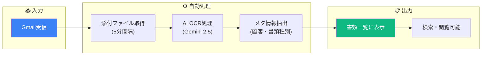
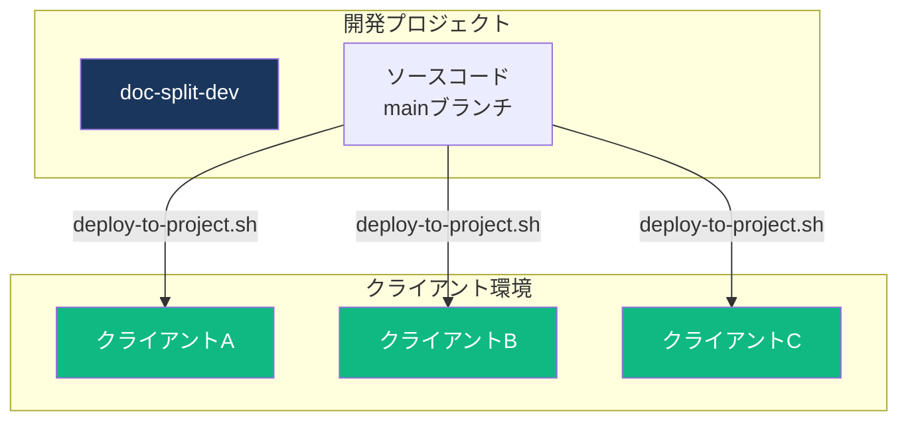

# 納品フロー

<style>
/* アニメーション付きフェーズカード */
.phase-card {
  background: linear-gradient(135deg, #f8fafc 0%, #e2e8f0 100%);
  border-radius: 12px;
  padding: 20px;
  margin: 20px 0;
  box-shadow: 0 4px 6px rgba(0,0,0,0.1);
  transition: transform 0.3s ease, box-shadow 0.3s ease;
  border-left: 4px solid #1a365d;
  color: #1e293b !important;
}
.phase-card:hover {
  transform: translateY(-5px);
  box-shadow: 0 8px 15px rgba(0,0,0,0.15);
}
.phase-card h3 {
  margin-top: 0;
  color: #1a365d !important;
  display: flex;
  align-items: center;
  gap: 10px;
}
.phase-card p, .phase-card li, .phase-card td {
  color: #1e293b !important;
}
.phase-card th {
  color: white !important;
}
.phase-number {
  background: #1a365d;
  color: white !important;
  width: 32px;
  height: 32px;
  border-radius: 50%;
  display: inline-flex;
  align-items: center;
  justify-content: center;
  font-weight: bold;
}

/* 自動化バッジ */
.badge-auto {
  background: linear-gradient(135deg, #10b981 0%, #059669 100%);
  color: white;
  padding: 4px 12px;
  border-radius: 20px;
  font-size: 12px;
  font-weight: bold;
  animation: pulse 2s infinite;
}
.badge-manual {
  background: linear-gradient(135deg, #f59e0b 0%, #d97706 100%);
  color: white;
  padding: 4px 12px;
  border-radius: 20px;
  font-size: 12px;
  font-weight: bold;
}
@keyframes pulse {
  0%, 100% { opacity: 1; }
  50% { opacity: 0.7; }
}

/* コマンドボックス */
.command-box {
  background: #1e293b !important;
  border-radius: 8px;
  padding: 15px 20px;
  margin: 15px 0;
  position: relative;
  overflow: hidden;
  color: #f1f5f9 !important;
}
.command-box::before {
  content: "$ ";
  color: #10b981 !important;
  font-weight: bold;
}
.command-box code {
  color: #f1f5f9 !important;
  background: transparent !important;
  font-family: 'Fira Code', monospace;
  padding: 0 !important;
}

/* タイムライン */
.timeline {
  position: relative;
  padding-left: 30px;
  margin: 20px 0;
  color: #1e293b !important;
}
.timeline::before {
  content: '';
  position: absolute;
  left: 10px;
  top: 0;
  bottom: 0;
  width: 2px;
  background: linear-gradient(to bottom, #1a365d, #3b82f6, #10b981);
}
.timeline-item {
  position: relative;
  padding: 15px 0;
  color: #1e293b !important;
}
.timeline-item::before {
  content: '';
  position: absolute;
  left: -24px;
  top: 20px;
  width: 12px;
  height: 12px;
  border-radius: 50%;
  background: #1a365d;
  border: 3px solid white;
  box-shadow: 0 0 0 2px #1a365d;
}

/* チェックリスト */
.checklist {
  list-style: none;
  padding: 0;
}
.checklist li {
  padding: 10px 0 10px 35px;
  position: relative;
  border-bottom: 1px solid #e2e8f0;
  color: #1e293b !important;
}
.checklist li::before {
  content: '✓';
  position: absolute;
  left: 0;
  color: #10b981 !important;
  font-weight: bold;
  font-size: 18px;
}

/* ステータスインジケーター */
.status-indicator {
  display: inline-flex;
  align-items: center;
  gap: 8px;
}
.status-dot {
  width: 10px;
  height: 10px;
  border-radius: 50%;
  animation: blink 1.5s infinite;
}
.status-dot.active { background: #10b981; }
.status-dot.pending { background: #f59e0b; }
@keyframes blink {
  0%, 100% { opacity: 1; }
  50% { opacity: 0.4; }
}

/* フロー矢印アニメーション */
.flow-arrow {
  text-align: center;
  font-size: 24px;
  color: #3b82f6;
  animation: bounce 1s infinite;
  margin: 10px 0;
}
@keyframes bounce {
  0%, 100% { transform: translateY(0); }
  50% { transform: translateY(5px); }
}

/* 注意ボックス */
.notice-box {
  background: linear-gradient(135deg, #fef3c7 0%, #fde68a 100%);
  border-radius: 8px;
  padding: 15px 20px;
  margin: 15px 0;
  border-left: 4px solid #f59e0b;
  color: #78350f !important;
}
.notice-box strong {
  color: #92400e !important;
}
.notice-box code {
  background: rgba(120, 53, 15, 0.1) !important;
  color: #78350f !important;
}
.success-box {
  background: linear-gradient(135deg, #d1fae5 0%, #a7f3d0 100%);
  border-radius: 8px;
  padding: 15px 20px;
  margin: 15px 0;
  border-left: 4px solid #10b981;
  color: #064e3b !important;
}
.success-box strong {
  color: #065f46 !important;
}
.success-box code {
  background: rgba(6, 78, 59, 0.1) !important;
  color: #064e3b !important;
}
</style>

クライアントへの納品は、**セットアップスクリプト方式** を採用しています。各クライアントが独立したGCPプロジェクトを作成し、セットアップスクリプトで初期設定を行います。

<div class="success-box">
<strong>2026年2月更新:</strong> マルチクライアント安全運用機構（<code>switch-client.sh</code>環境切替、認証安全チェック、PITR自動有効化）、Authorized Domains自動設定、<code>--with-gmail</code>オプション、<code>verify-setup.sh</code>検証スクリプトを追加し、納品プロセスを大幅に効率化しました。
</div>

---

## 納品フロー全体像

<!-- SVGフロー図 -->
<svg viewBox="0 0 800 200" style="width:100%;max-width:800px;margin:20px auto;display:block;">
  <!-- 背景グラデーション -->
  <defs>
    <linearGradient id="bg-grad" x1="0%" y1="0%" x2="100%" y2="0%">
      <stop offset="0%" style="stop-color:#1a365d;stop-opacity:0.1" />
      <stop offset="100%" style="stop-color:#3b82f6;stop-opacity:0.1" />
    </linearGradient>
    <linearGradient id="arrow-grad" x1="0%" y1="0%" x2="100%" y2="0%">
      <stop offset="0%" style="stop-color:#1a365d" />
      <stop offset="100%" style="stop-color:#10b981" />
    </linearGradient>
  </defs>

  <!-- 接続線 -->
  <path d="M 80 100 L 720 100" stroke="url(#arrow-grad)" stroke-width="3" fill="none" stroke-dasharray="10,5">
    <animate attributeName="stroke-dashoffset" from="100" to="0" dur="3s" repeatCount="indefinite"/>
  </path>

  <!-- Phase 1 -->
  <g transform="translate(40, 60)">
    <rect x="0" y="0" width="120" height="80" rx="10" fill="#1a365d" opacity="0.9"/>
    <text x="60" y="35" text-anchor="middle" fill="white" font-weight="bold" font-size="14">Phase 1</text>
    <text x="60" y="55" text-anchor="middle" fill="#a5b4fc" font-size="11">事前準備</text>
    <circle cx="60" cy="90" r="8" fill="#f59e0b">
      <animate attributeName="r" values="8;10;8" dur="2s" repeatCount="indefinite"/>
    </circle>
  </g>

  <!-- Phase 2 -->
  <g transform="translate(200, 60)">
    <rect x="0" y="0" width="120" height="80" rx="10" fill="#1a365d" opacity="0.9"/>
    <text x="60" y="35" text-anchor="middle" fill="white" font-weight="bold" font-size="14">Phase 2</text>
    <text x="60" y="55" text-anchor="middle" fill="#a5b4fc" font-size="11">環境構築</text>
    <circle cx="60" cy="90" r="8" fill="#10b981">
      <animate attributeName="r" values="8;10;8" dur="2s" repeatCount="indefinite"/>
    </circle>
  </g>

  <!-- Phase 3 -->
  <g transform="translate(360, 60)">
    <rect x="0" y="0" width="120" height="80" rx="10" fill="#1a365d" opacity="0.9"/>
    <text x="60" y="35" text-anchor="middle" fill="white" font-weight="bold" font-size="14">Phase 3</text>
    <text x="60" y="55" text-anchor="middle" fill="#a5b4fc" font-size="11">利用説明</text>
    <circle cx="60" cy="90" r="8" fill="#f59e0b">
      <animate attributeName="r" values="8;10;8" dur="2s" repeatCount="indefinite"/>
    </circle>
  </g>

  <!-- Phase 4 -->
  <g transform="translate(520, 60)">
    <rect x="0" y="0" width="120" height="80" rx="10" fill="#1a365d" opacity="0.9"/>
    <text x="60" y="35" text-anchor="middle" fill="white" font-weight="bold" font-size="14">Phase 4</text>
    <text x="60" y="55" text-anchor="middle" fill="#a5b4fc" font-size="11">動作確認</text>
    <circle cx="60" cy="90" r="8" fill="#10b981">
      <animate attributeName="r" values="8;10;8" dur="2s" repeatCount="indefinite"/>
    </circle>
  </g>

  <!-- 完了 -->
  <g transform="translate(680, 60)">
    <rect x="0" y="0" width="80" height="80" rx="10" fill="#10b981" opacity="0.9"/>
    <text x="40" y="45" text-anchor="middle" fill="white" font-weight="bold" font-size="20">✓</text>
    <text x="40" y="65" text-anchor="middle" fill="white" font-size="11">完了</text>
  </g>

  <!-- 凡例 -->
  <g transform="translate(40, 170)">
    <circle cx="10" cy="8" r="6" fill="#10b981"/>
    <text x="25" y="12" font-size="11" fill="#64748b">自動化済み</text>
    <circle cx="120" cy="8" r="6" fill="#f59e0b"/>
    <text x="135" y="12" font-size="11" fill="#64748b">手動作業あり</text>
  </g>
</svg>

---

## Phase 1: 事前準備

<div class="phase-card">
<h3><span class="phase-number">1</span> クライアント側作業 <span class="badge-manual">手動</span></h3>

| 作業項目 | 担当 | 成果物 |
|---------|------|--------|
| GCPプロジェクト作成 | クライアント | プロジェクトID |
| 課金アカウント設定 | クライアント | 課金有効化 |
| 開発者をオーナーに招待 | クライアント | 権限付与完了 |
| 監視対象Gmailアカウント確定 | クライアント | メールアドレス |
| 管理者アカウント確定 | クライアント | メールアドレス |
| マスターデータCSV準備 | クライアント | 顧客/書類種別/事業所CSV |

<div class="notice-box">
<strong>ポイント:</strong> マスターデータ準備はGCP作成と<strong>並行して</strong>進められます。これがボトルネックになりやすいため、早めに依頼しておくと効率的です。
</div>

</div>

---

## Phase 2: 環境構築

<div class="phase-card">
<h3><span class="phase-number">2</span> 開発者作業 <span class="badge-auto">自動化済み</span></h3>

### ワンコマンドセットアップ（推奨）

<div class="command-box">
<code>./scripts/setup-tenant.sh &lt;project-id&gt; &lt;admin-email&gt; --with-gmail</code>
</div>

Claude Code / CI用（非対話モード）:

<div class="command-box">
<code>./scripts/setup-tenant.sh &lt;project-id&gt; &lt;admin-email&gt; --with-gmail --client-id=X --client-secret=Y --auth-code=Z --yes</code>
</div>

このコマンド1つで以下が**すべて自動実行**されます：

<div class="timeline">
  <div class="timeline-item">
    <strong>Step 1:</strong> GCP API有効化（10個のAPI）
  </div>
  <div class="timeline-item">
    <strong>Step 1.5:</strong> Vertex AI権限設定
  </div>
  <div class="timeline-item">
    <strong>Step 2:</strong> Firebase設定 + エイリアス追加
  </div>
  <div class="timeline-item">
    <strong>Step 2.5:</strong> <span style="color:#10b981;font-weight:bold;">Authorized Domains自動設定 ✨NEW</span>
  </div>
  <div class="timeline-item">
    <strong>Step 3:</strong> 環境変数ファイル生成
  </div>
  <div class="timeline-item">
    <strong>Step 4:</strong> 管理者ユーザー・初期設定登録
  </div>
  <div class="timeline-item">
    <strong>Step 5:</strong> Firestore/Storageルール + CORS設定
  </div>
  <div class="timeline-item">
    <strong>Step 6:</strong> Cloud Functionsデプロイ
  </div>
  <div class="timeline-item">
    <strong>Step 7:</strong> Hostingデプロイ
  </div>
  <div class="timeline-item">
    <strong>Step 8:</strong> Gmail OAuth設定（対話式）
  </div>
  <div class="timeline-item">
    <strong>Step 9:</strong> <span style="color:#10b981;font-weight:bold;">Firestore PITR自動有効化 ✨NEW</span>（本番環境のみ）
  </div>
</div>

### セットアップ検証

<div class="command-box">
<code>./scripts/verify-setup.sh &lt;project-id&gt;</code>
</div>

```
[✓] GCPプロジェクト存在
[✓] 課金アカウント紐付け
[✓] Firebase Authentication有効化
[✓] Authorized Domains設定
[✓] Gmail OAuth Secret設定 (3件)
[✓] Cloud Functions デプロイ済み (19関数)
[✓] Firebase Hosting
[✓] settings/app 設定済み
[✓] settings/auth 設定済み
[✓] Storage CORS設定済み
[✓] Firestore PITR有効 (7日間)
[✓] authMode整合性OK (oauth + refresh-token確認済み)
[⚠] マスターデータ (顧客: 0件)

結果: 12/13 チェック合格
```

### マスターデータ投入

<div class="command-box">
<code>FIREBASE_PROJECT_ID=&lt;project-id&gt; node scripts/import-masters.js --customers customers.csv</code>
</div>

<div class="command-box">
<code>FIREBASE_PROJECT_ID=&lt;project-id&gt; node scripts/import-masters.js --documents documents.csv</code>
</div>

<div class="command-box">
<code>FIREBASE_PROJECT_ID=&lt;project-id&gt; node scripts/import-masters.js --offices offices.csv</code>
</div>

<div class="command-box">
<code>FIREBASE_PROJECT_ID=&lt;project-id&gt; node scripts/import-masters.js --all ./data/</code>
</div>

</div>

---

## Phase 3: 利用説明

<div class="phase-card">
<h3><span class="phase-number">3</span> クライアント同席作業 <span class="badge-manual">手動</span></h3>

### 管理者向け初期設定

| 設定項目 | 場所 | 説明 |
|---------|------|------|
| Gmail監視ラベル | 設定画面 | 監視対象のGmailラベルを追加（例: `AI_OCR`） |
| ユーザー追加 | 設定画面 | 利用者のメールアドレスを登録 |
| 許可ドメイン | 設定画面 | 同一ドメインユーザーの自動許可（任意） |

### 基本操作説明

<!-- Mermaid運用フロー図 -->


### 説明すべき機能

<ul class="checklist">
  <li>書類一覧の検索・ソート・フィルター</li>
  <li>PDF詳細閲覧とメタ情報編集</li>
  <li>PDF分割機能（複数書類が1PDFの場合）</li>
  <li>担当CM別ビュー</li>
  <li>エイリアス学習機能（表記揺れ対応）</li>
  <li>AI要約機能</li>
  <li>ホーム画面への追加（PWA対応）</li>
</ul>

</div>

---

## Phase 4: 動作確認

<div class="phase-card">
<h3><span class="phase-number">4</span> 最終確認 <span class="badge-auto">自動化済み</span></h3>

| 確認項目 | 方法 | 期待結果 |
|---------|------|---------|
| ログイン | 管理者アカウントでGoogleログイン | トップページ表示 |
| Gmail取得 | テストメール送信 → ラベル付与 | 5分後に書類一覧に表示 |
| OCR処理 | 取得された書類のメタ情報確認 | 顧客名・書類種別が推定される |
| PDF閲覧 | 詳細画面でPDFが表示されるか | 正常にPDF表示 |
| マスター照合 | 顧客名が正しく推定されるか | マスターデータと一致 |

<div class="success-box">
<strong>納品完了チェック:</strong>
<code>./scripts/verify-setup.sh &lt;project-id&gt;</code> で全項目合格を確認
</div>

</div>

---

## 納品時の提供物

| 提供物 | 形式 | URL/場所 |
|--------|------|---------|
| アプリURL | Web | `https://<project-id>.web.app` |
| ユーザーガイド | アプリ内 | ヘッダー「ヘルプ」からアクセス |
| 管理者ガイド | アプリ内 | ヘルプ画面のタブ切替（管理者のみ） |
| セットアップ記録 | アプリ内 | 設定画面「セットアップ情報」タブ |

---

## オプション: 過去メール巻き取り

Gmail連携開始前の過去分を取り込む場合：

<div class="command-box">
<code>node scripts/import-historical-gmail.js &lt;project-id&gt; --after 2026-01-01 --before 2026-01-31 --dry-run</code>
</div>

<div class="command-box">
<code>node scripts/import-historical-gmail.js &lt;project-id&gt; --after 2026-01-01 --before 2026-01-31</code>
</div>

---

## アップデート配信

納品後のクライアント環境へのアップデートフロー：



### 環境切り替え（デプロイ前の必須手順）

複数クライアント環境を管理する場合、デプロイ前に対象環境に切り替えます。

<div class="command-box">
<code>./scripts/switch-client.sh &lt;alias&gt;</code> <!-- gcloud構成・認証を切替 -->
</div>

<div class="command-box">
<code>./scripts/switch-client.sh --list</code> <!-- 登録済みクライアント一覧 -->
</div>

<div class="notice-box">
<strong>安全機構:</strong> <code>deploy-to-project.sh</code> はデプロイ前にgcloud構成とアカウントの一致を自動検証します。不一致の場合はデプロイを中止し、<code>switch-client.sh</code> での修正を案内します。
</div>

クライアント定義ファイル（`scripts/clients/*.env`）で各環境の認証情報を宣言的に管理:

| ファイル | プロジェクト | 認証方式 |
|---------|------------|---------|
| `dev.env` | doc-split-dev | 個人アカウント |
| `kanameone.env` | docsplit-kanameone | 個人アカウント |
| `cocoro.env` | docsplit-cocoro | サービスアカウント |

### アップデートコマンド

#### 全クライアント一括デプロイ（推奨）

<div class="command-box">
<code>./scripts/deploy-all-clients.sh</code> <!-- 全クライアントにHostingデプロイ -->
</div>

<div class="command-box">
<code>./scripts/deploy-all-clients.sh --rules</code> <!-- スキーマ変更時 -->
</div>

<div class="command-box">
<code>./scripts/deploy-all-clients.sh --dry-run</code> <!-- 対象確認（実行せず） -->
</div>

#### 個別クライアントデプロイ

<div class="command-box">
<code>./scripts/deploy-to-project.sh &lt;alias&gt;</code> <!-- Hostingのみ -->
</div>

<div class="command-box">
<code>./scripts/deploy-to-project.sh &lt;alias&gt; --rules</code> <!-- スキーマ変更時 -->
</div>

<div class="command-box">
<code>./scripts/deploy-to-project.sh &lt;alias&gt; --full</code> <!-- 全コンポーネント -->
</div>

---

## トラブルシューティング

| 問題 | 原因 | 対処 |
|------|------|------|
| ログインできない | ホワイトリスト未登録 | users コレクションに追加 |
| Gmail取得されない | OAuth認証エラー | setup-gmail-auth.sh 再実行 |
| OCRエラー | Gemini API制限 | しばらく待って再実行 |
| デプロイ失敗 | 権限不足 | IAMロール確認 |
| auth/unauthorized-domain | Authorized Domains未設定 | setup-tenant.shで自動設定済み（手動の場合はFirebase Console） |
| デプロイ時「gcloud構成が不一致」 | 別クライアントのgcloud構成が有効 | `./scripts/switch-client.sh <alias>` で切替 |
| デプロイ時「gcloudアカウントが不一致」 | 別アカウントでログイン中 | `switch-client.sh` で正しいアカウントに切替 |

---

## 納品物に含まれるもの

セットアップスクリプトを実行すると、以下が自動的にクライアント環境に含まれます。

### アプリ内ヘルプ

<div class="phase-card">

ユーザーガイド・管理者ガイドは**アプリ内**で閲覧可能です。

| ガイド | アクセス方法 | 対象 |
|--------|-------------|------|
| ユーザーガイド | ヘッダー「ヘルプ」 | 全ユーザー |
| 管理者ガイド | ヘルプ画面のタブ切替 | 管理者のみ |

**特徴:**
- 印刷対応のクリーンなデザイン
- 外部URL（開発環境等）へのリンクなし
- アプリと同時にデプロイ・更新

</div>

### セットアップ記録

<div class="phase-card">

セットアップ情報はFirestore（`settings/setup`）に自動保存されます。

| 記録項目 | 説明 |
|---------|------|
| プロジェクトID | GCP/Firebaseプロジェクト |
| セットアップ日時 | 初期設定実行日時 |
| 初期管理者 | 管理者メールアドレス |
| Gmail監視アカウント | 設定したGmailアドレス |
| オプション | Gmail OAuth有無、スキップ項目 |

**確認方法:** 設定画面 →「セットアップ情報」タブ

</div>

<div class="success-box">
<strong>追加の納品物は不要</strong><br>
<code>setup-tenant.sh</code> を実行すれば、ガイドもセットアップ記録も全て含まれます。
</div>

---

> **関連ドキュメント**: [ADR 0005 - マルチクライアントデプロイ方式](adr/0005-multi-client-deployment.md) | [Gmail設定ガイド](operation/gmail-setup-guide.md)
