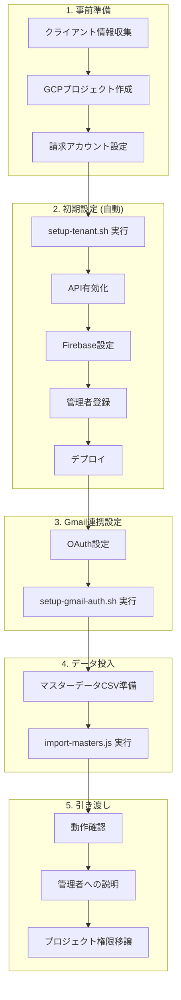
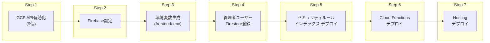
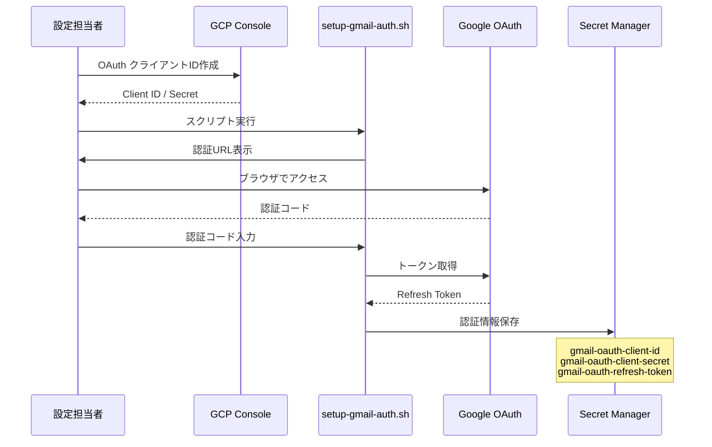

# 納品フロー

クライアントへの納品は、**GCPプロジェクト移譲方式**を採用しています。各クライアントに独立したGCPプロジェクトを作成し、完全にデータ分離された環境を提供します。

## 納品フロー全体像



## 1. 事前準備

### 必要な情報

| 項目 | 例 | 用途 |
|------|-----|------|
| クライアント名 | 株式会社ABC | プロジェクト名 |
| 管理者メール | admin@abc.co.jp | 初期管理者 |
| 監視Gmail | docs@abc.co.jp | 書類取得元 |
| マスターデータ | CSV | 顧客・書類種別等 |

### GCPプロジェクト作成

```bash
# プロジェクト作成
gcloud projects create abc-docsplit --name="ABC DocSplit"

# 請求アカウント紐付け
gcloud billing projects link abc-docsplit --billing-account=XXXXXX-XXXXXX-XXXXXX

# Firebaseプロジェクト追加
firebase projects:addfirebase abc-docsplit
```

## 2. 初期設定（自動化）

### setup-tenant.sh の実行

```bash
./scripts/setup-tenant.sh abc-docsplit admin@abc.co.jp docs@abc.co.jp
```

このスクリプトが自動実行する内容：



### 有効化されるAPI

| API | 用途 |
|-----|------|
| cloudfunctions.googleapis.com | Cloud Functions |
| firestore.googleapis.com | Firestore |
| storage.googleapis.com | Cloud Storage |
| aiplatform.googleapis.com | Vertex AI (Gemini) |
| gmail.googleapis.com | Gmail連携 |
| secretmanager.googleapis.com | 認証情報管理 |
| cloudscheduler.googleapis.com | 定期実行 |
| cloudbuild.googleapis.com | Functions ビルド |
| pubsub.googleapis.com | メッセージング |

## 3. Gmail連携設定

### OAuth認証の設定



### 実行コマンド

```bash
./scripts/setup-gmail-auth.sh abc-docsplit
```

## 4. マスターデータ投入

### CSVフォーマット

**customers.csv**
```csv
name,furigana,isDuplicate,careManagerName,notes
山田太郎,ヤマダタロウ,false,佐藤花子,
```

**documents.csv**
```csv
name,category,keywords
提供票,介護保険,提供票;サービス提供票
```

### インポート実行

```bash
# 個別インポート
node scripts/import-masters.js --customers data/customers.csv

# 一括インポート
node scripts/import-masters.js --all data/
```

## 5. 引き渡し

### 動作確認チェックリスト

| 項目 | 確認方法 |
|------|----------|
| ログイン | 管理者メールでGoogleログイン |
| 書類一覧表示 | トップページ表示 |
| マスター確認 | マスターページでデータ表示 |
| Gmail連携 | 設定ページでステータス確認 |
| エラーログ | エラー履歴ページ |

### 管理者への説明事項

1. **日常操作**
   - 書類の検索・閲覧
   - PDF分割機能の使い方

2. **管理機能**
   - ユーザー追加・削除
   - マスターデータ編集
   - Gmail監視設定

3. **注意事項**
   - 月額コスト目安（〜3,000円）
   - エラー発生時の対処

### プロジェクト権限移譲

```bash
# オーナー権限付与
gcloud projects add-iam-policy-binding abc-docsplit \
  --member="user:owner@abc.co.jp" \
  --role="roles/owner"

# 自分の権限削除（任意）
gcloud projects remove-iam-policy-binding abc-docsplit \
  --member="user:your-email@example.com" \
  --role="roles/owner"
```

## 納品所要時間の目安

| フェーズ | 所要時間 |
|----------|----------|
| 事前準備 | 15分 |
| 初期設定（自動） | 10分 |
| Gmail連携設定 | 10分 |
| マスターデータ投入 | 5分 |
| 動作確認・説明 | 30分 |
| **合計** | **約1時間** |

## トラブルシューティング

### よくある問題

| 問題 | 原因 | 対処 |
|------|------|------|
| ログインできない | ホワイトリスト未登録 | users コレクションに追加 |
| Gmail取得されない | OAuth認証エラー | setup-gmail-auth.sh 再実行 |
| OCRエラー | Gemini API制限 | しばらく待って再実行 |
| デプロイ失敗 | 権限不足 | IAMロール確認 |
