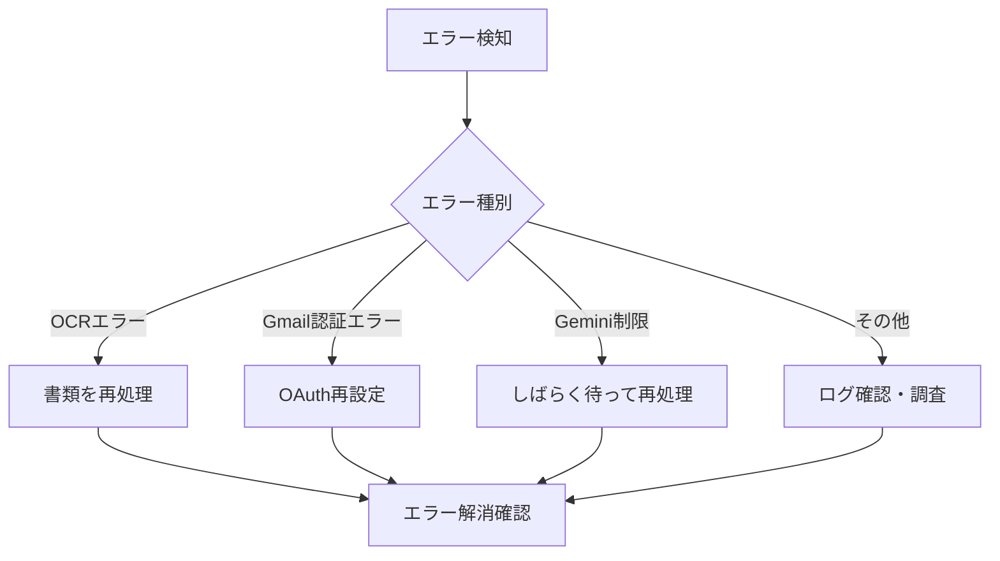
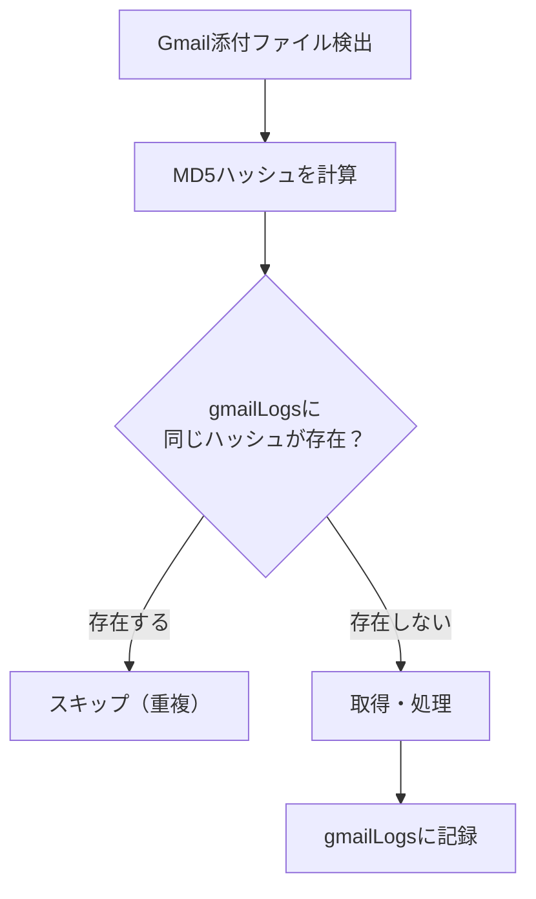

# 運用ガイド

## 日常運用

### 監視項目

| 項目 | 確認方法 | 頻度 |
|------|----------|------|
| 書類処理状況 | 書類一覧画面 | 毎日 |
| エラー発生 | エラー履歴画面 | 毎日 |
| Functionsログ | `firebase functions:log` | 問題発生時 |
| コスト | GCP Console 請求 | 月次 |

### エラー対応フロー



### 書類の手動再処理

1. エラー履歴画面でエラー書類を確認
2. 「再処理」ボタンをクリック
3. ステータスが「processing」に変更
4. 次回processOCR実行時に再処理

## マスターデータ管理

### CSVインポート（一括登録）

マスターデータはCSVファイルで一括インポートできます。

**テンプレートのダウンロード:**
1. マスター画面で対象タブを選択
2. 「テンプレートダウンロード」ボタンをクリック
3. CSVファイルを編集して保存

**インポート手順:**
1. マスター画面 → 対象タブ
2. 「CSVインポート」ボタン
3. ファイルを選択してアップロード

**同姓同名・同名の自動検知:**
- 顧客・事業所マスターでは、インポート時に同姓同名・同名を自動検知します
- `isDuplicate`フラグはシステムが自動設定するため、CSVに含める必要はありません
- 同名が検出された場合、ログに表示されます

詳細: [同名/同姓同名対応](duplicate-name-handling.md)

### 顧客マスター

**追加が必要なケース:**
- 新規顧客の書類が「顧客名不明」で登録された場合

**追加手順:**
1. マスター画面 → 顧客タブ
2. 「追加」ボタン
3. 顧客名、フリガナを入力
4. 保存

### 書類種別マスター

**キーワード設定のポイント:**
- OCR結果に含まれる特徴的なワードを設定
- 複数キーワードはセミコロン区切り

**例:**
```
名前: 提供票
キーワード: 提供票;サービス提供票;サービス利用票
```

## ユーザー管理

### ユーザー追加

1. 設定画面 → ユーザー管理タブ
2. 「ユーザー追加」ボタン
3. メールアドレス、ロールを入力
4. 保存
5. ユーザーに初回ログインを依頼

### ロール変更

| ロール | 権限 |
|--------|------|
| admin | 全機能 + 設定変更 |
| user | 書類閲覧・検索のみ |

### ユーザー削除

1. ユーザー一覧で対象ユーザーの「削除」をクリック
2. 確認ダイアログで「削除」

## バックアップ

### Firestoreバックアップ

```bash
# エクスポート
gcloud firestore export gs://<bucket-name>/backup-$(date +%Y%m%d)

# インポート（復元）
gcloud firestore import gs://<bucket-name>/backup-YYYYMMDD
```

### 定期バックアップ設定

Cloud Schedulerで定期実行:

```bash
gcloud scheduler jobs create http firestore-backup \
  --schedule="0 3 * * *" \
  --uri="https://firestore.googleapis.com/v1/projects/<project-id>/databases/(default):exportDocuments" \
  --http-method=POST \
  --oauth-service-account-email=<service-account>
```

## コスト管理

### 月額コスト内訳（目安）

| サービス | 月額目安 |
|----------|----------|
| Cloud Functions | 〜500円 |
| Firestore | 〜500円 |
| Cloud Storage | 〜500円 |
| Vertex AI (Gemini) | 〜1,000円 |
| Secret Manager | 〜100円 |
| **合計** | **〜2,600円** |

### コスト削減Tips

1. **Functions実行間隔の調整**
   - 書類量が少ない場合は15分間隔に変更

2. **Storage整理**
   - 古いエラーログの削除
   - 処理済み書類の定期アーカイブ

3. **Gemini API使用量**
   - 大量処理時はレート制限を意識

### 予算アラート設定

```bash
gcloud billing budgets create \
  --billing-account=<billing-account-id> \
  --display-name="DocSplit Monthly Budget" \
  --budget-amount=3000JPY \
  --threshold-rules=percent=80,basis=current-spend
```

## Gmail添付ファイル重複チェック

### 仕組み

Gmail添付ファイルの取得時、**MD5ハッシュベース**で重複を検出します。



### 重複判定の挙動

| ケース | ファイル名 | 内容 | 結果 |
|--------|-----------|------|------|
| 新規ファイル | 新規 | 新規 | ✅ 取得 |
| 同名・別内容 | 同じ | 異なる | ✅ 取得（別ファイルとして処理） |
| 別名・同内容 | 異なる | 同じ | ❌ スキップ（重複として検出） |
| 完全一致 | 同じ | 同じ | ❌ スキップ（重複として検出） |

### なぜMD5ハッシュを使うのか

- **ファイル名ベースの問題**: 同じファイルを異なる名前で送付されると重複取得してしまう
- **MD5ハッシュの利点**: ファイル内容が同一であれば確実に検出
- **実運用での効果**: メール転送や再送時の重複取得を防止

### gmailLogsコレクション

処理済みファイルの記録:

```typescript
{
  messageId: "18d1a2b3c4d5e6f7",     // GmailメッセージID
  attachmentId: "ANGjdJ8...",        // 添付ファイルID
  fileName: "書類.pdf",
  fileHash: "d41d8cd98f00b204e9800998ecf8427e",  // MD5ハッシュ
  processedAt: Timestamp,
  documentId: "abc123"               // 作成されたドキュメントID
}
```

### 注意事項

- 同じ内容のファイルは最初の1回のみ取得されます
- 意図的に再取得が必要な場合は、対象のgmailLogsレコードを削除してください
- ファイル名が同じでも内容が異なれば別々に取得されます

## トラブルシューティング

### よくある問題と対処

| 症状 | 原因 | 対処 |
|------|------|------|
| ログインできない | ホワイトリスト未登録 | ユーザー追加 |
| 書類が取得されない | Gmail認証切れ | OAuth再設定 |
| OCRが失敗する | Gemini API制限 | 時間を置いて再処理 |
| 顧客名が不明 | マスター未登録 | 顧客マスター追加 |
| 書類種別が不明 | キーワード不足 | 書類種別マスター更新 |

### ログ確認

```bash
# 最新ログ
firebase functions:log -n 50

# 特定関数のログ
firebase functions:log --only checkGmailAttachments

# エラーのみ
firebase functions:log --only processOCR | grep ERROR
```

### 緊急時の対応

**Gmail連携停止:**
```bash
# Scheduler一時停止
gcloud scheduler jobs pause checkGmailAttachments --location=asia-northeast1
```

**復旧:**
```bash
gcloud scheduler jobs resume checkGmailAttachments --location=asia-northeast1
```
