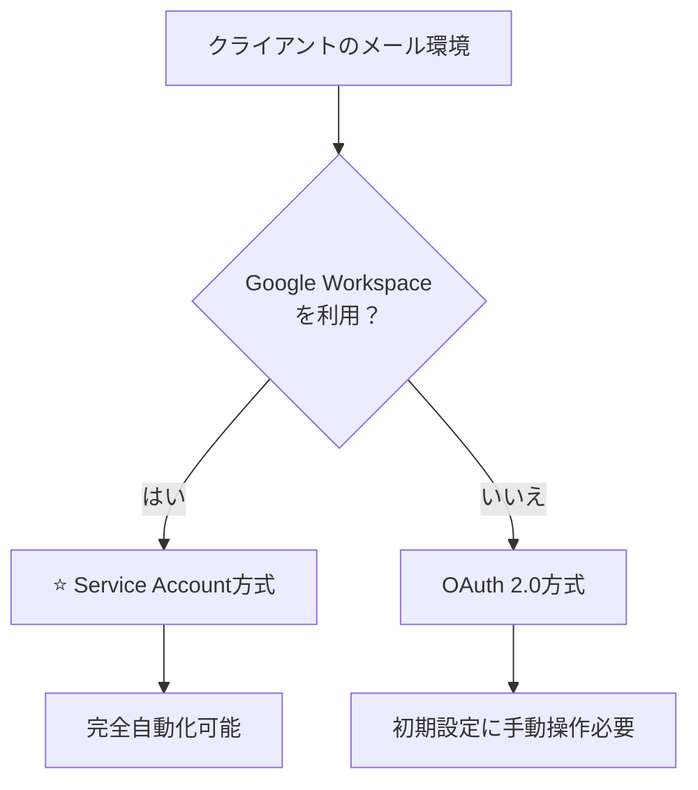

# Gmail連携設定ガイド

DocSplitのGmail連携には2つの方式があります。クライアント環境に応じて選択してください。

## 方式比較

| 方式 | 対象 | 自動化レベル | 手動操作 |
|------|------|-------------|----------|
| **Service Account + Domain-wide Delegation** | Google Workspace | ✅ 高 | 管理者の委任設定のみ |
| **OAuth 2.0** | 個人Gmail | ⚠️ 低 | GCPコンソール + ブラウザ認証 |



---

## 方式1: Service Account（推奨・本番向け）

Google Workspaceを利用しているクライアント向け。**一度設定すれば完全自動**。

### 前提条件

- Google Workspaceの管理者権限
- 監視対象のGmailアカウント（例: `documents@client-company.com`）

### 手順

#### Step 1: setup-tenant.sh実行

```bash
./scripts/setup-tenant.sh <project-id> <admin-email> <gmail-account>
```

これにより以下が自動設定されます:
- Firestore `settings/gmail.authMode = 'service_account'`
- Firestore `settings/gmail.delegatedUserEmail = <gmail-account>`

#### Step 2: Workspace管理者による委任設定

クライアントのWorkspace管理者に以下を依頼:

1. **Google Workspace管理コンソール**にアクセス
   ```
   https://admin.google.com
   ```

2. **セキュリティ** → **アクセスとデータ管理** → **APIの制御**

3. **ドメイン全体の委任** → **API クライアントを追加**

4. 以下を入力:
   | 項目 | 値 |
   |------|-----|
   | クライアントID | `<project-number>-compute@developer.gserviceaccount.com` |
   | OAuth スコープ | `https://www.googleapis.com/auth/gmail.readonly` |

   ※ project-numberは以下で確認:
   ```bash
   gcloud projects describe <project-id> --format="value(projectNumber)"
   ```

5. **承認**をクリック

#### Step 3: 動作確認

```bash
gcloud functions call checkGmailAttachments --project <project-id>
```

---

## 方式2: OAuth 2.0（開発・個人Gmail向け）

個人Gmailや開発環境向け。初回設定に手動操作が必要。

### 手順

#### Step 1: OAuth同意画面の設定

1. GCPコンソールにアクセス:
   ```
   https://console.cloud.google.com/apis/credentials/consent?project=<project-id>
   ```

2. 設定:
   - User Type: 外部
   - アプリ名: DocSplit
   - スコープ: `https://www.googleapis.com/auth/gmail.readonly`
   - テストユーザー: 監視対象のGmailアドレスを追加

#### Step 2: OAuthクライアントID作成

1. GCPコンソールにアクセス:
   ```
   https://console.cloud.google.com/apis/credentials?project=<project-id>
   ```

2. **認証情報を作成** → **OAuth クライアント ID**
   - 種類: デスクトップアプリ
   - 名前: DocSplit Gmail

3. Client IDとClient Secretをメモ

#### Step 3: 認証スクリプト実行

```bash
python3 scripts/gmail-oauth-cli.py
```

スクリプトが自動で:
1. ブラウザで認証ページを開く
2. 認証コードを取得
3. リフレッシュトークンを取得
4. Secret Managerに保存
5. Cloud Functionsに権限付与

#### Step 4: Firestore設定をOAuthモードに変更

Firestoreの `settings/gmail` を更新:
```json
{
  "authMode": "oauth",
  "oauthClientId": "<client-id>"
}
```

#### Step 5: Cloud Functions再デプロイ

```bash
firebase deploy --only functions
```

---

## トラブルシューティング

### エラー: "Delegation not authorized"

- Workspace管理者にドメイン全体の委任設定を再確認依頼
- スコープが正確に `https://www.googleapis.com/auth/gmail.readonly` か確認

### エラー: "Token has been expired or revoked"

- OAuth方式の場合、`scripts/gmail-oauth-cli.py`を再実行してトークン更新

### エラー: "Gmail account not configured"

- Firestore `settings/app.gmailAccount` に監視対象アドレスを設定

---

## 切替方法

OAuth → Service Account に切り替える場合:

```bash
# Firestoreを更新
firebase firestore:set settings/gmail '{
  "authMode": "service_account",
  "delegatedUserEmail": "documents@client.com"
}'
```

Service Account → OAuth に切り替える場合:

```bash
# 1. OAuth設定を実行
python3 scripts/gmail-oauth-cli.py

# 2. Firestoreを更新
firebase firestore:set settings/gmail '{
  "authMode": "oauth",
  "oauthClientId": "<client-id>"
}'
```
