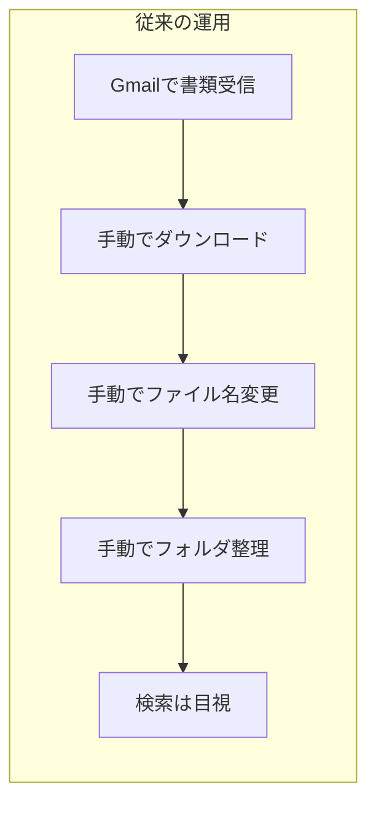
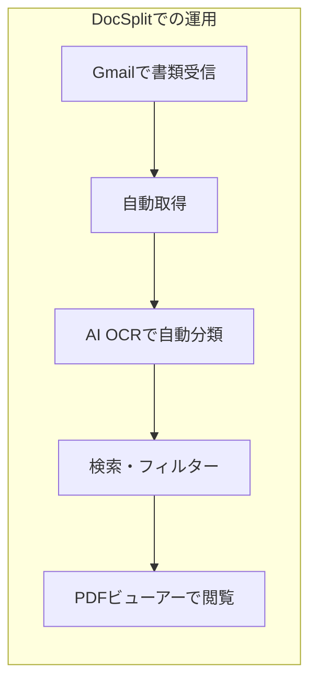
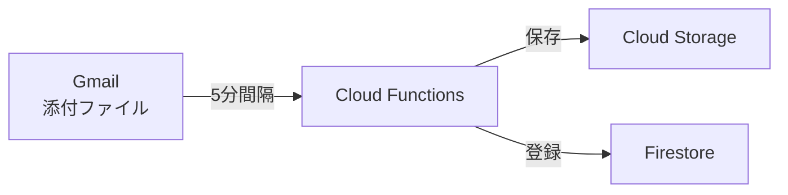
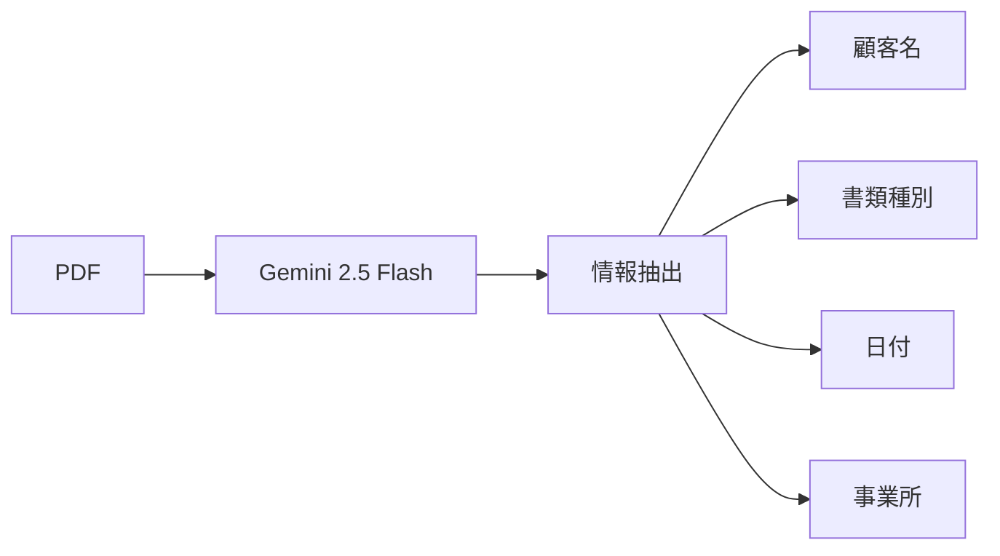
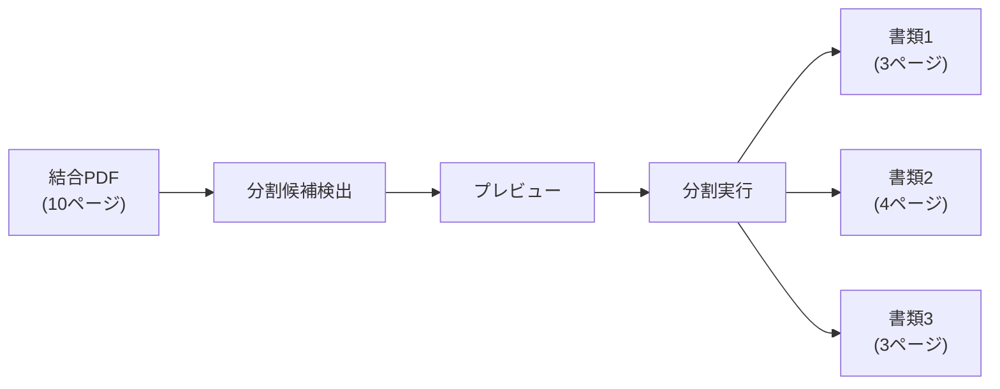

# プロジェクト概要

## DocSplitとは

**DocSplit**は、介護事業所向けの書類管理ビューアーアプリです。AppSheetで構築された既存システムをGCPでリプレイス開発したものです。

## 背景と課題

### 従来の課題



- 書類の手動整理に時間がかかる
- ファイル名の命名規則が統一されない
- 検索が困難
- 複数書類が結合されたPDFの処理が煩雑

### DocSplitによる解決



## 主要機能

### 1. Gmail自動連携



- 指定したGmailアカウントを5分間隔で監視
- 添付PDFを自動取得・保存
- ラベルによるフィルタリング対応

### 2. AI OCR処理



**抽出される情報:**
- 顧客名（フリガナ照合）
- 書類種別（キーワードマッチング）
- 書類日付（和暦対応）
- 事業所名

### 3. PDF分割機能

複数の書類が結合されたPDFを自動検出・分割



### 4. 書類検索・閲覧

| 検索項目 | 説明 |
|----------|------|
| フリーテキスト | 書類名、顧客名で検索 |
| ステータス | 処理中、完了、エラー |
| 書類種別 | プルダウン選択 |
| 日付範囲 | 開始日〜終了日 |

### 5. マスターデータ管理

| マスター | 用途 |
|----------|------|
| 顧客 | OCRでの顧客名マッチング |
| 書類種別 | キーワードによる自動分類 |
| 事業所 | 事業所名の正規化 |
| ケアマネージャー | 担当者紐付け |

## 技術仕様

### 性能目標

| 指標 | 目標値 |
|------|--------|
| Gmail取得間隔 | 5分 |
| OCR処理速度 | 10秒/ページ以下 |
| 検索応答時間 | 1秒以下 |
| 月額コスト | 3,000円以下 |

### 制約事項

- 1ファイルあたりの最大サイズ: 50MB
- 対応形式: PDF
- 同時処理数: Gemini APIレート制限に依存

## プロジェクト構成

```
doc-split/
├── frontend/          # React SPA
│   ├── src/
│   │   ├── components/  # UIコンポーネント
│   │   ├── hooks/       # カスタムフック
│   │   ├── pages/       # ページコンポーネント
│   │   └── stores/      # 状態管理(Zustand)
│   └── public/          # 静的ファイル
├── functions/         # Cloud Functions
│   ├── src/
│   │   ├── gmail/       # Gmail連携
│   │   ├── ocr/         # OCR処理
│   │   ├── pdf/         # PDF操作
│   │   └── utils/       # ユーティリティ
│   └── test/            # テスト
├── scripts/           # 運用スクリプト
├── docs/              # ドキュメント
└── shared/            # 共通型定義
```

## 開発ステータス

| フェーズ | 状態 | 内容 |
|---------|------|------|
| Phase 0 | ✅ 完了 | GCP環境構築 |
| Phase 1 | ✅ 完了 | Firestoreスキーマ・セキュリティルール |
| Phase 2 | ✅ 完了 | Gmail連携・OCR処理 |
| Phase 3 | ✅ 完了 | フロントエンド |
| Phase 4 | ✅ 完了 | 管理機能・PDF分割 |
| Phase 5 | ✅ 完了 | テスト・本番デプロイ |
| Phase 6 | ✅ 完了 | ビジネスロジック移行 |
| Phase 7 | ✅ 完了 | 処理履歴・同姓同名解決 |

**本番URL**: https://doc-split-dev.web.app
