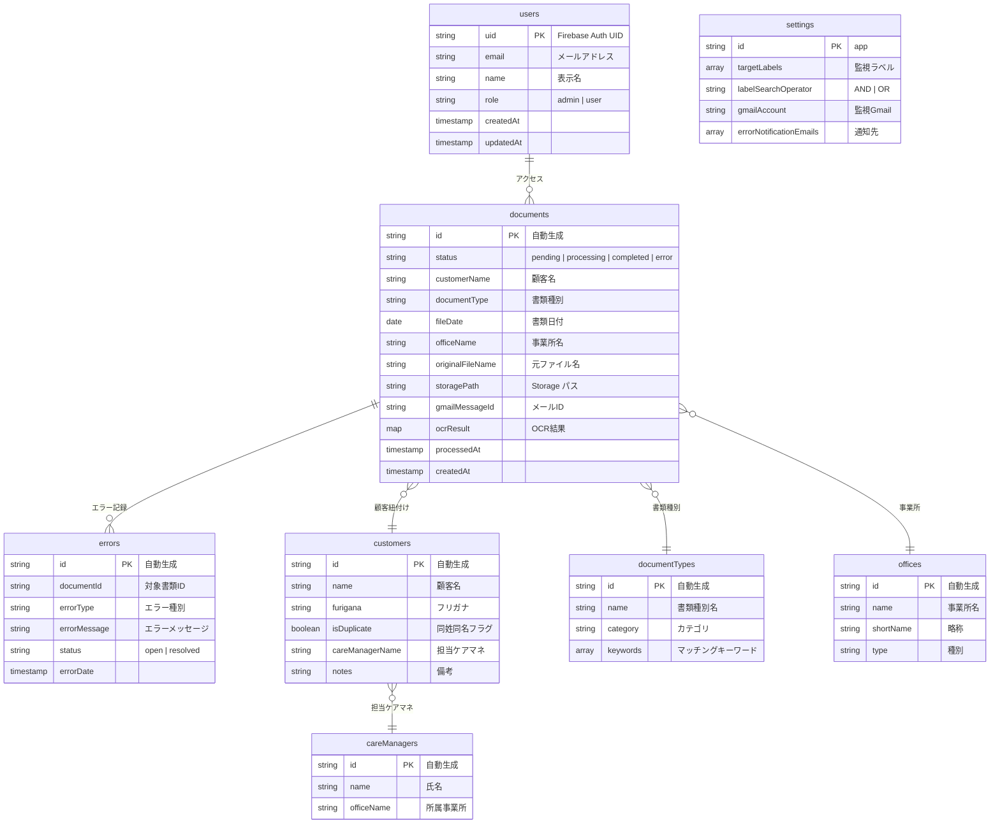
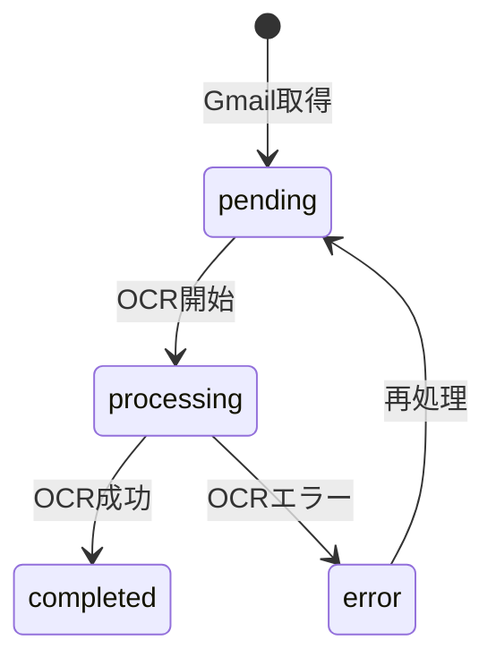

# データモデル

## Firestore コレクション構成



## コレクション詳細

### users

ホワイトリスト認証用のユーザー情報。

| フィールド | 型 | 必須 | 説明 |
|------------|-----|------|------|
| uid | string | ✓ | Firebase Auth UID（ドキュメントID） |
| email | string | ✓ | メールアドレス |
| name | string | | 表示名 |
| role | string | ✓ | `admin` または `user` |
| createdAt | timestamp | ✓ | 作成日時 |
| updatedAt | timestamp | ✓ | 更新日時 |

### documents

取得・処理された書類情報。

| フィールド | 型 | 必須 | 説明 |
|------------|-----|------|------|
| id | string | ✓ | 自動生成ID |
| status | string | ✓ | `pending`, `processing`, `completed`, `error` |
| customerName | string | | 顧客名（OCR結果） |
| documentType | string | | 書類種別（OCR結果） |
| fileDate | date | | 書類日付（OCR結果） |
| officeName | string | | 事業所名（OCR結果） |
| originalFileName | string | ✓ | 元のファイル名 |
| storagePath | string | ✓ | Cloud Storageパス |
| gmailMessageId | string | | Gmail メッセージID |
| ocrResult | map | | OCR生結果 |
| processedAt | timestamp | | 処理完了日時 |
| createdAt | timestamp | ✓ | 作成日時 |

**status遷移:**


### customers

顧客マスター。OCRでの顧客名マッチングに使用。

| フィールド | 型 | 必須 | 説明 |
|------------|-----|------|------|
| id | string | ✓ | 自動生成ID |
| name | string | ✓ | 顧客名 |
| furigana | string | | フリガナ（マッチング用） |
| isDuplicate | boolean | | 同姓同名フラグ |
| careManagerName | string | | 担当ケアマネ名 |
| notes | string | | 備考 |

### documentTypes

書類種別マスター。

| フィールド | 型 | 必須 | 説明 |
|------------|-----|------|------|
| id | string | ✓ | 自動生成ID |
| name | string | ✓ | 書類種別名 |
| category | string | | カテゴリ |
| keywords | array | | マッチングキーワード |

### offices

事業所マスター。

| フィールド | 型 | 必須 | 説明 |
|------------|-----|------|------|
| id | string | ✓ | 自動生成ID |
| name | string | ✓ | 正式名称 |
| shortName | string | | 略称 |
| type | string | | 事業所種別 |

### errors

エラー履歴。

| フィールド | 型 | 必須 | 説明 |
|------------|-----|------|------|
| id | string | ✓ | 自動生成ID |
| documentId | string | | 対象書類ID |
| errorType | string | ✓ | エラー種別 |
| errorMessage | string | ✓ | エラーメッセージ |
| status | string | ✓ | `open`, `resolved` |
| errorDate | timestamp | ✓ | 発生日時 |

### settings

アプリ設定（単一ドキュメント `settings/app`）。

| フィールド | 型 | 必須 | 説明 |
|------------|-----|------|------|
| targetLabels | array | | 監視対象ラベル |
| labelSearchOperator | string | | `AND` または `OR` |
| gmailAccount | string | | 監視Gmailアカウント |
| errorNotificationEmails | array | | エラー通知先 |

## インデックス

### 複合インデックス

| コレクション | フィールド | 用途 |
|--------------|------------|------|
| documents | status ASC, processedAt ASC | OCR処理キュー |
| documents | status ASC, processedAt DESC | 書類一覧（ステータス別） |
| documents | customerName ASC, fileDate DESC | 顧客別書類一覧 |
| documents | documentType ASC, processedAt DESC | 種別別書類一覧 |
| errors | status ASC, errorDate DESC | エラー一覧 |
| errors | errorType ASC, errorDate DESC | エラー種別別一覧 |

## Cloud Storage 構成

```
gs://<project-id>-documents/
├── pending/           # 処理待ち
│   └── {documentId}.pdf
├── processed/         # 処理済み
│   └── {YYYY}/{MM}/
│       └── {documentId}.pdf
└── split/            # 分割結果
    └── {originalDocId}/
        └── segment_{n}.pdf
```
