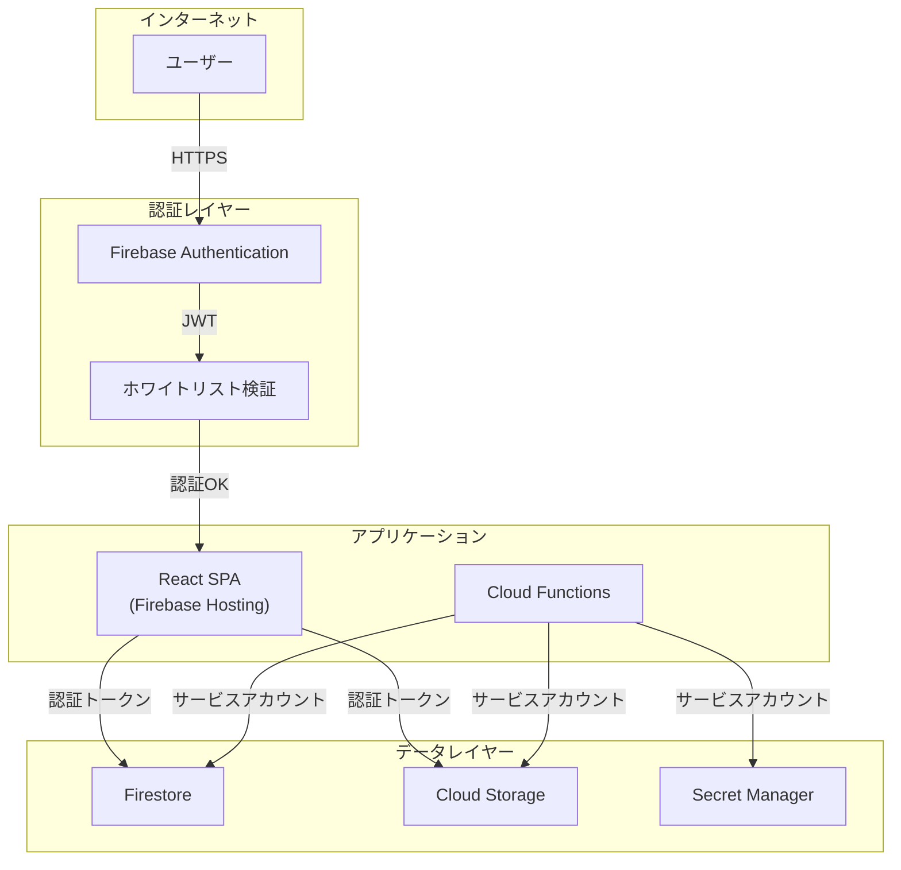
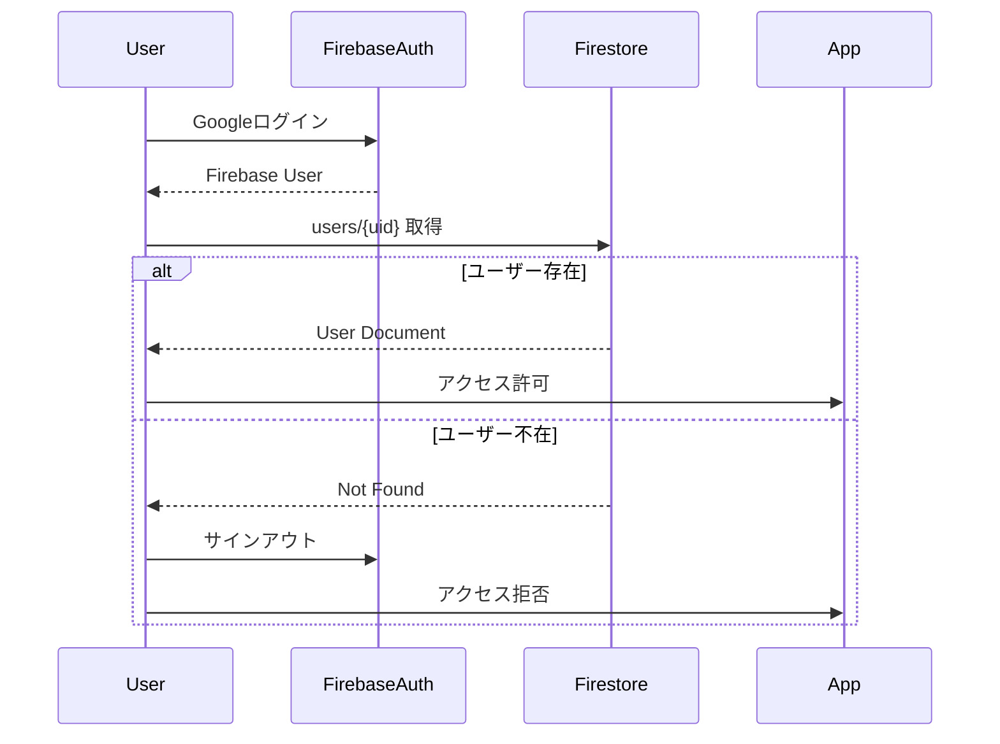
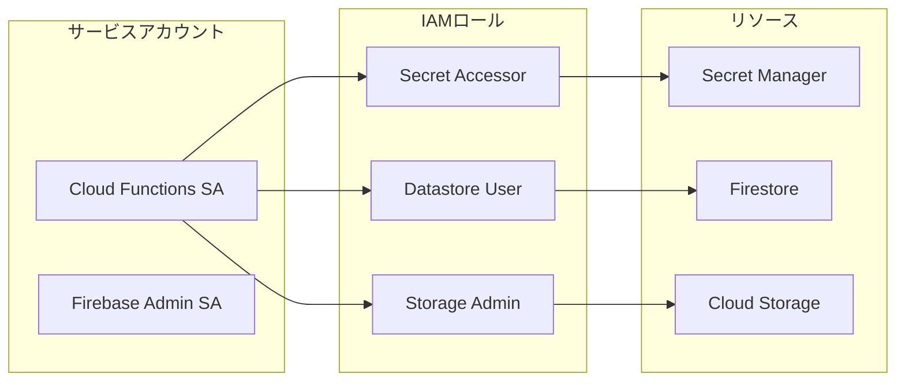

# セキュリティ

## セキュリティ設計概要



## 認証・認可

### Firebase Authentication

- **プロバイダー**: Google OAuth 2.0
- **認証フロー**: signInWithPopup
- **トークン**: Firebase ID Token (JWT)

### ホワイトリスト認証



### ロールベースアクセス制御

| ロール | 書類閲覧 | 書類操作 | マスター編集 | ユーザー管理 | 設定変更 |
|--------|----------|----------|--------------|--------------|----------|
| admin | ✓ | ✓ | ✓ | ✓ | ✓ |
| user | ✓ | ✓ | - | - | - |

## Firestoreセキュリティルール

```javascript
rules_version = '2';
service cloud.firestore {
  match /databases/{database}/documents {
    // 認証チェック
    function isAuthenticated() {
      return request.auth != null;
    }

    // ホワイトリストチェック
    function isWhitelisted() {
      return isAuthenticated() &&
        exists(/databases/$(database)/documents/users/$(request.auth.uid));
    }

    // 管理者チェック
    function isAdmin() {
      return isWhitelisted() &&
        get(/databases/$(database)/documents/users/$(request.auth.uid)).data.role == 'admin';
    }

    // users: 管理者のみ書き込み可
    match /users/{userId} {
      allow read: if isWhitelisted();
      allow write: if isAdmin();
    }

    // documents: 認証ユーザーは読み書き可
    match /documents/{docId} {
      allow read, write: if isWhitelisted();
    }

    // マスターデータ: 読み取りは全員、書き込みは管理者
    match /customers/{id} {
      allow read: if isWhitelisted();
      allow write: if isAdmin();
    }

    match /documentTypes/{id} {
      allow read: if isWhitelisted();
      allow write: if isAdmin();
    }

    // 設定: 管理者のみ
    match /settings/{id} {
      allow read: if isWhitelisted();
      allow write: if isAdmin();
    }
  }
}
```

## Storageセキュリティルール

```javascript
rules_version = '2';
service firebase.storage {
  match /b/{bucket}/o {
    // 認証チェック
    function isAuthenticated() {
      return request.auth != null;
    }

    // ファイルサイズ制限 (50MB)
    function isValidSize() {
      return request.resource.size < 50 * 1024 * 1024;
    }

    // PDFのみ許可
    function isPdf() {
      return request.resource.contentType == 'application/pdf';
    }

    match /documents/{allPaths=**} {
      allow read: if isAuthenticated();
      allow write: if isAuthenticated() && isValidSize() && isPdf();
    }
  }
}
```

## シークレット管理

### Secret Managerの使用

| シークレット | 用途 | アクセス権限 |
|--------------|------|--------------|
| gmail-oauth-client-id | Gmail API認証 | Cloud Functions SA |
| gmail-oauth-client-secret | Gmail API認証 | Cloud Functions SA |
| gmail-oauth-refresh-token | Gmail API認証 | Cloud Functions SA |

### IAMロール



## 通信セキュリティ

| 経路 | プロトコル | 暗号化 |
|------|------------|--------|
| ブラウザ ↔ Hosting | HTTPS | TLS 1.3 |
| ブラウザ ↔ Firestore | HTTPS | TLS 1.3 |
| ブラウザ ↔ Storage | HTTPS | TLS 1.3 |
| Functions ↔ Gmail API | HTTPS | TLS 1.3 |
| Functions ↔ Vertex AI | HTTPS | TLS 1.3 |

## データ保護

### 保存時暗号化

- **Firestore**: Google管理の暗号化キー (AES-256)
- **Cloud Storage**: Google管理の暗号化キー (AES-256)
- **Secret Manager**: Google管理の暗号化キー

### データ分離

- 各テナントは独立したGCPプロジェクト
- プロジェクト間のデータアクセス不可
- 請求も独立

## セキュリティベストプラクティス

### 実施済み

- [x] Firebase Authentication使用
- [x] ホワイトリスト認証
- [x] Firestoreセキュリティルール
- [x] Storageセキュリティルール
- [x] Secret Manager使用
- [x] HTTPS強制
- [x] ロールベースアクセス制御

### 推奨事項

- [ ] 定期的なアクセスログ監査
- [ ] 不審なアクティビティの監視
- [ ] OAuth同意画面の「内部」設定
- [ ] IP制限（必要に応じて）

## 脆弱性対応

### 依存関係の更新

```bash
# 脆弱性チェック
npm audit

# 自動修正
npm audit fix
```

### 定期的なセキュリティレビュー

- 月次: 依存関係の脆弱性チェック
- 四半期: セキュリティルールのレビュー
- 年次: 全体的なセキュリティ監査
